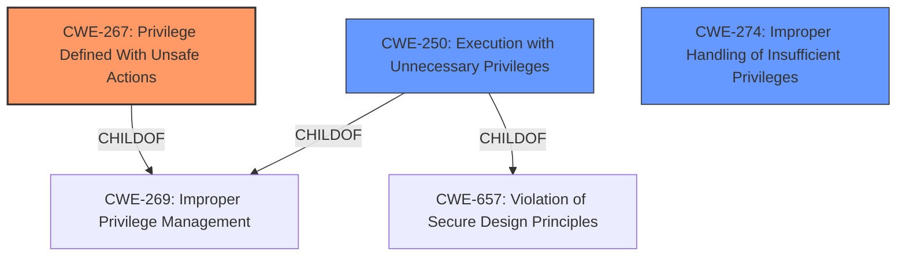

# Raw Analyzer Response for CVE-2022-38065

# Summary
| CWE ID | CWE Name | Confidence | CWE Abstraction Level | CWE Vulnerability Mapping Label | CWE-Vulnerability Mapping Notes |
|---|---|---|---|---|---|
| CWE-267 | Privilege Defined With Unsafe Actions | 0.8 | Base | Allowed | Primary CWE. The vulnerability stems from overly permissive functions that allow for actions that should be tightly controlled, ultimately leading to privilege escalation. |
| CWE-250 | Execution with Unnecessary Privileges | 0.7 | Base | Allowed | Secondary CWE. The overly permissive functions within `oslo.privsep`, `nova`, and `os_brick` are executed with higher privileges than necessary, which creates new weaknesses and amplifies the consequences of other weaknesses. |
| CWE-274 | Improper Handling of Insufficient Privileges | 0.5 | Base | Discouraged | Secondary CWE. This is a possible weakness where the product does not handle or incorrectly handles when it has insufficient privileges to perform an operation, leading to resultant weaknesses. |

## Evidence and Confidence

*   **Confidence Score:** 0.8
*   **Evidence Strength:** HIGH

## Relationship Analysis
The primary CWE is CWE-267, which highlights that a specific privilege can be used to perform unsafe actions. CWE-250 is a ChildOf CWE-269 and CWE-657, and CWE-267 is a ChildOf CWE-269. CWE-274 is related as the program may not handle insufficient privileges.

## Vulnerability Chain
The vulnerability chain starts with **overly permissive functions** within the `oslo.privsep` library (CWE-267), leading to **execution with unnecessary privileges** (CWE-250), and finally resulting in **privilege escalation**.

## Summary of Analysis
The initial assessment pointed towards a **privilege escalation vulnerability** due to **overly permissive functions**. The analysis of the "CVE Reference Links Content Summary" confirms that the **root cause** lies in the `nova` and `os_brick` modules containing **privileged wrappers that are too broad in scope**.

The selection of CWE-267 is based on the fact that the existing privileges, roles, or capabilities within the `oslo.privsep` library can be used to perform unsafe actions that were not intended. This aligns directly with the CWE description: "A particular privilege, role, capability, or right can be used to perform unsafe actions that were not intended, even when it is assigned to the correct entity." This is further supported by the evidence that the `nova` module contains privileged wrappers for functions like `chmod`, `chown`, `rmdir`, and arbitrary file operations, while the `os_brick` module allows execution of arbitrary shell commands as root. This is a direct example of a privilege being defined with unsafe actions.

CWE-250 is selected because the vulnerable functions are executed with higher privileges than necessary. The description states: "The product performs an operation at a privilege level that is higher than the minimum level required, which creates new weaknesses or amplifies the consequences of other weaknesses." The overly broad functions in `nova` and `os_brick` modules are executed with root privileges, even though they should be more tightly controlled, amplifying the potential for privilege escalation.

CWE-274 was considered because the OpenStack application may not handle cases where it has insufficient privileges, but that is not clearly the root cause.

The selected CWEs are at the optimal level of specificity because they accurately represent the **root cause** of the vulnerability (CWE-267) and a contributing factor (CWE-250). They are also at the Base level of abstraction, which is preferred for mapping root causes.

Relevant CWE Information:
- CWE-267: Privilege Defined With Unsafe Actions
- CWE-250: Execution with Unnecessary Privileges
- CWE-274: Improper Handling of Insufficient Privileges