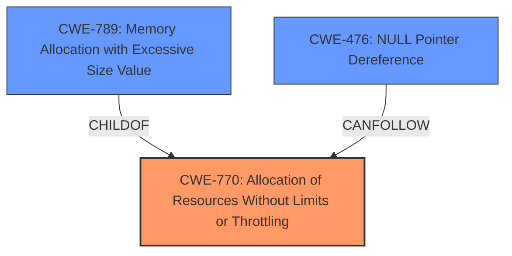

# Analysis Report for CVE-2022-3807

# Vulnerability Analysis Report: CVE-2022-3807

## Description


## Analysis (with Relationship Data)

# Summary
| CWE ID | CWE Name | Confidence | CWE Abstraction Level | CWE Vulnerability Mapping Label | CWE-Vulnerability Mapping Notes |
|---|---|---|---|---|---|
| CWE-770 | Allocation of Resources Without Limits or Throttling | 0.9 | Base | Allowed | Primary CWE |
| CWE-789 | Memory Allocation with Excessive Size Value | 0.8 | Variant | Allowed | Secondary Candidate |
| CWE-476 | NULL Pointer Dereference | 0.7 | Base | Allowed | Secondary Candidate |

## Evidence and Confidence

*   **Confidence Score:** 0.8
*   **Evidence Strength:** HIGH

## Relationship Analysis
The primary weakness is **CWE-770 (Allocation of Resources Without Limits or Throttling)** because the code allocates memory without proper checks on the size or number of resources. **CWE-789 (Memory Allocation with Excessive Size Value)** is a variant of **CWE-770**, representing the specific case where the size value is excessive, but the root cause is still the lack of limits or throttling. **CWE-476 (NULL Pointer Dereference)** results from the unchecked memory allocation, where a null pointer is dereferenced if allocation fails.



## Vulnerability Chain
1.  **Root Cause:** **Improper Memory Allocation**: The code attempts to allocate a buffer without validating the size, leading to potential resource exhaustion (**CWE-770**).
2.  **Excessive Size Value:** The allocated memory might be excessively large (**CWE-789**).
3.  **Unchecked Allocation Result:** The code does not check if the memory allocation was successful.
4.  **Null Pointer Dereference:** If the allocation fails, a null pointer is dereferenced, leading to a crash (**CWE-476**).
5.  **Impact:** Denial of Service (DoS) due to the crash.

## Summary of Analysis
Initially, the analysis focused on the **resource consumption** impact and the reported **componentA vulnerability**. The **CVE Reference Links Content Summary** provided crucial details about the **rootcause**: "unhandled memory allocation failure" and "**unchecked memory allocation**," as well as the resulting "Null Pointer Dereference."

The selection of **CWE-770 (Allocation of Resources Without Limits or Throttling)** as the primary CWE is based on the evidence that the code allocates memory without imposing restrictions on size, violating the intended security policy. The high retriever score for **CWE-770** also supports this choice.

**CWE-789 (Memory Allocation with Excessive Size Value)** is considered a secondary CWE as it specifies the variant where the allocated size is excessive, adding more detail to the allocation issue.

**CWE-476 (NULL Pointer Dereference)** is a consequence of the unchecked memory allocation, and the code's attempt to dereference the null pointer if the allocation fails. This is why it is a secondary candidate.

The chosen CWEs are at the optimal level of specificity because they precisely represent the **rootcause** (CWE-770, CWE-789) and the direct consequence (CWE-476) of the vulnerability based on the **CVE Reference Links Content Summary**.

Other CWEs Considered and Rejected:

*   **CWE-79 (Improper Neutralization of Input During Web Page Generation ('Cross-site Scripting'))** and **CWE-89 (Improper Neutralization of Special Elements used in an SQL Command ('SQL Injection'))**: These are not relevant as the vulnerability is not related to input neutralization or web page generation.
*   **CWE-252 (Unchecked Return Value)**: While there's an unchecked return value aspect (allocation failure), the more direct issue is the resource allocation problem.
*   **CWE-434 (Unrestricted Upload of File with Dangerous Type)**: Not related to file uploads.
*   **CWE-1325 (Improperly Controlled Sequential Memory Allocation)**: While related to memory allocation, the core issue isn't sequential allocation, but the lack of limits on the initial allocation.
*   **CWE-705 (Incorrect Control Flow Scoping)**: Not the primary issue, although the lack of a check on allocation could be considered a control flow problem.
*   **CWE-1241 (Use of Predictable Algorithm in Random Number Generator)** and **CWE-334 (Small Space of Random Values)**: Not relevant as the vulnerability does not involve random number generation.
*   **CWE-117 (Improper Output Neutralization for Logs)**: The vulnerability is not related to logging.


## CWE Relationship Analysis

Current CWEs represent these abstraction levels: .


### Vulnerability Chain Analysis

**Chain starting from CWE-89:**
- 89 (Improper Neutralization of Special Elements used in an SQL Command ('SQL Injection')) - ROOT


**Chain starting from CWE-1325:**
- 1325 (Improperly Controlled Sequential Memory Allocation) - ROOT


### CWE Relationship Diagram

```mermaid
graph TD
    classDef primary fill:#f96,stroke:#333,stroke-width:2px
    classDef secondary fill:#69f,stroke:#333
    classDef tertiary fill:#9e9,stroke:#333
```


*Report generated on 2025-03-31 01:35:29*
