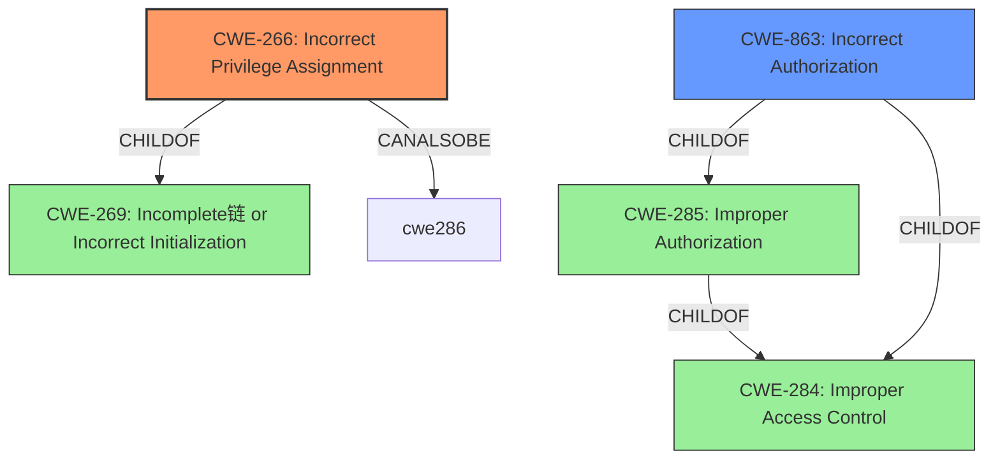

# Enhanced Analysis for CVE-2022-38070

# Summary
| CWE ID | CWE Name | Confidence | CWE Abstraction Level | CWE Vulnerability Mapping Label | CWE-Vulnerability Mapping Notes |
|---|---|---|---|---|---|
| CWE-266 | Incorrect Privilege Assignment | 0.8 | Base | Allowed | Primary CWE |
| CWE-863 | Incorrect Authorization | 0.6 | Class | Allowed-with-Review | Secondary Candidate |

## Evidence and Confidence

*   **Confidence Score:** 0.7
*   **Evidence Strength:** LOW

## Relationship Analysis
The primary CWE, CWE-266 (Incorrect Privilege Assignment), is a Base level CWE, offering a specific description of the **incorrect assignment of privileges**. CWE-266 is a child of CWE-269 (Incomplete链 or Incorrect Initialization) and CanAlsoBe CWE-286 (Incorrect User Management).
CWE-863 (Incorrect Authorization) is a Class-level CWE, representing a broader category of **incorrect authorization checks**. It is a child of CWE-285 (Improper Authorization) and CWE-284 (Improper Access Control).
The choice of CWE-266 over CWE-863 is based on the specific mention of **privilege escalation** in the vulnerability description.



## Vulnerability Chain
The chain of events is as follows:
1.  **Root Cause:** **Incorrect Privilege Assignment** (CWE-266) - A user is granted more privileges than they should have.
2.  **Impact:** **Privilege Escalation** - The user exploits these excessive privileges to gain unauthorized access or control.

## Summary of Analysis
The initial assessment focused on identifying the root cause of the vulnerability, which is the **privilege escalation**. The evidence for privilege escalation is directly mentioned in the Vulnerability Description as "Privilege Escalation (subscriber+) vulnerability".

The Retriever Results provided several candidate CWEs, including:
*   CWE-862 Missing Authorization
*   CWE-284 Improper Access Control
*   CWE-266 Incorrect Privilege Assignment
*   CWE-863 Incorrect Authorization
*   CWE-352 Cross-Site Request Forgery (CSRF)

Based on the evidence, CWE-266 (Incorrect Privilege Assignment) was selected as the primary CWE. This is because the vulnerability description explicitly mentions **privilege escalation**, indicating that the root cause is an **incorrect assignment of privileges**, which aligns directly with CWE-266.

CWE-863 (Incorrect Authorization) was considered as a secondary candidate because the vulnerability ultimately leads to an authorization bypass. However, CWE-266 is more specific to the **incorrect privilege assignment** that enables the **privilege escalation**.

CWE-284 (Improper Access Control) and CWE-285 (Improper Authorization) were deemed too high-level and generic.

CWE-862 (Missing Authorization) was not chosen because the vulnerability involves an **incorrect** authorization, rather than a completely **missing** authorization check.

CWE-352 (Cross-Site Request Forgery (CSRF)) was not selected as there is no evidence to support this type of vulnerability from the provided description.

The choice of CWE-266 reflects the most specific and accurate representation of the **root cause** based on the limited evidence available. The confidence level is moderate due to the lack of detailed technical information. More information about the vulnerable code or process would increase the confidence in the assessment.


## CWE Relationship Analysis

Current CWEs represent these abstraction levels: .


### Vulnerability Chain Analysis

**Chain starting from CWE-862:**
- 862 (Missing Authorization) - ROOT


**Chain starting from CWE-266:**
- 266 (Incorrect Privilege Assignment) - ROOT


### CWE Relationship Diagram

```mermaid
graph TD
    classDef primary fill:#f96,stroke:#333,stroke-width:2px
    classDef secondary fill:#69f,stroke:#333
    classDef tertiary fill:#9e9,stroke:#333
```