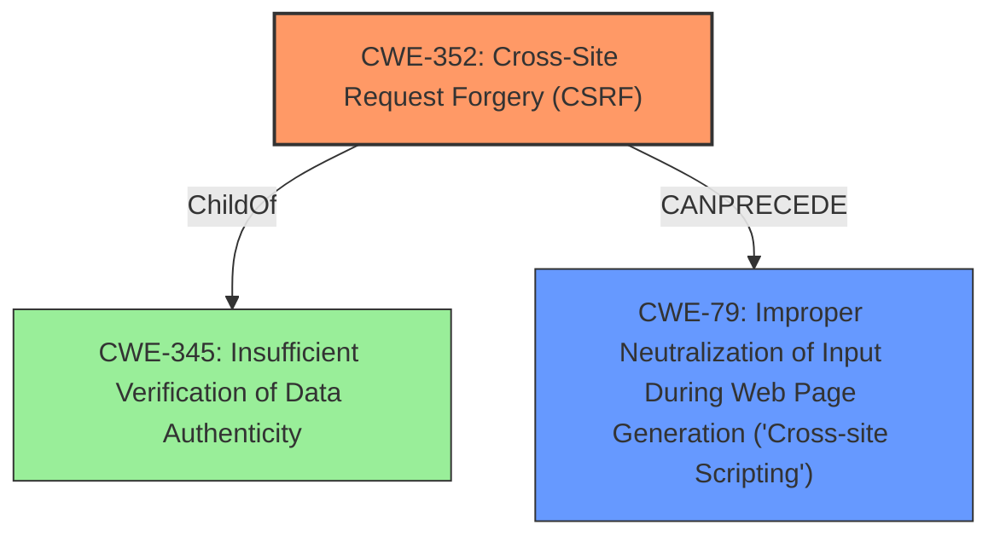

# Analysis Report for CVE-2022-38075

# Vulnerability Analysis Report: CVE-2022-38075

## Description


## Analysis (with Relationship Data)

# Summary
| CWE ID | CWE Name | Confidence | CWE Abstraction Level | CWE Vulnerability Mapping Label | CWE-Vulnerability Mapping Notes |
|---|---|---|---|---|---|
| CWE-352 | Cross-Site Request Forgery (CSRF) | 1.0 | Compound | Allowed | Primary CWE |
| CWE-79 | Improper Neutralization of Input During Web Page Generation ('Cross-site Scripting') | 0.9 | Base | Allowed | Secondary CWE |

## Evidence and Confidence

*   **Confidence Score:** 0.95
*   **Evidence Strength:** HIGH

## Relationship Analysis
The primary weakness is CWE-352, Cross-Site Request Forgery (CSRF), which directly addresses the **lack of CSRF protection**. The secondary weakness is CWE-79, Improper Neutralization of Input During Web Page Generation ('Cross-site Scripting'), representing the impact of the CSRF vulnerability which leads to Stored Cross-Site Scripting (XSS). CWE-352 is a compound weakness, meaning it's composed of multiple underlying issues. While CWE-79 is a base level weakness. CWE-352 can lead to CWE-79 because an attacker can use CSRF to trick a user into performing actions that inject malicious scripts.



## Vulnerability Chain
The vulnerability chain starts with the **lack of CSRF protection** (CWE-352). This allows an attacker to trick a user into performing actions they did not intend to, which leads to Stored Cross-Site Scripting (XSS) (CWE-79).
  - The root cause is **lack of CSRF protection**.
  - The weakness that followed is Stored Cross-Site Scripting (XSS) (CWE-79).

## Summary of Analysis
The vulnerability description clearly states a Cross-Site Request Forgery (CSRF) vulnerability leading to Stored Cross-Site Scripting (XSS).

The **Vulnerability Description Key Phrases** section indicates:
  - **rootcause:** **lack of CSRF protection**
  - **impact:** cross-site scripting

The **CVE Reference Links Content Summary** section confirms:
  - "Root cause of vulnerability": "The Mantenimiento web WordPress plugin (versions <= 0.13) is vulnerable to Cross-Site Request Forgery (CSRF)."
  - "Weaknesses/vulnerabilities present": "Cross-Site Request Forgery (CSRF)"
  - "Impact of exploitation": "A malicious actor could force higher privileged users to execute unwanted actions under their current authentication."

Based on this evidence, the primary CWE is CWE-352 (Cross-Site Request Forgery). The subsequent Stored Cross-Site Scripting (XSS) is best represented by CWE-79. The relationship between these two is that the **lack of CSRF protection** allows for actions to be performed by an attacker through a victim user, where one possible action is the injection of a script, leading to XSS.

CWE-352 is a compound weakness, which is appropriate as it describes a combination of factors that lead to the vulnerability. CWE-79 is a base level weakness, representing the specific impact of the injected script.

Other CWEs Considered:
- CWE-116: Improper Encoding or Escaping of Output - While XSS often involves improper encoding, the primary issue here is the CSRF vulnerability that allows the injection to occur in the first place.
- CWE-434: Unrestricted Upload of File with Dangerous Type - This is not relevant as the vulnerability doesn't involve file uploads.
- CWE-89: Improper Neutralization of Special Elements used in an SQL Command ('SQL Injection') - This is not relevant as the vulnerability doesn't involve SQL injection.
- CWE-94: Improper Control of Generation of Code ('Code Injection') - Not as specific as XSS (CWE-79) for the described impact.

Relevant CWE Information:

# Enhanced Context (25 CWEs)
The following CWEs were identified as potentially relevant to this vulnerability:

## CWE-601: URL Redirection to Untrusted Site ('Open Redirect')
**Abstraction Level**: Base
**Similarity Score**: 0.80
**Source**: dense

**Description**:
The web application accepts a user-controlled input that specifies a link to an external site, and uses that link in a redirect.

**Mapping Guidance**:
- Usage: Allowed
- Rationale: This CWE entry is at the Base level of abstraction, which is a preferred level of abstraction for mapping to the root causes of vulnerabilities.


## CWE-74: Improper Neutralization of Special Elements in Output Used by a Downstream Component ('Injection')
**Abstraction Level**: Class
**Similarity Score**: 0.77
**Source**: dense

**Description**:
The product constructs all or part of a command, data structure, or record using externally-influenced input from an upstream component, but it does not neutralize or incorrectly neutralizes special elements that could modify how it is parsed or interpreted when it is sent to a downstream component.

**Mapping Guidance**:
- Usage: Discouraged
- Rationale: CWE-74 is high-level and often misused when lower-level weaknesses are more appropriate.


## CWE-41: Improper Resolution of Path Equivalence
**Abstraction Level**: Base
**Similarity Score**: 0.77
**Source**: dense

**Description**:
The product is vulnerable to file system contents disclosure through path equivalence. Path equivalence involves the use of special characters in file and directory names. The associated manipulations are intended to generate multiple names for the same object.

**Mapping Guidance**:
- Usage: Allowed
- Rationale: This CWE entry is at the Base level of abstraction, which is a preferred level of abstraction for mapping to the root causes of vulnerabilities.


## CWE-80: Improper Neutralization of Script-Related HTML Tags in a Web Page (Basic XSS)
**Abstraction Level**: Variant
**Similarity Score**: 0.76
**Source**: dense

**Description**:
The product receives input from an upstream component, but it does not neutralize or incorrectly neutralizes special characters such as "<", ">", and "&" that could be interpreted as web-scripting elements when they are sent to a downstream component that processes web pages.

**Mapping Guidance**:
- Usage: Allowed
- Rationale: This CWE entry is at the Variant level of abstraction, which is a preferred level of abstraction for mapping to the root causes of vulnerabilities.


## CWE-472: External Control of Assumed-Immutable Web Parameter
**Abstraction Level**: Base
**Similarity Score**: 0.76
**Source**: dense

**Description**:
The web application does not sufficiently verify inputs that are assumed to be immutable but are actually externally controllable, such as hidden form fields.

**Mapping Guidance**:
- Usage: Allowed
- Rationale: This CWE entry is at the Base level of abstraction, which is a preferred level of abstraction for mapping to the root causes of vulnerabilities.


## CWE-425: Direct Request ('Forced Browsing')
**Abstraction Level**: Base
**Similarity Score**: 0.76
**Source**: dense

**Description**:
The web application does not adequately enforce appropriate authorization on all restricted URLs, scripts, or files.

**Mapping Guidance**:
- Usage: Allowed
- Rationale: This CWE entry is at the Base level of abstraction, which is a preferred level of abstraction for mapping to the root causes of vulnerabilities.


## CWE-184: Incomplete List of Disallowed Inputs
**Abstraction Level**: Base
**Similarity Score**: 0.76
**Source**: dense

**Description**:
The product implements a protection mechanism that relies on a list of inputs (or properties of inputs) that are not allowed by policy or otherwise require other action to neutralize before additional processing takes place, but the list is incomplete.

**Mapping Guidance**:
- Usage: Allowed
- Rationale: This CWE entry is at the Base level of abstraction, which is a preferred level of abstraction for mapping to the root causes of vulnerabilities.


## CWE-610: Externally Controlled Reference to a Resource in Another Sphere
**Abstraction Level**: Class
**Similarity Score**: 0.75
**Source**: dense

**Description**:
The product uses an externally controlled name or reference that resolves to a resource that is outside of the intended control sphere.

**Mapping Guidance**:
- Usage: Discouraged
- Rationale: This CWE entry is a level-1 Class (i.e., a child of a Pillar). It might have lower


## CWE Relationship Analysis

Current CWEs represent these abstraction levels: .


### Vulnerability Chain Analysis

**Chain starting from CWE-89:**
- 89 (Improper Neutralization of Special Elements used in an SQL Command ('SQL Injection')) - ROOT


**Chain starting from CWE-601:**
- 601 (URL Redirection to Untrusted Site ('Open Redirect')) - ROOT


### CWE Relationship Diagram

```mermaid
graph TD
    classDef primary fill:#f96,stroke:#333,stroke-width:2px
    classDef secondary fill:#69f,stroke:#333
    classDef tertiary fill:#9e9,stroke:#333
```


*Report generated on 2025-03-30 17:38:34*
