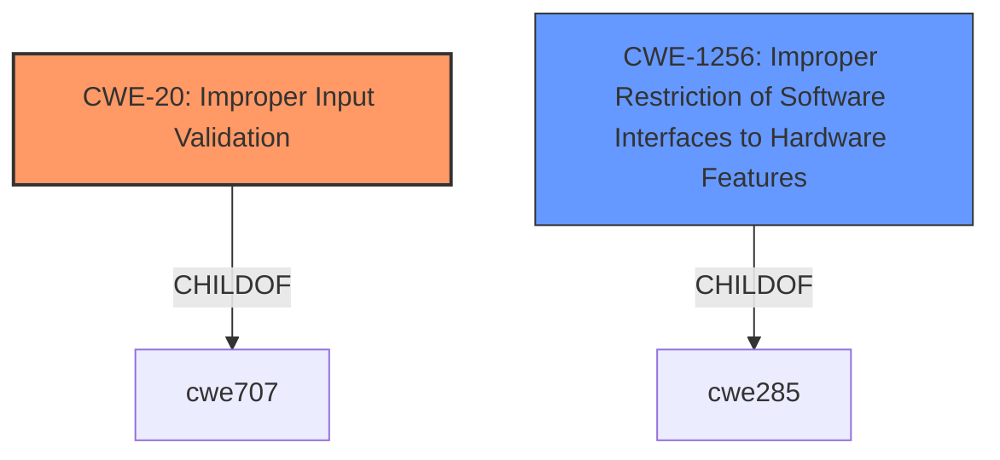

# Analysis for CVE-2022-38099

# Summary

| CWE ID | CWE Name | Confidence | CWE Abstraction Level | CWE Vulnerability Mapping Label | CWE-Vulnerability Mapping Notes |
|---|---|---|---|---|---|
| CWE-20 | Improper Input Validation | 0.9 | Class | Primary CWE | Discouraged |
| CWE-1256 | Improper Restriction of Software Interfaces to Hardware Features | 0.7 | Base | Secondary Candidate | Allowed |

## Evidence and Confidence

*   **Confidence Score:** 0.9
*   **Evidence Strength:** HIGH

## Relationship Analysis
The primary relationship impacting the CWE selection is the parent-child relationship. Specifically, CWE-20 [Improper Input Validation] is a class-level CWE. The retriever results suggest that a more specific child of CWE-20 would be more appropriate. However, given the details provided, CWE-20 is the most fitting. CWE-1256 [Improper Restriction of Software Interfaces to Hardware Features] is a base-level CWE which is appropriate, but the description and observed examples only partially fit the Vulnerability Description.

## Vulnerability Chain
The vulnerability chain starts with the **improper input validation** (CWE-20) in the BIOS firmware, which leads to the potential for privilege escalation.
  - Root Cause: **Improper Input Validation** (CWE-20)
  - Impact: Escalation of Privilege

## Summary of Analysis
The initial assessment identified **Improper Input Validation** as the root cause based on the "Vulnerability Description Key Phrases" and "CVE Reference Links Content Summary".

The "Vulnerability Description Key Phrases" section states:
- **rootcause:** **Improper input validation**
- **impact:** escalation of privilege

The "CVE Reference Links Content Summary" section supports this by stating:
- **Root Cause of Vulnerability:**
  - **Improper input validation** in the BIOS firmware of some Intel NUC 11 Compute Elements.
- **Impact of Exploitation:**
  - Successful exploitation could lead to privilege escalation, allowing a privileged user to gain higher-level control over the system.

While CWE-20 [Improper Input Validation] is a class-level CWE and the mapping guidance discourages its use when more specific CWEs are available, it remains the most accurate representation of the **root cause** given the available information. The vulnerability stems from the BIOS firmware's failure to adequately validate input, which subsequently allows a privileged user to escalate their privileges. This aligns with the general description of CWE-20.

I also considered CWE-1256 [Improper Restriction of Software Interfaces to Hardware Features], since the vulnerability occurs in the BIOS firmware, which is a software interface to the hardware. However, the description of CWE-1256 focuses on power and clock management, hardware memory or register bits modification, or the ability to observe physical side channels. While privilege escalation could involve these, the provided description doesn't explicitly mention these aspects. So, it's a possible secondary candidate.

Therefore, the selection of CWE-20 [Improper Input Validation] is based on the evidence of **improper input validation** being the **root cause** of the vulnerability, with a confidence score of 0.9.

Relevant CWE Information:

# Enhanced Context (25 CWEs)
The following CWEs were identified as potentially relevant to this vulnerability:

## CWE-1220: Insufficient Granularity of Access Control
**Abstraction Level**: Base
**Similarity Score**: 0.76
**Source**: dense
**Description**:
The product implements access controls via a policy or other feature with the intention to disable or restrict accesses (reads and/or writes) to assets in a system from untrusted agents. However, implemented access controls lack required granularity, which renders the control policy too broad because it allows accesses from unauthorized agents to the security-sensitive assets.
**Why Not Used:** This vulnerability involves **improper input validation**, not necessarily an issue with the granularity of access controls. While the impact is privilege escalation, the root cause is the lack of validation.

## CWE-653: Improper Isolation or Compartmentalization
**Abstraction Level**: Class
**Similarity Score**: 0.76
**Source**: dense
**Description**:
The product does not properly compartmentalize or isolate functionality, processes, or resources that require different privilege levels, rights, or permissions.
**Why Not Used:** The description doesn't explicitly state an issue with isolation or compartmentalization.

## CWE-691: Insufficient Control Flow Management
**Abstraction Level**: Pillar
**Similarity Score**: 0.76
**Source**: dense
**Description**:
The code does not sufficiently manage its control flow during execution, creating conditions in which the control flow can be modified in unexpected ways.
**Why Not Used:** The retriever results list CWE-691 [Insufficient Control Flow Management], but it is a very high-level (Pillar) CWE and the mapping guidance discourages its use. Furthermore, the vulnerability description focuses on **improper input validation**, not control flow management.

## CWE-1289: Improper Validation of Unsafe Equivalence in Input
**Abstraction Level**: Base
**Similarity Score**: 0.75
**Source**: dense
**Description**:
The product receives an input value that is used as a resource identifier or other type of reference, but it does not validate or incorrectly validates that the input is equivalent to a potentially-unsafe value.
**Why Not Used:** This is related to **improper input validation**, but the unsafe equivalence description is not present.

## CWE-274: Improper Handling of Insufficient Privileges
**Abstraction Level**: Base
**Similarity Score**: 0.75
**Source**: dense
**Description**:
The product does not handle or incorrectly handles when it has insufficient privileges to perform an operation, leading to resultant weaknesses.
**Why Not Used:** The vulnerability description highlights **improper input validation**, not the handling of insufficient privileges.

## CWE-807: Reliance on Untrusted Inputs in a Security Decision
**Abstraction Level**: Base
**Similarity Score**: 0.75
**Source**: dense
**Description**:
The product uses a protection mechanism that relies on the existence or values of an input, but the input can be modified by an untrusted actor in a way that bypasses the protection mechanism.
**Why Not Used:** This is related to **improper input validation**, but the protection mechanism description is not present.

## CWE-280: Improper Handling of Insufficient Permissions or Privileges 
**Abstraction Level**: Base
**Similarity Score**: 0.74
**Source**: dense
**Description**:
The product does not handle or incorrectly handles when it has insufficient privileges to access resources or functionality as specified by their permissions. This may cause it to follow unexpected code paths that may leave the product in an invalid state.
**Why Not Used:** The vulnerability description highlights **improper input validation**, not the handling of insufficient permissions or privileges.

## CWE-664: Improper Control of a Resource Through its Lifetime
**Abstraction Level**: Pillar
**Similarity Score**: 0.74
**Source**: dense
**Description**:
The product does not maintain or incorrectly maintains control over a resource throughout its lifetime of creation, use, and release.
**Why Not Used:** This is too high-level and doesn't directly apply to the **improper input validation** issue.

## CWE-183: Permissive List of Allowed Inputs
**Abstraction Level**: Base
**Similarity Score**: 0.73
**Source**: dense
**Description**:
The product implements a protection mechanism that relies on a list of inputs (or properties of inputs) that are explicitly allowed by policy because the inputs are assumed to be safe, but the list is too permissive - that is, it allows an input that is unsafe, leading to resultant weaknesses.
**Why Not Used:** The vulnerability description doesn't explicitly mention a permissive list of allowed inputs.

## CWE-657: Violation of Secure Design Principles
**Abstraction Level**: Class
**Similarity Score**: 0.73
**Source**: dense
**Description**:
The product violates well-established principles for secure design.
**Why Not Used:** Too generic. The root cause is **improper input validation**.

## CWE-190: Integer Overflow or Wraparound
**Abstraction Level**: Base
**Similarity Score**: 7286.02
**Source**: sparse
**Description**:
The product performs a calculation that can produce an integer overflow or wraparound when the logic assumes that the resulting value will always be larger than the original value.
**Why Not Used:** There is no mention of integer overflow or wraparound.

## CWE-119: Improper Restriction of Operations within the Bounds of a Memory Buffer
**Abstraction Level**: Class
**Similarity Score**: 7071.