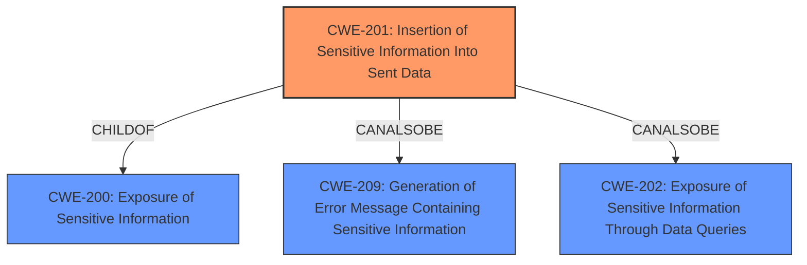

# Enhanced Analysis for CVE-2022-38113

# Summary
| CWE ID | CWE Name | Confidence | CWE Abstraction Level | CWE Vulnerability Mapping Label | CWE-Vulnerability Mapping Notes |
|---|---|---|---|---|---|
| CWE-201 | Insertion of Sensitive Information Into Sent Data | 0.9 | Base | Allowed | Primary CWE |

## Evidence and Confidence

*   **Confidence Score:** 0.9
*   **Evidence Strength:** HIGH

## Relationship Analysis
The analysis focuses on the direct match of the vulnerability to **CWE-201** (Insertion of Sensitive Information Into Sent Data), a Base-level CWE. While other CWEs like **CWE-550** (Server-generated Error Message Containing Sensitive Information) and **CWE-497** (Exposure of Sensitive System Information to an Unauthorized Control Sphere) were considered due to their relevance to information exposure, **CWE-201** best captures the **root cause**, which is the **insertion** of sensitive build and service versions into the server response header. The relationships like *CanAlsoBe* for **CWE-201** with **CWE-202** (Exposure of Sensitive Information Through Data Queries) were reviewed but deemed less specific than the direct data insertion aspect.



## Vulnerability Chain
The vulnerability chain is relatively straightforward:

1.  **Root Cause:** Inclusion of sensitive version information in the server response.
2.  **Weakness:** **Insertion of Sensitive Information Into Sent Data (CWE-201)**.
3.  **Impact:** Disclosure of build and services versions to potential attackers, aiding in identifying and exploiting known vulnerabilities.

## Summary of Analysis
The primary assessment is based on the provided vulnerability description and the corresponding "CVE Reference Links Content Summary". The evidence explicitly states that the "**Root cause of vulnerability:** The vulnerability stems from the server's response headers disclosing build and service versions." This directly aligns with **CWE-201** (Insertion of Sensitive Information Into Sent Data), where the server is transmitting data (response headers) containing sensitive information (build and service versions) to another actor (client/attacker).

The retriever results further support this, with **CWE-201** being ranked highest. The relationship graph reinforces that **CWE-201** is a child of **CWE-200** (Exposure of Sensitive Information), which is a broader category. However, **CWE-201** is more specific because it identifies the mechanism: **insertion of the sensitive information**.

The decision to select **CWE-201** is based on its direct match to the vulnerability's root cause and mechanism, aligning with MITRE's mapping guidance for selecting the most specific and relevant CWE.

**CWE-550** (Server-generated Error Message Containing Sensitive Information) and **CWE-497** (Exposure of Sensitive System Information to an Unauthorized Control Sphere) were considered, but the vulnerability is not specifically related to error messages (as in **CWE-550**) nor does it expose system-level information beyond the software versions (as required by **CWE-497**). Therefore, **CWE-201** is the optimal choice.


## CWE Relationship Analysis

Current CWEs represent these abstraction levels: .


### Vulnerability Chain Analysis

**Chain starting from CWE-201:**
- 201 (Insertion of Sensitive Information Into Sent Data) - ROOT


**Chain starting from CWE-200:**
- 200 (Exposure of Sensitive Information to an Unauthorized Actor) - ROOT


### CWE Relationship Diagram

```mermaid
graph TD
    classDef primary fill:#f96,stroke:#333,stroke-width:2px
    classDef secondary fill:#69f,stroke:#333
    classDef tertiary fill:#9e9,stroke:#333
```