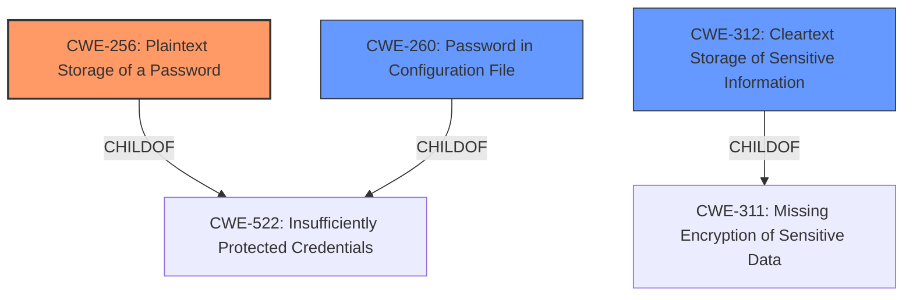

# Analysis for CVE-2022-38121

# Summary
| CWE ID | CWE Name | Confidence | CWE Abstraction Level | CWE Vulnerability Mapping Label | CWE-Vulnerability Mapping Notes |
|---|---|---|---|---|---|
| CWE-256 | Plaintext Storage of a Password | 1.0 | Base | Allowed | Primary CWE |
| CWE-260 | Password in Configuration File | 0.9 | Base | Allowed | Secondary Candidate |
| CWE-312 | Cleartext Storage of Sensitive Information | 0.8 | Base | Allowed | Secondary Candidate |

## Evidence and Confidence

*   **Confidence Score:** 0.9
*   **Evidence Strength:** HIGH

## Relationship Analysis
The primary CWE is CWE-256, which is a Base level CWE. CWE-256 is a child of CWE-522 (Insufficiently Protected Credentials), which is a Class level CWE. CWE-260 (Password in Configuration File) is also a child of CWE-522, making it a peer of CWE-256. CWE-312 (Cleartext Storage of Sensitive Information) is a child of CWE-311 (Missing Encryption of Sensitive Data), a Class level CWE. The selection of CWE-256 is based on the specific detail of the password being stored in plaintext.

## Vulnerability Chain
The vulnerability chain starts with the **password stored in plaintext**, leading to the **access of all users and administrators account names and passwords**.

## Summary of Analysis
The analysis is based on the evidence provided in the vulnerability description and the CVE Reference Links Content Summary, which clearly states that "UPSMON PRO configuration file stores user password in plaintext" and "Plaintext storage of credentials." The retriever results also support the selection of CWE-256 (Plaintext Storage of a Password), CWE-260 (Password in Configuration File), and CWE-312 (Cleartext Storage of Sensitive Information).

The graph relationships show that CWE-256 and CWE-260 are both children of CWE-522, indicating that they are more specific types of insufficiently protected credentials. CWE-312 is a child of CWE-311, which is a more general category of missing encryption of sensitive data.

The selected CWEs are at the optimal level of specificity because they accurately reflect the root cause of the vulnerability, which is the storage of passwords in plaintext within a configuration file.

Relevant CWE Information:

# Enhanced Context (25 CWEs)

## CWE-256: Plaintext Storage of a Password
**Abstraction:** Base
**Status:** Incomplete

### Description
Storing a **password in plaintext** may result in a system compromise.

### Extended Description
Password management issues occur when a **password is stored in plaintext** in an application's properties, configuration file, or memory. **Storing a plaintext password** in a configuration file allows anyone who can read the file access to the password-protected resource. In some contexts, even storage of a **plaintext password** in memory is considered a security risk if the **password is not cleared** immediately after it is used.

### Alternative Terms
None

### Relationships
ChildOf -> CWE-522

### Mapping Guidance
**Usage:** Allowed
**Rationale:** This CWE entry is at the Base level of abstraction, which is a preferred level of abstraction for mapping to the root causes of vulnerabilities.
**Comments:** Carefully read both the name and description to ensure that this mapping is an appropriate fit. Do not try to 'force' a mapping to a lower-level Base/Variant simply to comply with this preferred level of abstraction.
**Reasons:**
- Acceptable-Use

### Observed Examples
- **CVE-2022-30275:** Remote Terminal Unit (RTU) uses a driver that relies on a **password stored in plaintext**.

## CWE-260: Password in Configuration File
**Abstraction:** Base
**Status:** Incomplete

### Description
The product stores a password in a configuration file that might be accessible to actors who do not know the password.

### Extended Description
This can result in compromise of the system for which the password is used. An attacker could gain access to this file and learn the stored password or worse yet, change the password to one of their choosing.

### Alternative Terms
None

### Relationships
ChildOf -> CWE-522

### Mapping Guidance
**Usage:** Allowed
**Rationale:** This CWE entry is at the Base level of abstraction, which is a preferred level of abstraction for mapping to the root causes of vulnerabilities.
**Comments:** Carefully read both the name and description to ensure that this mapping is an appropriate fit. Do not try to 'force' a mapping to a lower-level Base/Variant simply to comply with this preferred level of abstraction.
**Reasons:**
- Acceptable-Use

### Observed Examples
- **CVE-2022-38665:** A continuous delivery pipeline management tool stores an unencypted password in a configuration file.

## CWE-312: Cleartext Storage of Sensitive Information
**Abstraction:** Base
**Status:** Draft

### Description
The product stores sensitive information in cleartext within a resource that might be accessible to another control sphere.

### Extended Description
Because the information is stored in cleartext (i.e., unencrypted), attackers could potentially read it. Even if the information is encoded in a way that is not human-readable, certain techniques could determine which encoding is being used, then decode the information.

When organizations adopt cloud services, it can be easier for attackers to access the data from anywhere on the Internet.

In some systems/environments such as cloud, the use of "double encryption" (at both the software and hardware layer) might be required, and the developer might be solely responsible for both layers, instead of shared responsibility with the administrator of the broader system/environment.

### Alternative Terms
None

### Relationships
ChildOf -> CWE-311
ChildOf -> CWE-311
ChildOf -> CWE-922

### Mapping Guidance
**Usage:** Allowed
**Rationale:** This CWE entry is at the Base level of abstraction, which is a preferred level of abstraction for mapping to the root causes of vulnerabilities.
**Comments:** Carefully read both the name and description to ensure that this mapping is an appropriate fit. Do not try to 'force' a mapping to a lower-level Base/Variant simply to comply with this preferred level of abstraction.
**Reasons:**
- Acceptable-Use

### Additional Notes
**[Terminology]** Different people use "cleartext" and "plaintext" to mean the same thing: the lack of encryption. However, within cryptography, these have more precise meanings. Plaintext is the information just before it is fed into a cryptographic algorithm, including already-encrypted text. Cleartext is any information that is unencrypted, although it might be in an encoded form that is not easily human-readable (such as base64 encoding).

### Observed Examples
- **CVE-2022-30275:** Remote Terminal Unit (RTU) uses a driver that relies on a **password stored in plaintext**.

I am confident in this assessment because the vulnerability description explicitly states that the password is stored in plaintext, which aligns perfectly with the definition of CWE-256. The mapping guidance for CWE-256 also supports its selection, as it is a Base level CWE and is allowed for use in mapping vulnerabilities. CWE-260 is a good secondary candidate, since the password was stored in a configuration file, but is less specific that the primary CWE. CWE-312 is a good secondary candidate because plaintext storage is mentioned.