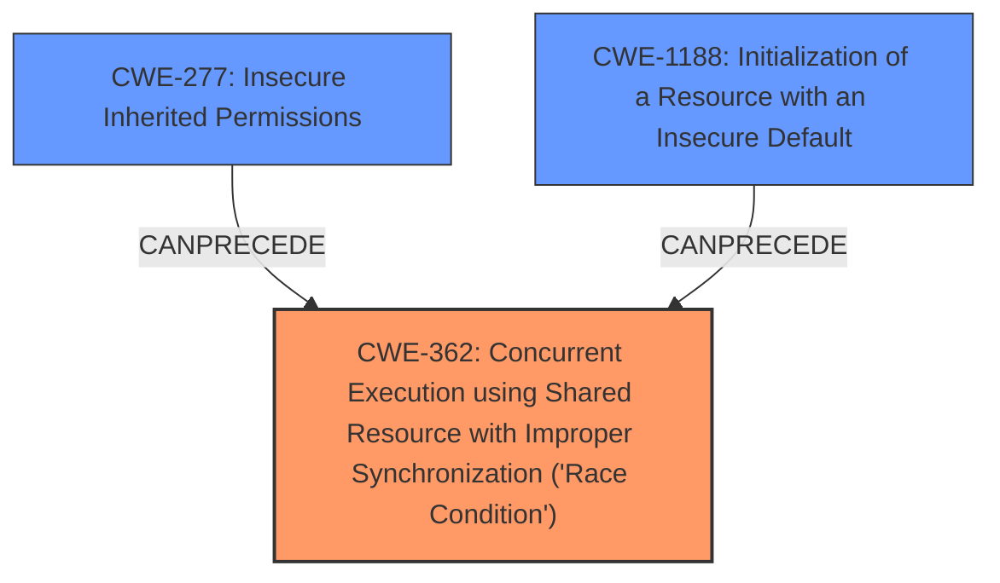

# Analysis for CVE-2022-38170

# Summary
| CWE ID | CWE Name | Confidence | CWE Abstraction Level | CWE Vulnerability Mapping Label | CWE-Vulnerability Mapping Notes |
|---|---|---|---|---|---|
| CWE-362 | Concurrent Execution using Shared Resource with Improper Synchronization ('Race Condition') | 0.9 | Class | Allowed-with-Review | Primary CWE. Matches the **race condition** weakness.  |
| CWE-277 | Insecure Inherited Permissions | 0.8 | Variant | Allowed | Secondary CWE.  The **insecure umask** is the root cause that leads to insecure permissions. |
| CWE-1188 | Initialization of a Resource with an Insecure Default | 0.7 | Base | Allowed | Secondary CWE. The **insecure umask** represents an insecure default setting. |

## Evidence and Confidence

*   **Confidence Score:** 0.8
*   **Evidence Strength:** HIGH

## Relationship Analysis
The primary weakness is a race condition (CWE-362), which is a Class-level CWE. The root cause is an insecure umask, which leads to insecure inherited permissions (CWE-277). Also, the insecure umask can be considered an insecure default (CWE-1188).

## Vulnerability Chain
The vulnerability chain starts with the **insecure umask** configuration, which leads to a **race condition** where world-writable files can be created. This allows local users to expose arbitrary file contents via the webserver.
  - Insecure umask (CWE-277, CWE-1188) -> Race condition (CWE-362) -> Arbitrary file exposure

## Summary of Analysis
The initial analysis identified a **race condition** (CWE-362) and an **insecure umask**. The description states, "an **insecure umask** was configured... which could result in a **race condition** giving world-writable files... and allowing local users to expose arbitrary file contents."

The retriever results listed CWE-362 as the top candidate. CWE-362 is a Class, and the mapping guidance suggests examining children for a better fit, but none of the children seem more appropriate. The next best match is CWE-277 Insecure Inherited Permissions and CWE-1188 Initialization of a Resource with an Insecure Default, both of which apply to the **insecure umask** root cause.

The evidence supports mapping both the **race condition** and the **insecure umask** to their respective CWEs. The **insecure umask** is the root cause that enables the race condition, leading to the impact.

The selected CWEs are at the optimal level of specificity. CWE-362 is a Class, but no more specific child CWE applies. CWE-277 and CWE-1188 are both Base, which is appropriate for the root cause.

Relevant CWE Information:
# Enhanced Context (25 CWEs)
The following CWEs were identified as potentially relevant to this vulnerability:

## CWE-59: Improper Link Resolution Before File Access ('Link Following')
Was considered but determined not applicable. There's no mention of symbolic links or link following in the vulnerability description.

## CWE-427: Uncontrolled Search Path Element
Was considered but determined not applicable. The vulnerability does not involve manipulating search paths.

## CWE-73: External Control of File Name or Path
Was considered but determined not applicable. The vulnerability doesn't involve external control of file names or paths.

## CWE-367: Time-of-check Time-of-use (TOCTOU) Race Condition
Was considered but determined not applicable. While the vulnerability includes a race condition, it's not specifically a TOCTOU race condition.

## CWE-552: Files or Directories Accessible to External Parties
Was considered but determined not applicable. While the impact is file exposure, the root cause is not directly related to making files accessible to external parties, but rather the insecure permissions and race condition leading to world-writable files.

## CWE-426: Untrusted Search Path
Was considered but determined not applicable. Similar to CWE-427, this vulnerability doesn't involve untrusted search paths.

## CWE-41: Improper Resolution of Path Equivalence
Was considered but determined not applicable. The vulnerability doesn't involve path equivalence issues.

## CWE-23: Relative Path Traversal
Was considered but determined not applicable. The vulnerability doesn't involve path traversal issues.

## CWE-362: Concurrent Execution using Shared Resource with Improper Synchronization ('Race Condition')
This CWE was selected as the primary CWE.

## CWE-667: Improper Locking
Was considered but determined not applicable. The vulnerability doesn't explicitly mention issues with locking mechanisms.

## CWE-427: Uncontrolled Search Path Element
Was considered but determined not applicable. The vulnerability does not involve manipulating search paths.

## CWE-59: Improper Link Resolution Before File Access ('Link Following')
Was considered but determined not applicable. There's no mention of symbolic links or link following in the vulnerability description.

## CWE-367: Time-of-check Time-of-use (TOCTOU) Race Condition
Was considered but determined not applicable. While the vulnerability includes a race condition, it's not specifically a TOCTOU race condition.

## CWE-362: Concurrent Execution using Shared Resource with Improper Synchronization ('Race Condition')
This CWE was selected as the primary CWE.

## CWE-732: Incorrect Permission Assignment for Critical Resource
Was considered, however, CWE-277 more directly applies to the insecure inherited permissions issue from the insecure umask.

## CWE-476: NULL Pointer Dereference
Was considered but determined not applicable. There's no mention of null pointer dereferences in the vulnerability description.

## CWE-363: Race Condition Enabling Link Following
Was considered but determined not applicable. There's no mention of symbolic links or link following in the vulnerability description.

## CWE-98: Improper Control of Filename for Include/Require Statement in PHP Program ('PHP Remote File Inclusion')
Was considered but determined not applicable. The vulnerability doesn't involve PHP file inclusion issues.

## CWE-416: Use After Free
Was considered but determined not applicable. There's no mention of use-after-free issues in the vulnerability description.

## CWE-73: External Control of File Name or Path
Was considered but determined not applicable. The vulnerability doesn't involve external control of file names or paths.

## CWE-386: Symbolic Name not Mapping to Correct Object
Was considered but determined not applicable. The vulnerability doesn't involve symbolic name mapping issues.

## CWE-59: Improper Link Resolution Before File Access ('Link Following')
Was considered but determined not applicable. There's no mention of symbolic links or link following in the vulnerability description.

## CWE-364: Signal Handler Race Condition
Was considered but determined not applicable. The vulnerability doesn't involve signal handler race conditions.

## CWE-609: Double-Checked Locking
Was considered but determined not applicable. The vulnerability doesn't involve double-checked locking issues.

## CWE-1265: Unintended Reentrant Invocation of Non-reentrant Code Via Nested Calls
Was considered but determined not applicable. The vulnerability doesn't involve reentrant invocation issues.