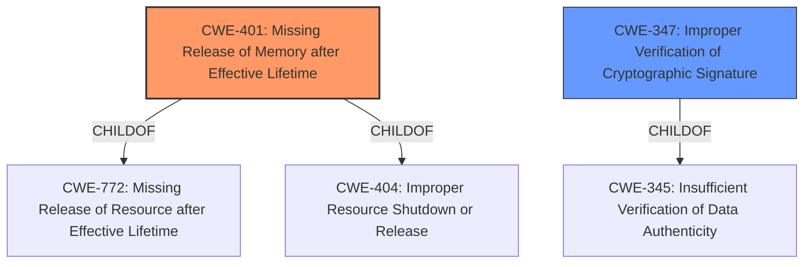

# Analysis for CVE-2022-38177

# Summary
| CWE ID  | CWE Name                                                    | Confidence | CWE Abstraction Level | CWE Vulnerability Mapping Label | CWE-Vulnerability Mapping Notes |
| :-------- | :---------------------------------------------------------- | :--------- | :---------------------- | :------------------------------ | :------------------------------ |
| CWE-401   | Missing Release of Memory after Effective Lifetime       | 1.0        | Variant               | Primary                         | Allowed                       |
| CWE-347   | Improper Verification of Cryptographic Signature          | 0.7        | Base                  | Secondary                       | Allowed                       |

## Evidence and Confidence

*   **Confidence Score:** 0.85
*   **Evidence Strength:** HIGH

## Relationship Analysis
The primary CWE, CWE-401 [Missing Release of Memory after Effective Lifetime], is a variant-level CWE that accurately describes the memory leak caused by the **malformed ECDSA signature**. It is a child of CWE-772 [Missing Release of Resource after Effective Lifetime] and CWE-404 [Improper Resource Shutdown or Release].

CWE-347 [Improper Verification of Cryptographic Signature] is a base-level CWE which is considered as a secondary issue. It is a child of CWE-345 [Insufficient Verification of Data Authenticity].

## Vulnerability Chain
The vulnerability chain starts with the attacker spoofing the resolver with responses containing a **malformed ECDSA signature**. This leads to the **improper handling or lack of verification of the signature** and subsequently results in a **memory leak**, eventually causing a denial of service due to resource exhaustion.

1.  Attacker sends spoofed response with **malformed ECDSA signature**.
2.  Improper or missing verification of the cryptographic signature (CWE-347).
3.  Memory is allocated but not released (CWE-401).
4.  Gradual memory erosion leads to denial of service.

## Summary of Analysis
The initial assessment, supported by the "CWE for similar CVE Descriptions" and "Retriever Results," points to CWE-401 [Missing Release of Memory after Effective Lifetime] as the primary weakness. The "Vulnerability Description" clearly states that the **malformed ECDSA signature** triggers a **memory leak**, which aligns directly with the description of CWE-401: "The product does not sufficiently track and release allocated memory after it has been used, which slowly consumes remaining memory." The CVE Reference Links Content Summary confirms this: "Memory leak in the ECDSA DNSSEC verification code."

CWE-347 [Improper Verification of Cryptographic Signature] is considered as a secondary CWE. It is the **malformed ECDSA signature** that leads to the memory leak.

The selection of CWE-401 [Missing Release of Memory after Effective Lifetime] as the primary CWE and CWE-347 [Improper Verification of Cryptographic Signature] as secondary is based on the evidence provided and their respective descriptions. Both CWEs are at appropriate levels of specificity (Variant and Base, respectively).

Relevant CWE Information:

# Enhanced Context (25 CWEs)
The following CWEs were identified as potentially relevant to this vulnerability:

## CWE-703: Improper Check or Handling of Exceptional Conditions
**Abstraction Level**: Pillar
**Similarity Score**: 0.78
**Source**: dense

**Description**:
The product does not properly anticipate or handle exceptional conditions that rarely occur during normal operation of the product.

**Mapping Guidance**:
- Usage: Discouraged
- Rationale: This CWE entry is extremely high-level, a Pillar.

*Not Selected:* This is a high-level CWE and not specific to the vulnerability.

## CWE-226: Sensitive Information in Resource Not Removed Before Reuse
**Abstraction Level**: Base
**Similarity Score**: 0.78
**Source**: dense

**Description**:
The product releases a resource such as memory or a file so that it can be made available for reuse, but it does not clear or "zeroize" the information contained in the resource before the product performs a critical state transition or makes the resource available for reuse by other entities.

**Mapping Guidance**:
- Usage: Allowed
- Rationale: This CWE entry is at the Base level of abstraction, which is a preferred level of abstraction for mapping to the root causes of vulnerabilities.

*Not Selected:* This CWE is not relevant as the memory is not being reused.

## CWE-404: Improper Resource Shutdown or Release
**Abstraction Level**: Class
**Similarity Score**: 0.77
**Source**: dense

**Description**:
The product does not release or incorrectly releases a resource before it is made available for re-use.

**Mapping Guidance**:
- Usage: Allowed-with-Review
- Rationale: This CWE entry is a Class and might have Base-level children that would be more appropriate

*Not Selected:* CWE-401 [Missing Release of Memory after Effective Lifetime] is a child of this CWE and is a better fit for the description.

## CWE-754: Improper Check for Unusual or Exceptional Conditions
**Abstraction Level**: Class
**Similarity Score**: 0.77
**Source**: dense

**Description**:
The product does not check or incorrectly checks for unusual or exceptional conditions that are not expected to occur frequently during day to day operation of the product.

**Mapping Guidance**:
- Usage: Allowed-with-Review
- Rationale: This CWE entry is a Class and might have Base-level children that would be more appropriate

*Not Selected:* Too generic and doesn't directly relate to memory management.

## CWE-617: Reachable Assertion
**Abstraction Level**: Base
**Similarity Score**: 0.76
**Source**: dense

**Description**:
The product contains an assert() or similar statement that can be triggered by an attacker, which leads to an application exit or other behavior that is more severe than necessary.

**Mapping Guidance**:
- Usage: Allowed
- Rationale: This CWE entry is at the Base level of abstraction, which is a preferred level of abstraction for mapping to the root causes of vulnerabilities.

*Not Selected:* Not relevant; the vulnerability doesn't involve assertions.

## CWE-667: Improper Locking
**Abstraction Level**: Class
**Similarity Score**: 0.76
**Source**: dense

**Description**:
The product does not properly acquire or release a lock on a resource, leading to unexpected resource state changes and behaviors.

**Mapping Guidance**:
- Usage: Allowed-with-Review
- Rationale: This CWE entry is a Class and might have Base-level children that would be more appropriate

*Not Selected:* Not relevant; the vulnerability doesn't involve locking mechanisms.

## CWE-1289: Improper Validation of Unsafe Equivalence in Input
**Abstraction Level**: Base
**Similarity Score**: 0.76
**Source**: dense

**Description**:
The product receives an input value that is used as a resource identifier or other type of reference, but it does not validate or incorrectly validates that the input is equivalent to a potentially-unsafe value.

**Mapping Guidance**:
- Usage: Allowed
- Rationale: This CWE entry is at the Base level of abstraction, which is a preferred level of abstraction for mapping to the root causes of vulnerabilities.

*Not Selected:* Not directly related to the core issue of memory leakage.

## CWE-131: Incorrect Calculation of Buffer Size
**Abstraction Level**: Base
**Similarity Score**: 0.76
**Source**: dense

**Description**:
The product does not correctly calculate the size to be used when allocating a buffer, which could lead to a buffer overflow.

**Mapping Guidance**:
- Usage: Allowed
- Rationale: This CWE entry is at the Base level of abstraction, which is a preferred level of abstraction for mapping to the root causes of vulnerabilities.

*Not Selected:* While this can lead to memory issues, the core problem here is not the calculation of buffer size but the failure to release allocated memory.

## CWE-252: Unchecked Return Value
**Abstraction Level**: Base
**Similarity Score**: 0.75
**Source**: dense

**Description**:
The product does not check the return value from a method or function, which can prevent it from detecting unexpected states and conditions.

**Mapping Guidance**:
- Usage: Allowed
- Rationale: This CWE entry is at the Base level of abstraction, which is a preferred level of abstraction for mapping to the root causes of vulnerabilities