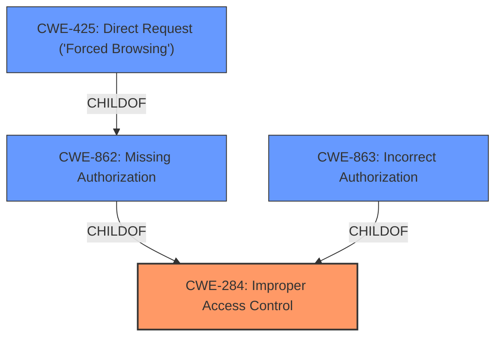

# Enhanced Analysis for CVE-2022-38184

# Summary
| CWE ID  | CWE Name                                                                 | Confidence | CWE Abstraction Level | CWE Vulnerability Mapping Label | CWE-Vulnerability Mapping Notes |
| :-------- | :----------------------------------------------------------------------- | :---------- | :---------------------- | :------------------------------ | :------------------------------ |
| CWE-284 | Improper Access Control                                                  | 0.9         | Pillar                  | Primary                         | Discouraged                     |
| CWE-425 | Direct Request ('Forced Browsing')                                     | 0.7         | Base                    | Secondary                       | Allowed                         |
| CWE-862 | Missing Authorization                                                  | 0.6         | Base                    | Secondary                       | Allowed |
| CWE-863 | Incorrect Authorization                                                  | 0.6         | Class                    | Secondary                       | Allowed-with-Review |

## Evidence and Confidence

*   **Confidence Score:** 0.9
*   **Evidence Strength:** HIGH

## Relationship Analysis
The primary CWE is CWE-284, which is a high-level category. More specific CWEs like CWE-425, CWE-862, and CWE-863 are related and provide more detail. CWE-425 (Direct Request) is a child of CWE-862 (Missing Authorization), suggesting that the vulnerability involves directly accessing resources without proper checks. CWE-863 (Incorrect Authorization) is a sibling to CWE-862, indicating a related authorization issue. Given the **improper access control** rootcause, starting with the high-level CWE-284 and then considering its more specific children and siblings provides a comprehensive classification. The abstraction levels range from Pillar (CWE-284) to Base (CWE-425 and CWE-862) and Class (CWE-863), showing a progression from general to specific.



## Vulnerability Chain
The vulnerability chain starts with the **improper access control**, leading to a missing or incorrect authorization check, and culminating in the ability to read arbitrary URLs.

1.  **Root Cause:** **Improper Access Control** (CWE-284)
2.  **Weakness:** Missing or Incorrect Authorization (CWE-862, CWE-863)
3.  **Weakness:** Direct Request (CWE-425)
4.  **Impact:** Read arbitrary URLs

## Summary of Analysis
The initial analysis identified **improper access control** as the root cause, supported by the vulnerability description and CVE reference summary. The analysis then considered more specific CWEs related to authorization and direct requests. The graph relationships guided the selection of CWEs, showing how the high-level **improper access control** leads to more specific authorization issues. The final selection includes CWE-284 as the primary, with CWE-425, CWE-862 and CWE-863 as secondary CWEs to provide more specific details about the vulnerability.

The vulnerability description states: "There is an **improper access control** vulnerability in Portal for ArcGIS versions 10.8.1 and below which could allow a remote, unauthenticated attacker to access an API that may induce Esri Portal for ArcGIS to read arbitrary URLs."

The CVE Reference Links Content Summary states:
"Root Cause of Vulnerability:
- Improper access control.

Weaknesses/Vulnerabilities Present:
- The vulnerability is an **improper access control** issue in Portal for ArcGIS.
- This allows an unauthenticated attacker to access an API."

The selected CWEs are at the optimal level of specificity, balancing the need for a comprehensive classification with the desire to avoid overly broad or generic mappings.

Relevant CWE Information:

*   **CWE-284: Improper Access Control** - The vulnerability stems from a failure to properly restrict access to resources, which aligns with the description of the vulnerability in Portal for ArcGIS. It is a Pillar level CWE, but it's being used because it's explicitly called out in the vulnerability description. MITRE discourages using CWE-284.
*   **CWE-425: Direct Request ('Forced Browsing')** - This CWE describes a scenario where the application does not adequately enforce authorization on all restricted URLs, which is consistent with the ability to access an API and induce the system to read arbitrary URLs. This is a Base level CWE.
*   **CWE-862: Missing Authorization** - This CWE describes a scenario where a system does not perform authorization checks when an actor attempts to access a resource. This is a Base level CWE.
*   **CWE-863: Incorrect Authorization** - This CWE describes a scenario where a system performs an authorization check, but it does not correctly perform the check. This is a Class level CWE.

CWE-287 (Improper Authentication) was considered but not used because the vulnerability is primarily about access control after a user (or lack thereof) has been authenticated, rather than the authentication process itself.


## CWE Relationship Analysis

Current CWEs represent these abstraction levels: .


### Vulnerability Chain Analysis

**Chain starting from CWE-862:**
- 862 (Missing Authorization) - ROOT


**Chain starting from CWE-425:**
- 425 (Direct Request ('Forced Browsing')) - ROOT


### CWE Relationship Diagram

```mermaid
graph TD
    classDef primary fill:#f96,stroke:#333,stroke-width:2px
    classDef secondary fill:#69f,stroke:#333
    classDef tertiary fill:#9e9,stroke:#333
```