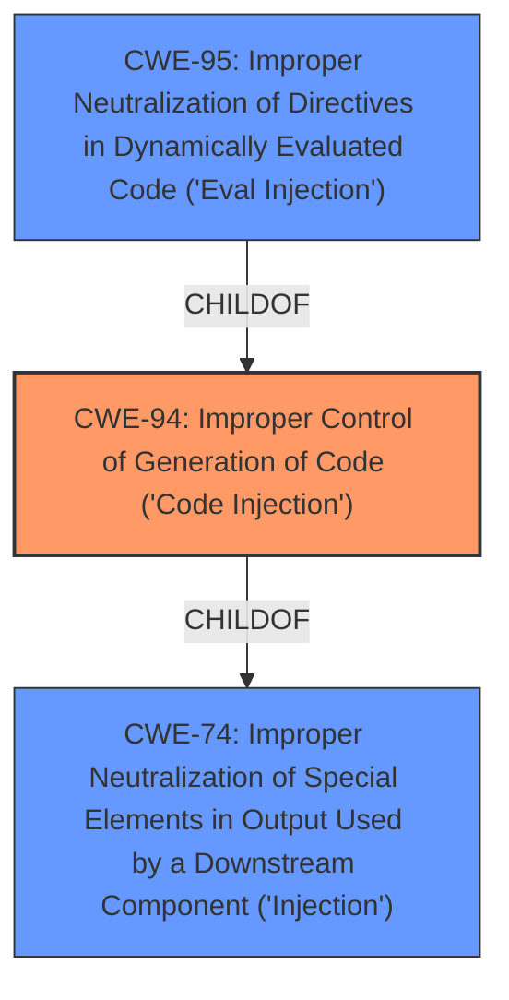

# Analysis Report for CVE-2022-38193

# Vulnerability Analysis Report: CVE-2022-38193

## Description


## Analysis (with Relationship Data)

# Summary
| CWE ID | CWE Name | Confidence | CWE Abstraction Level | CWE Vulnerability Mapping Label | CWE-Vulnerability Mapping Notes |
|---|---|---|---|---|---|
| CWE-94 | Improper Control of Generation of Code ('Code Injection') | 0.9 | Base | Allowed-with-Review | Primary CWE |
| CWE-95 | Improper Neutralization of Directives in Dynamically Evaluated Code ('Eval Injection') | 0.7 | Variant | Allowed | Secondary Candidate |

## Evidence and Confidence

*   **Confidence Score:** 0.8
*   **Evidence Strength:** HIGH

## Relationship Analysis
The primary relationship impacting the CWE selection is that CWE-95 is a variant of CWE-94. Both relate to code injection, but CWE-95 focuses on the use of `eval()` or similar functions to dynamically execute code. CWE-94 is broader and more general, encompassing any form of code generation with improper neutralization. Given that the vulnerability description specifies **code injection** and **arbitrary code execution**, and the "CVE Reference Links Content Summary" mentions "Improper handling of user-supplied input, leading to code injection," CWE-94 is a strong initial candidate. If the application uses `eval()` then CWE-95 would be more appropriate, but since we don't have that information, CWE-94 is the better choice.



## Vulnerability Chain
The vulnerability chain begins with the application's **improper handling of user-supplied input**. This leads to **code injection**, which then results in **arbitrary code execution**.

Improper Input Handling -> Code Injection (CWE-94) -> Arbitrary Code Execution

## Summary of Analysis
The initial assessment identified CWE-94 as the most relevant CWE based on the vulnerability description and the "CVE Reference Links Content Summary". The description explicitly states a **code injection** vulnerability that may allow a remote, unauthenticated attacker to pass strings which could potentially cause arbitrary code execution. The summary states that the root cause is a code injection vulnerability due to improper handling of user-supplied input, leading to arbitrary code execution.

CWE-94 (Improper Control of Generation of Code ('Code Injection')) aligns directly with the identified weakness. It describes a scenario where a product constructs a code segment using externally-influenced input but fails to neutralize special elements that could modify the code's syntax or behavior. This aligns with the vulnerability description which states that an attacker can pass strings that could cause arbitrary code execution. The usage is "Allowed-with-Review" since it is frequently misused, but it is being used correctly here since the product is constructing a code segment.

CWE-95 (Improper Neutralization of Directives in Dynamically Evaluated Code ('Eval Injection')) was considered as a more specific variant of CWE-94, focusing on the use of `eval()` or similar functions. However, the provided information does not explicitly confirm the use of `eval()`. Therefore, while CWE-95 remains a possible classification, CWE-94 is more appropriate given the available evidence.

CWE-74 (Improper Neutralization of Special Elements in Output Used by a Downstream Component ('Injection')) is a class-level CWE that is the parent of CWE-94. It is too general and does not describe the specific vulnerability as accurately as CWE-94.

The selection of CWE-94 is at the optimal level of specificity because it directly addresses the **code injection** aspect of the vulnerability, which is explicitly mentioned in both the vulnerability description and the "CVE Reference Links Content Summary". While more specific information about the injection mechanism (e.g., the use of `eval()`) could lead to a more precise classification (CWE-95), the current evidence supports CWE-94 as the most accurate representation of the vulnerability.


## CWE Relationship Analysis

Current CWEs represent these abstraction levels: .


### Vulnerability Chain Analysis

**Chain starting from CWE-94:**
- 94 (Improper Control of Generation of Code ('Code Injection')) - ROOT


**Chain starting from CWE-74:**
- 74 (Improper Neutralization of Special Elements in Output Used by a Downstream Component ('Injection')) - ROOT


### CWE Relationship Diagram

```mermaid
graph TD
    classDef primary fill:#f96,stroke:#333,stroke-width:2px
    classDef secondary fill:#69f,stroke:#333
    classDef tertiary fill:#9e9,stroke:#333
```


*Report generated on 2025-03-30 23:53:16*
