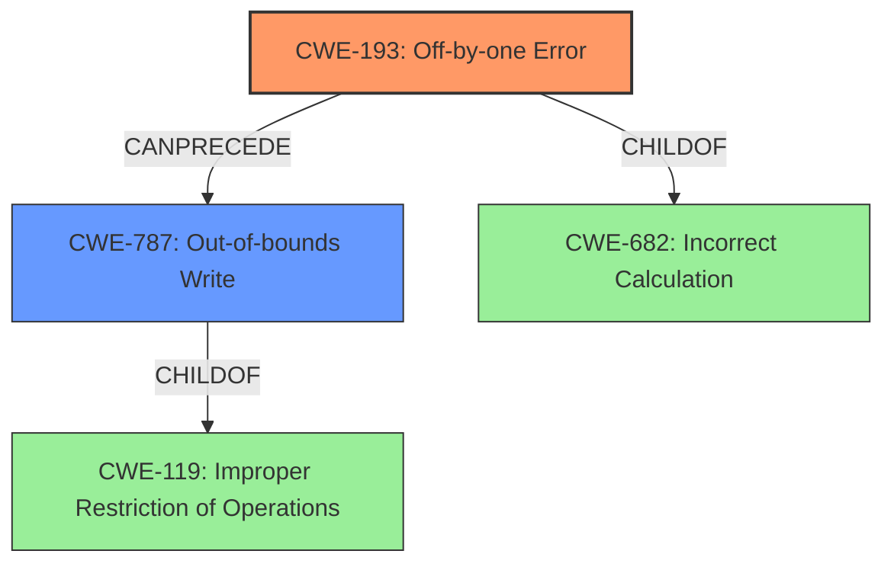

# Analysis Report for CVE-2022-3821

# Vulnerability Analysis Report: CVE-2022-3821

## Description


## Analysis (with Relationship Data)

# Summary
| CWE ID | CWE Name | Confidence | CWE Abstraction Level | CWE Vulnerability Mapping Label | CWE-Vulnerability Mapping Notes |
|---|---|---|---|---|---|
| CWE-193 | Off-by-one Error | 0.9 | Base | Allowed | Primary CWE |
| CWE-787 | Out-of-bounds Write | 0.8 | Base | Allowed | Secondary CWE |

## Evidence and Confidence

*   **Confidence Score:** 0.85
*   **Evidence Strength:** HIGH

## Relationship Analysis
The primary weakness is an **off-by-one error** (CWE-193) which is a base level CWE and a child of CWE-682 (Incorrect Calculation). This leads to an **out-of-bounds write** (CWE-787) which is a base level CWE and child of CWE-119 (Improper Restriction of Operations within the Bounds of a Memory Buffer). CWE-193 can precede CWE-119, showing how the off-by-one error can lead to a buffer overflow.



## Vulnerability Chain
The vulnerability chain starts with an **off-by-one error** (CWE-193) in the `format_timespan()` function, leading to an **out-of-bounds write** (CWE-787), which causes a denial of service (DoS).

## Summary of Analysis
The initial assessment identifies an **off-by-one error** leading to a **buffer overrun** and a denial of service.

The vulnerability description states: "An **off-by-one Error** issue was discovered in Systemd in format_timespan() function of time-util.c. An attacker could supply specific values for time and accuracy that leads to **buffer overrun** in format_timespan(), leading to a Denial of Service."

The CVE Reference Links Content Summary states:
- "**Root cause of vulnerability:** An off-by-one error exists in the `format_timespan()` function within the `time-util.c` file of the systemd project."
- "**Weaknesses/vulnerabilities present:** Buffer Overflow: The `format_timespan()` function calculates the number of bytes it will write to a buffer incorrectly, which leads to writing beyond the bounds of the provided buffer, resulting in a buffer overflow. Specifically, the line `n = MIN((size_t) k, l);` where `n` becomes the size of buffer `l`, followed by `p += n;` will cause `p` to point one byte after the buffer `buf`, which then leads to an overwrite when null-terminating with `*p=0;`"
- "**Off-by-one Error:** The core issue is that the code allows `p` to be incremented to point beyond the end of the buffer, and then attempts to write a null terminator at that out-of-bounds location."

Based on the evidence, CWE-193 (Off-by-one Error) and CWE-787 (Out-of-bounds Write) are the most appropriate CWEs.

CWE-193 is selected as the primary CWE because the root cause of the vulnerability is the **off-by-one error** in the calculation of the buffer size. This error allows the code to write one byte beyond the intended boundary of the buffer.

CWE-787 is selected as a secondary CWE because the **off-by-one error** directly leads to an out-of-bounds write, causing a buffer overflow.

The selected CWEs are at the optimal level of specificity because they accurately represent the root cause and resulting weakness of the vulnerability.


## CWE Relationship Analysis

Current CWEs represent these abstraction levels: .


### Vulnerability Chain Analysis

**Chain starting from CWE-787:**
- 787 (Out-of-bounds Write) - ROOT


**Chain starting from CWE-682:**
- 682 (Incorrect Calculation) - ROOT


### CWE Relationship Diagram

```mermaid
graph TD
    classDef primary fill:#f96,stroke:#333,stroke-width:2px
    classDef secondary fill:#69f,stroke:#333
    classDef tertiary fill:#9e9,stroke:#333
```


*Report generated on 2025-03-30 11:15:55*
