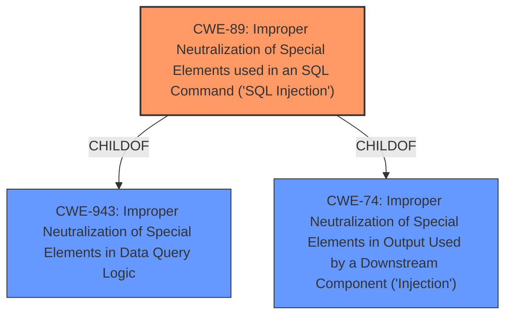

# Analysis Report for CVE-2022-3825

# Vulnerability Analysis Report: CVE-2022-3825

## Description


## Analysis (with Relationship Data)

# Summary
| CWE ID | CWE Name | Confidence | CWE Abstraction Level | CWE Vulnerability Mapping Label | CWE-Vulnerability Mapping Notes |
|---|---|---|---|---|---|
| CWE-89 | Improper Neutralization of Special Elements used in an SQL Command ('SQL Injection') | 1.0 | Base | Allowed | Primary CWE |

## Evidence and Confidence

*   **Confidence Score:** 1.0
*   **Evidence Strength:** HIGH

## Relationship Analysis
The primary relationship influencing the decision is the ChildOf relationship between CWE-89 and its parents, such as CWE-943 and CWE-74. While CWE-74 is a more general "Injection" class, CWE-89 provides the specificity needed for this SQL injection vulnerability. No other relationships significantly influence the final classification, as the focus remains on the direct **root cause** of the vulnerability.



## Vulnerability Chain
The vulnerability chain is straightforward:
1.  **Root Cause:** Improper neutralization of special elements in the `login` argument leading to **SQL injection**.
2.  **Impact:** Potential compromise of confidentiality, integrity, and availability of the system.

## Summary of Analysis
The primary basis for this assessment is the clear evidence provided in the vulnerability description and the CVE Reference Links Content Summary. The **Vulnerability Description** indicates that manipulating the `login` argument leads to **SQL injection**. The **CVE Reference Links Content Summary** explicitly states, "The product constructs an SQL command using externally-influenced input from the `login` argument without proper sanitization, leading to SQL injection," and identifies "SQL injection vulnerability (CWE-89)."

The graph relationships reinforce the selection of CWE-89. While other CWEs like CWE-74 (Improper Neutralization of Special Elements in Output Used by a Downstream Component ('Injection')) were considered, CWE-89 provides the most specific and accurate representation of the vulnerability.

The selected CWE is at the optimal level of specificity because it directly addresses the **root cause** of the **SQL injection** vulnerability, which is the improper neutralization of special elements used in an SQL command.

Relevant CWE Information:

# Enhanced Context (25 CWEs)

## CWE-89: Improper Neutralization of Special Elements used in an SQL Command ('SQL Injection')
**Abstraction:** Base
**Status:** Stable

### Description
The product constructs all or part of an SQL command using externally-influenced input from an upstream component, but it does not neutralize or incorrectly neutralizes special elements that could modify the intended SQL command when it is sent to a downstream component. Without sufficient removal or quoting of SQL syntax in user-controllable inputs, the generated SQL query can cause those inputs to be interpreted as SQL instead of ordinary user data.

### Extended Description
Not provided

### Alternative Terms
SQL injection: a common attack-oriented phrase
SQLi: a common abbreviation for "SQL injection"

### Relationships
ChildOf -> CWE-943
ChildOf -> CWE-74

### Mapping Guidance
**Usage:** Allowed
**Rationale:** This CWE entry is at the Base level of abstraction, which is a preferred level of abstraction for mapping to the root causes of vulnerabilities.
**Comments:** Carefully read both the name and description to ensure that this mapping is an appropriate fit. Do not try to 'force' a mapping to a lower-level Base/Variant simply to comply with this preferred level of abstraction.
**Reasons:**
- Acceptable-Use


### Additional Notes
**[Relationship]** SQL injection can be resultant from special character mismanagement, MAID, or denylist/allowlist problems. It can be primary to authentication errors.

### Observed Examples
- **CVE-2023-32530:** SQL injection in security product dashboard using crafted certificate fields
- **CVE-2021-42258:** SQL injection in time and billing software, as exploited in the wild per CISA KEV.
- **CVE-2021-27101:** SQL injection in file-transfer system via a crafted Host header, as exploited in the wild per CISA KEV.

## CWE-74: Improper Neutralization of Special Elements in Output Used by a Downstream Component ('Injection')
**Abstraction Level**: Class
The product constructs all or part of a command, data structure, or record using externally-influenced input from an upstream component, but it does not neutralize or incorrectly neutralizes special elements that could modify how it is parsed or interpreted when it is sent to a downstream component.
**Rationale:** CWE-74 is high-level and often misused when lower-level weaknesses are more appropriate.

## CWE-79: Improper Neutralization of Input During Web Page Generation ('Cross-site Scripting')
**Abstraction Level**: Base
The product does not neutralize or incorrectly neutralizes user-controllable input before it is placed in output that is used as a web page that is served to other users.
**Rationale:** Though present in the retriever results, it is not relevant since the **vulnerability** is **SQL Injection** and not Cross-site Scripting.

## CWE-434: Unrestricted Upload of File with Dangerous Type
**Abstraction Level**: Base
The product allows the upload or transfer of dangerous file types that are automatically processed within its environment.
**Rationale:** Though present in the retriever results, it is not relevant since the **vulnerability** is **SQL Injection** and not related to unrestricted file uploads.

## CWE-1336: Improper Neutralization of Special Elements Used in a Template Engine
**Abstraction Level**: Base
The product uses a template engine to insert or process externally-influenced input, but it does not neutralize or incorrectly neutralizes special elements or syntax that can be interpreted as template expressions or other code directives when processed by the engine.
**Rationale:** Though present in the retriever results, it is not relevant since the **vulnerability** is **SQL Injection** and not template injection.


## CWE Relationship Analysis

Current CWEs represent these abstraction levels: .


### Vulnerability Chain Analysis

**Chain starting from CWE-89:**
- 89 (Improper Neutralization of Special Elements used in an SQL Command ('SQL Injection')) - ROOT


**Chain starting from CWE-434:**
- 434 (Unrestricted Upload of File with Dangerous Type) - ROOT


### CWE Relationship Diagram

```mermaid
graph TD
    classDef primary fill:#f96,stroke:#333,stroke-width:2px
    classDef secondary fill:#69f,stroke:#333
    classDef tertiary fill:#9e9,stroke:#333
```


*Report generated on 2025-03-30 21:26:41*
