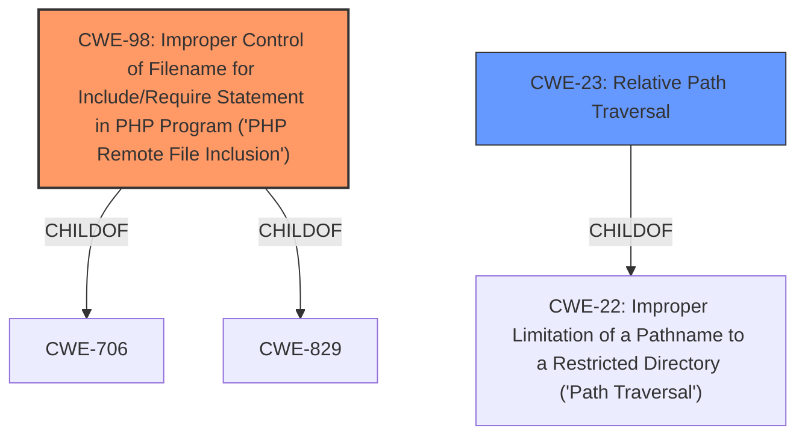

# Analysis Report for CVE-2022-38258

# Vulnerability Analysis Report: CVE-2022-38258

## Description


## Analysis (with Relationship Data)

# Summary
| CWE ID | CWE Name | Confidence | CWE Abstraction Level | CWE Vulnerability Mapping Label | CWE-Vulnerability Mapping Notes |
|---|---|---|---|---|---|
| CWE-98 | Improper Control of Filename for Include/Require Statement in PHP Program ('PHP Remote File Inclusion') | 0.9 | Variant | Allowed | Primary CWE |
| CWE-23 | Relative Path Traversal | 0.7 | Base | Allowed | Secondary Candidate |

## Evidence and Confidence

*   **Confidence Score:** 0.8
*   **Evidence Strength:** HIGH

## Relationship Analysis
The primary CWE selected is CWE-98, which is a Variant of CWE-706 and CWE-829. CWE-23 is a base CWE and a child of CWE-22.


## Vulnerability Chain
The vulnerability chain starts with **Improper Control of Filename** which leads to **Local File Inclusion (LFI)**. An attacker can then leverage this to achieve **Denial of Service (DoS)** or **access sensitive server information**.

## Summary of Analysis
The initial assessment focused on the **local file inclusion (LFI)** vulnerability, driven by the ability to manipulate the `getpage` parameter. The primary candidate, CWE-98, aligns closely with the description of **improper control of filename** in PHP include/require statements. The evidence is strong, stemming from the vulnerability description and the CVE reference summary.

The choice of CWE-98 is further supported by the "Retriever Results," where it is listed as the top candidate. While other CWEs like CWE-23 (Relative Path Traversal) were considered, CWE-98 more accurately captures the specific nature of the vulnerability, involving the **improper control of filenames** used in include/require statements, rather than just general path traversal. The extended description of CWE-98 includes the phrase "Local file inclusion", making it a strong match.

```
"A local file inclusion (LFI) vulnerability in D-Link DIR 819 v1.06 allows attackers to cause a Denial of Service (DoS) or access sensitive server information via manipulation of the getpage parameter in a crafted web request."
```

CWE-23 (Relative Path Traversal) was considered because the CVE summary indicates that the `WEB_DisplayPage` function is vulnerable to path traversal via the `getpage` parameter, allowing access to files outside the intended `/usr/www/html` directory. This aligns with the description of CWE-23, which involves **improper neutralization of sequences like ".." that can resolve to locations outside the restricted directory.** This is a valid secondary CWE since it provides more context.

The selection of CWE-98 and CWE-23 is based on the provided evidence and their descriptions, ensuring the chosen CWEs are at the optimal level of specificity.
Relevant CWE Information:

# Enhanced Context (25 CWEs)

## CWE-98: Improper Control of Filename for Include/Require Statement in PHP Program ('PHP Remote File Inclusion')
**Abstraction:** Variant
**Status:** Draft

### Description
The PHP application receives input from an upstream component, but it does not restrict or incorrectly restricts the input before its usage in "require," "include," or similar functions.

## CWE-23: Relative Path Traversal
**Abstraction:** Base
**Status:** Draft

### Description
The product uses external input to construct a pathname that should be within a restricted directory, but it does not properly neutralize sequences such as ".." that can resolve to a location that is outside of that directory.


## CWE Relationship Analysis

Current CWEs represent these abstraction levels: .


### Vulnerability Chain Analysis

**Chain starting from CWE-706:**
- 706 (Use of Incorrectly-Resolved Name or Reference) - ROOT


**Chain starting from CWE-98:**
- 98 (Improper Control of Filename for Include/Require Statement in PHP Program ('PHP Remote File Inclusion')) - ROOT


### CWE Relationship Diagram

```mermaid
graph TD
    classDef primary fill:#f96,stroke:#333,stroke-width:2px
    classDef secondary fill:#69f,stroke:#333
    classDef tertiary fill:#9e9,stroke:#333
```


*Report generated on 2025-03-31 05:08:53*
