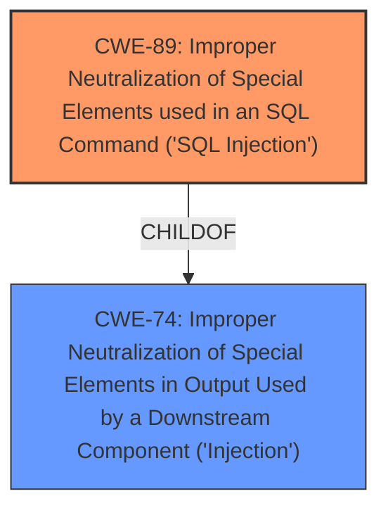

# Enhanced Analysis for CVE-2022-3827

# Summary
| CWE ID | CWE Name | Confidence | CWE Abstraction Level | CWE Vulnerability Mapping Label | CWE-Vulnerability Mapping Notes |
|---|---|---|---|---|---|
| CWE-89 | Improper Neutralization of Special Elements used in an SQL Command ('SQL Injection') | 1.0 | Base | Allowed | Primary CWE: The vulnerability is due to **lack of sanitization** of the `cg_id` argument leading to SQL injection. |

## Evidence and Confidence

*   **Confidence Score:** 1.0
*   **Evidence Strength:** HIGH

## Relationship Analysis
The primary relationship is that CWE-89 (SQL Injection) is a child of CWE-74 (Improper Neutralization of Special Elements in Output Used by a Downstream Component ('Injection')). This parent-child relationship reflects that SQL injection is a specific type of injection vulnerability. While CWE-74 is a higher-level class, CWE-89 provides a more precise description of the vulnerability.



## Vulnerability Chain
The vulnerability chain starts with the **lack of sanitization** of the `cg_id` argument. This leads directly to the **SQL injection** vulnerability, which can allow an attacker to gain unauthorized access to the database.

## Summary of Analysis
The analysis is based on the provided evidence, which clearly indicates an SQL injection vulnerability due to the **lack of sanitization** of the `cg_id` argument in the `formContactGroup.php` file. The CVE Reference Links Content Summary confirms that the original code used direct SQL queries with string concatenation, making it vulnerable to SQL injection.

The relationship graph shows that CWE-89 is a specific type of injection (CWE-74).

The selection of CWE-89 is at the optimal level of specificity because it directly addresses the root cause of the vulnerability, which is the **improper neutralization** of special elements used in an SQL command. The description states that the `$cg_id` variable was directly inserted into the SQL query without proper sanitization. The patch addresses this by using prepared statements with parameterized queries.

The evidence from the "CVE Reference Links Content Summary" section is very strong:
- "The original code used a direct SQL query with string concatenation, making it vulnerable to SQL injection. Specifically, the `$cg_id` variable was directly inserted into the SQL query without proper sanitization."
- "$DBRESULT = $pearDB->query("SELECT * FROM `contactgroup` WHERE `cg_id` = '" . $cg_id . "' LIMIT 1");"
- "An attacker could manipulate `$cg_id` to inject malicious SQL code, potentially leading to data breaches or unauthorized database operations."
- "The commit addresses the SQL injection vulnerability by using prepared statements with parameterized queries."

Other CWEs Considered:
- CWE-79 (Improper Neutralization of Input During Web Page Generation ('Cross-site Scripting')): While neutralization is a factor, the vulnerability is specifically related to SQL commands, not web page generation.
- CWE-74 (Improper Neutralization of Special Elements in Output Used by a Downstream Component ('Injection')): This is a parent class of CWE-89. Because SQL Injection is the specific issue, using CWE-89 is preferred.
- CWE-94 (Improper Control of Generation of Code ('Code Injection')): This CWE is too broad. The specific issue is SQL injection, not general code injection.


## CWE Relationship Analysis

Current CWEs represent these abstraction levels: .


### Vulnerability Chain Analysis

**Chain starting from CWE-89:**
- 89 (Improper Neutralization of Special Elements used in an SQL Command ('SQL Injection')) - ROOT


**Chain starting from CWE-94:**
- 94 (Improper Control of Generation of Code ('Code Injection')) - ROOT


### CWE Relationship Diagram

```mermaid
graph TD
    classDef primary fill:#f96,stroke:#333,stroke-width:2px
    classDef secondary fill:#69f,stroke:#333
    classDef tertiary fill:#9e9,stroke:#333
```