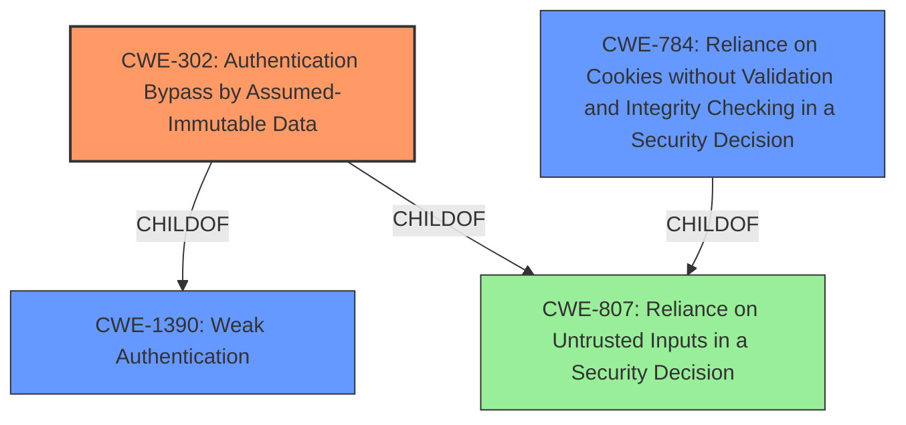

# Analysis Report for CVE-2022-38297

# Vulnerability Analysis Report: CVE-2022-38297

## Description


## Analysis (with Relationship Data)

# Summary
| CWE ID | CWE Name | Confidence | CWE Abstraction Level | CWE Vulnerability Mapping Label | CWE-Vulnerability Mapping Notes |
|---|---|---|---|---|---|
| CWE-302 | Authentication Bypass by Assumed-Immutable Data | 0.9 | Base | Allowed | Primary CWE |
| CWE-784 | Reliance on Cookies without Validation and Integrity Checking in a Security Decision | 0.7 | Variant | Allowed | Secondary Candidate |
| CWE-1390 | Weak Authentication | 0.6 | Class | Allowed-with-Review | Secondary Candidate |

## Evidence and Confidence

*   **Confidence Score:** 0.8
*   **Evidence Strength:** MEDIUM

## Relationship Analysis
The primary CWE is CWE-302, which is a Base-level weakness describing authentication bypass due to reliance on modifiable data. It is related to CWE-1390 (Weak Authentication) as a child. The secondary CWE, CWE-784, focuses on the specific case of relying on cookies without proper validation. This is also a variant of CWE-807. The hierarchical relationship shows that CWE-302 is more general and CWE-784 is a specific type of CWE-302 that relies on cookies.



## Vulnerability Chain
The vulnerability chain starts with the **authentication bypass** due to cookie poisoning. The server is **relying on cookies without validation**, allowing an attacker to modify the cookies and bypass authentication.

## Summary of Analysis
The initial analysis identified **authentication bypass** via cookie poisoning as the root cause. The subsequent analysis, including the retriever results, supports mapping this to CWE-302 (Authentication Bypass by Assumed-Immutable Data). The vulnerability description states, "UCMS v1.6.0 contains an **authentication bypass** vulnerability which is exploited via cookie poisoning." The CVE Reference Links Content Summary indicates "The root cause is a 'cookies poisoning attack vulnerability' affecting UCMS v1.6."

CWE-302 accurately captures the essence of the vulnerability, where the system assumes the immutability of cookie data used for authentication, which can be modified by an attacker. CWE-784 is a more specific variant of CWE-807 and a more specific type of the primary weakness.

The retriever also suggested CWE-1390 (Weak Authentication) which is a parent of CWE-302, but CWE-302 is more descriptive.

I am overriding the retriever which gave a higher rating to CWE-784, since the evidence points to the more general CWE-302.

Relevant CWE Information:

# Enhanced Context (25 CWEs)

## CWE-807: Reliance on Untrusted Inputs in a Security Decision
**Abstraction Level**: Base
**Similarity Score**: 0.78
**Source**: dense

**Description**:
The product uses a protection mechanism that relies on the existence or values of an input, but the input can be modified by an untrusted actor in a way that bypasses the protection mechanism.

**Mapping Guidance**:
- Usage: Allowed
- Rationale: This CWE entry is at the Base level of abstraction, which is a preferred level of abstraction for mapping to the root causes of vulnerabilities.

## CWE-784: Reliance on Cookies without Validation and Integrity Checking in a Security Decision
**Abstraction Level**: Variant
**Similarity Score**: 0.132
**Source**: sparse

**Description**:
The product uses a protection mechanism that relies on the existence or values of a cookie, but it does not properly ensure that the cookie is valid for the associated user.

**Mapping Guidance**:
- Usage: Allowed
- Rationale: This CWE entry is at the Variant level of abstraction, which is a preferred level of abstraction for mapping to the root causes of vulnerabilities.

### Explanation of Selected CWEs:

*   **CWE-302: Authentication Bypass by Assumed-Immutable Data**
    *   The vulnerability involves **authentication bypass** by manipulating cookies, which are assumed to be immutable for authentication purposes.
    *   The security implication is unauthorized access to the system.
    *   CWE-302 is a child of CWE-1390 (Weak Authentication) and CWE-807 (Reliance on Untrusted Inputs in a Security Decision).
    *   This is the primary weakness.
    *   MITRE mapping guidance ALLOWED.
*   **CWE-784: Reliance on Cookies without Validation and Integrity Checking in a Security Decision**
    *   The vulnerability involves a reliance on cookies for a security decision (authentication) without proper validation.
    *   The security implication is **authentication bypass** or privilege escalation.
    *   CWE-784 is a more specific case of CWE-807.
    *   This is a secondary candidate.
    *   MITRE mapping guidance ALLOWED.
*   **CWE-1390: Weak Authentication**
    *   The vulnerability involves a weakness in the authentication mechanism, allowing an attacker to bypass authentication.
    *   The security implication is unauthorized access to the system.
    *   CWE-1390 is a Class-level weakness, and CWE-302 is a more specific child.
    *   This is a secondary candidate.
    *   MITRE mapping guidance ALLOWED-WITH-REVIEW.

### Explanation of Other Considered CWEs:

*   **CWE-287: Improper Authentication** - This is a very general class and less descriptive than CWE-302 and therefore is not a good fit. The mapping guidance also discourages its use.
*   **CWE-798: Use of Hard-coded Credentials** - This doesn't apply as the vulnerability is related to cookie poisoning, not hard-coded credentials.
*   **CWE-113: Improper Neutralization of CRLF Sequences in HTTP Headers ('HTTP Request/Response Splitting')** - This is not relevant to cookie poisoning and **authentication bypass**.
*   **CWE-79: Improper Neutralization of Input During Web Page Generation ('Cross-site Scripting')** - This is not relevant to **authentication bypass** by cookie poisoning.
*   **CWE-425: Direct Request ('Forced Browsing')** - This is not relevant to **authentication bypass** by cookie poisoning.
*   **CWE-288: Authentication Bypass Using an Alternate Path or Channel** - This is not relevant to **authentication bypass** by cookie poisoning.
*   **CWE-138: Improper Neutralization of Special Elements** - This is a class and less descriptive than CWE-302 and therefore is not a good fit.
*   **CWE-41: Improper Resolution of Path Equivalence** - This is not relevant to **authentication bypass** by cookie poisoning.
*   **CWE-98: Improper Control of Filename for Include/Require Statement in PHP Program ('PHP Remote File Inclusion')** - This is not relevant to **authentication bypass** by cookie poisoning.
*   **CWE-259: Use of Hard-coded Password** - This doesn't apply as the vulnerability is related to cookie poisoning, not hard-coded credentials.
*   **CWE-471: Modification of Assumed-Immutable Data (MAID)** - While this CWE is similar, CWE-302 directly addresses the authentication bypass scenario, making it a more specific and accurate fit.
*   **CWE-494: Download of Code Without Integrity Check** - This is not relevant to **authentication bypass** by cookie poisoning.
*   **CWE-420: Unprotected Alternate Channel** - This is not relevant to **authentication bypass** by cookie poisoning.
*   **CWE-257: Storing Passwords in a Recoverable Format** - This is not relevant to **authentication bypass** by cookie poisoning.
*   **CWE-80: Improper Neutralization of Script-Related HTML Tags in a Web Page (Basic XSS)** - This is not relevant to **authentication bypass** by cookie poisoning.
*   **CWE-116: Improper Encoding or Escaping of Output** - This is not relevant to **authentication bypass** by cookie poisoning.
*   **CWE-451: User Interface (UI) Misrepresentation of Critical Information** -


## CWE Relationship Analysis

Current CWEs represent these abstraction levels: .


### Vulnerability Chain Analysis

**Chain starting from CWE-41:**
- 41 (Improper Resolution of Path Equivalence) - ROOT


**Chain starting from CWE-807:**
- 807 (Reliance on Untrusted Inputs in a Security Decision) - ROOT


### CWE Relationship Diagram

```mermaid
graph TD
    classDef primary fill:#f96,stroke:#333,stroke-width:2px
    classDef secondary fill:#69f,stroke:#333
    classDef tertiary fill:#9e9,stroke:#333
```


*Report generated on 2025-03-31 05:33:13*
