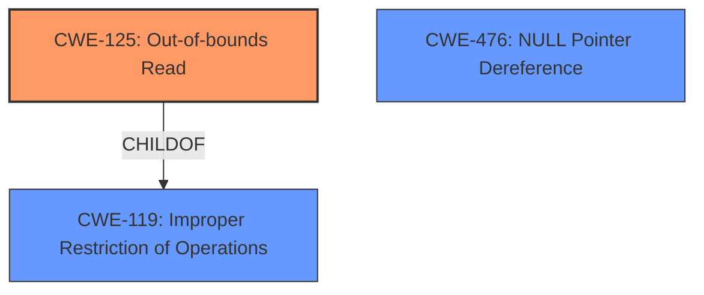

# Analysis Report for CVE-2022-38307

# Vulnerability Analysis Report: CVE-2022-38307

## Description


## Analysis (with Relationship Data)

# Summary
| CWE ID    | CWE Name                                                                   | Confidence | CWE Abstraction Level | CWE Vulnerability Mapping Label | CWE-Vulnerability Mapping Notes |
| --------- | -------------------------------------------------------------------------- | ---------- | --------------------- | ------------------------------- | ------------------------------- |
| CWE-125   | Out-of-bounds Read                                                         | 0.9        | Base                  | Primary                         | Allowed                       |
| CWE-476   | NULL Pointer Dereference                                                   | 0.7        | Base                  | Secondary                       | Allowed                       |

## Evidence and Confidence

*   **Confidence Score:** 0.8
*   **Evidence Strength:** HIGH

## Relationship Analysis
The primary relationship influencing the CWE selection is that CWE-125 **(Out-of-bounds Read)** is a child of CWE-119 **(Improper Restriction of Operations within the Bounds of a Memory Buffer)**. While CWE-119 is a broader class, the details of the vulnerability clearly indicate an out-of-bounds read, making CWE-125 a more specific and accurate choice.
CWE-825 **(Expired Pointer Dereference)** can be preceded by CWE-125 **(Out-of-bounds Read)**, but there is no evidence of an expired pointer in this case.



## Vulnerability Chain
The vulnerability chain starts with the parsing of a crafted Mach-O binary, leading to an attempt to read memory at an invalid address (0x000000000068) within the `LIEFMachOSegmentCommandfile_offset()` function. This results in an out-of-bounds read and subsequently a segmentation fault.

## Summary of Analysis
The initial assessment identified several potential CWEs, including CWE-125 **(Out-of-bounds Read)** and CWE-476 **(NULL Pointer Dereference)**. The provided evidence strongly suggests that the vulnerability stems from an attempt to read memory outside the intended buffer boundary, leading to a segmentation fault.

The "**Root cause of vulnerability**" explicitly mentions "The root cause is a segmentation fault (SEGV) occurring within the `LIEF::MachO::SegmentCommand::file_offset()` function... The crash is triggered when parsing a crafted Mach-O binary. The vulnerability arises from an attempt to read memory at address 0x000000000068, which is likely in the zero page." Also, the "**Weaknesses/vulnerabilities present:**" section mentions that the "vulnerability is a read out-of-bounds issue, likely caused by incorrect handling of offsets within the Mach-O file format parsing logic."

CWE-125 **(Out-of-bounds Read)** aligns perfectly with this description, as it captures the essence of reading data past the end or before the beginning of the intended buffer.

CWE-476 **(NULL Pointer Dereference)** was considered as a secondary issue, because a segmentation fault can also be caused by a null pointer dereference.

The final decision favors CWE-125 **(Out-of-bounds Read)** as the primary CWE due to the specific mention of an "out-of-bounds issue" in the vulnerability description, and the attempt to read memory at address 0x000000000068, which is likely in the zero page. This addresses the root cause of the vulnerability at the optimal level of specificity.

Relevant CWE Information:

# Enhanced Context (25 CWEs)
The following CWEs were identified as potentially relevant to this vulnerability:

## CWE-131: Incorrect Calculation of Buffer Size
**Abstraction Level**: Base
**Similarity Score**: 0.77
**Source**: dense

**Description**:
The product does not correctly calculate the size to be used when allocating a buffer, which could lead to a buffer overflow.

**Mapping Guidance**:
- Usage: Allowed
- Rationale: This CWE entry is at the Base level of abstraction, which is a preferred level of abstraction for mapping to the root causes of vulnerabilities.

## CWE-191: Integer Underflow (Wrap or Wraparound)
**Abstraction Level**: Base
**Similarity Score**: 0.77
**Source**: dense

**Description**:
The product subtracts one value from another, such that the result is less than the minimum allowable integer value, which produces a value that is not equal to the correct result.

**Mapping Guidance**:
- Usage: Allowed
- Rationale: This CWE entry is at the Base level of abstraction, which is a preferred level of abstraction for mapping to the root causes of vulnerabilities.

## CWE-125: Out-of-bounds Read
**Abstraction Level**: Base
**Similarity Score**: 0.76
**Source**: dense

**Description**:
The product reads data past the end, or before the beginning, of the intended buffer.

**Mapping Guidance**:
- Usage: Allowed
- Rationale: This CWE entry is at the Base level of abstraction, which is a preferred level of abstraction for mapping to the root causes of vulnerabilities.

## CWE-126: Buffer Over-read
**Abstraction Level**: Variant
**Similarity Score**: 0.76
**Source**: dense

**Description**:
The product reads from a buffer using buffer access mechanisms such as indexes or pointers that reference memory locations after the targeted buffer.

**Mapping Guidance**:
- Usage: Allowed
- Rationale: This CWE entry is at the Variant level of abstraction, which is a preferred level of abstraction for mapping to the root causes of vulnerabilities.

## CWE-824: Access of Uninitialized Pointer
**Abstraction Level**: Base
**Similarity Score**: 0.76
**Source**: dense

**Description**:
The product accesses or uses a pointer that has not been initialized.

**Mapping Guidance**:
- Usage: Allowed
- Rationale: This CWE entry is at the Base level of abstraction, which is a preferred level of abstraction for mapping to the root causes of vulnerabilities.

## CWE-1325: Improperly Controlled Sequential Memory Allocation
**Abstraction Level**: Base
**Similarity Score**: 0.76
**Source**: dense

**Description**:
The product manages a group of objects or resources and performs a separate memory allocation for each object, but it does not properly limit the total amount of memory that is consumed by all of the combined objects.

**Mapping Guidance**:
- Usage: Allowed
- Rationale: This CWE entry is at the Base level of abstraction, which is a preferred level of abstraction for mapping to the root causes of vulnerabilities.

## CWE-789: Memory Allocation with Excessive Size Value
**Abstraction Level**: Variant
**Similarity Score**: 0.76
**Source**: dense

**Description**:
The product allocates memory based on an untrusted, large size value, but it does not ensure that the size is within expected limits, allowing arbitrary amounts of memory to be allocated.

**Mapping Guidance**:
- Usage: Allowed
- Rationale: This CWE entry is at the Variant level of abstraction, which is a preferred level of abstraction for mapping to the root causes of vulnerabilities.

## CWE-476: NULL Pointer Dereference
**Abstraction Level**: Base
**Similarity Score**: 0.76
**Source**: dense

**Description**:
The product dereferences a pointer that it expects to be valid but is NULL.

**Mapping Guidance**:
- Usage: Allowed
- Rationale: This CWE entry is at the Base level of abstraction, which is a preferred level of abstraction for mapping to the root causes of vulnerabilities.

## CWE-822: Untrusted Pointer Dereference
**Abstraction Level**: Base
**Similarity Score**: 0.76
**Source**: dense

**Description**:
The product obtains a value from an untrusted source, converts this value to a pointer, and dereferences the resulting pointer.

**Mapping Guidance**:
- Usage: Allowed
- Rationale: This CWE entry is at the Base level of abstraction, which is a preferred level of abstraction for mapping to the root causes of vulnerabilities.

## CWE-667: Improper Locking
**Abstraction Level**: Class
**Similarity Score**: 0.76
**Source**: dense

**Description**:
The product does not properly acquire or release a lock on a resource, leading to unexpected resource state changes and behaviors.

**Mapping Guidance**:
- Usage: Allowed-with-Review
- Rationale: This CWE entry is a Class and might have Base-level children that would be more appropriate

## CWE-125: Out-of-bounds Read
**Abstraction Level**: Base
**Similarity Score**: 5841.16
**Source**: sparse

**Description**:
The product reads data past the end, or before the beginning, of the intended buffer.


## CWE Relationship Analysis

Current CWEs represent these abstraction levels: .


### Vulnerability Chain Analysis

**Chain starting from CWE-131:**
- 131 (Incorrect Calculation of Buffer Size) - ROOT


**Chain starting from CWE-1325:**
- 1325 (Improperly Controlled Sequential Memory Allocation) - ROOT


### CWE Relationship Diagram

```mermaid
graph TD
    classDef primary fill:#f96,stroke:#333,stroke-width:2px
    classDef secondary fill:#69f,stroke:#333
    classDef tertiary fill:#9e9,stroke:#333
```


*Report generated on 2025-03-31 03:14:07*
