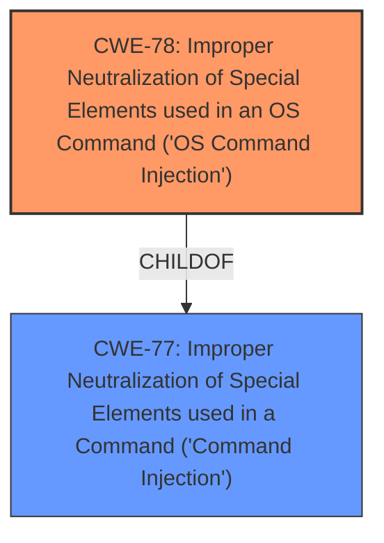

# Analysis Report for CVE-2022-38308

# Vulnerability Analysis Report: CVE-2022-38308

## Description


## Analysis (with Relationship Data)

# Summary
| CWE ID | CWE Name | Confidence | CWE Abstraction Level | CWE Vulnerability Mapping Label | CWE-Vulnerability Mapping Notes |
|---|---|---|---|---|---|
| CWE-78 | Improper Neutralization of Special Elements used in an OS Command ('OS Command Injection') | 1.0 | Base | Allowed | Primary CWE |
| CWE-77 | Improper Neutralization of Special Elements used in a Command ('Command Injection') | 0.7 | Class | Allowed-with-Review | Secondary Candidate |

## Evidence and Confidence

*   **Confidence Score:** 1.0
*   **Evidence Strength:** HIGH

## Relationship Analysis
The primary CWE selected is CWE-78, which is a Base level CWE and a child of CWE-77. CWE-77 is a more general class describing command injection. The choice of CWE-78 is driven by the evidence pointing specifically to OS command injection.



## Vulnerability Chain
The vulnerability chain starts with the **improper neutralization** of the `lang` parameter, leading to **OS Command Injection**, and finally resulting in the ability to **execute arbitrary commands**.

## Summary of Analysis
The initial assessment identified the presence of a command injection vulnerability in TOTOLink A700RU. The evidence clearly indicates that the **command injection** occurs due to **improper neutralization** of special elements in the `lang` parameter, allowing attackers to execute arbitrary commands. The `CVE Reference Links Content Summary` section explicitly states the **root cause** as the "insecure use of the `cstesystem` function" where "user-controlled input from the `lang` parameter is incorporated into the command string without proper sanitization."

The Retriever Results also strongly suggest CWE-78 (Improper Neutralization of Special Elements used in an OS Command ('OS Command Injection')) and CWE-77 (Improper Neutralization of Special Elements used in a Command ('Command Injection')).

Given that the vulnerability involves the execution of OS commands, CWE-78 is the more specific and accurate choice. CWE-77 is a broader class that encompasses various types of command injection, but CWE-78 directly addresses the OS command scenario. The mapping guidance for CWE-78 also confirms that it is at the Base level of abstraction, which is preferred.

Therefore, the final assessment is that CWE-78 is the primary CWE, representing the **root cause** of the vulnerability.

Relevant CWE Information:

# Enhanced Context (25 CWEs)

## CWE-113: Improper Neutralization of CRLF Sequences in HTTP Headers ('HTTP Request/Response Splitting')
**Abstraction Level**: Variant
**Similarity Score**: 0.77

This CWE is not applicable as the vulnerability is not related to HTTP Request/Response Splitting.

## CWE-74: Improper Neutralization of Special Elements in Output Used by a Downstream Component ('Injection')
**Abstraction Level**: Class
**Similarity Score**: 0.76

This CWE is too high-level and doesn't accurately represent the specific OS command injection vulnerability.

## CWE-93: Improper Neutralization of CRLF Sequences ('CRLF Injection')
**Abstraction Level**: Base
**Similarity Score**: 0.74

This CWE is not applicable as the vulnerability is not related to CRLF injection.

## CWE-184: Incomplete List of Disallowed Inputs
**Abstraction Level**: Base
**Similarity Score**: 0.74

While input validation is missing, CWE-78 is a more direct representation of the vulnerability.

## CWE-41: Improper Resolution of Path Equivalence
**Abstraction Level**: Base
**Similarity Score**: 0.74

This CWE is not applicable as the vulnerability is not related to path equivalence.

## CWE-138: Improper Neutralization of Special Elements
**Abstraction Level**: Class
**Similarity Score**: 0.73

This CWE is too high-level and doesn't accurately represent the specific OS command injection vulnerability.

## CWE-88: Improper Neutralization of Argument Delimiters in a Command ('Argument Injection')
**Abstraction Level**: Base
**Similarity Score**: 0.72

This CWE is not the primary issue, though it could potentially be a contributing factor.

## CWE-134: Use of Externally-Controlled Format String
**Abstraction Level**: Base
**Similarity Score**: 0.72

This CWE is not applicable as the vulnerability is not related to format string vulnerabilities.

## CWE-73: External Control of File Name or Path
**Abstraction Level**: Base
**Similarity Score**: 0.72

This CWE is not applicable as the vulnerability is not related to file name or path manipulation.

## CWE-1289: Improper Validation of Unsafe Equivalence in Input
**Abstraction Level**: Base
**Similarity Score**: 0.72

This CWE is not the primary issue.

## CWE-88: Improper Neutralization of Argument Delimiters in a Command ('Argument Injection')
**Abstraction Level**: Base
**Similarity Score**: 7239.74

This is a duplicate entry.

## CWE-78: Improper Neutralization of Special Elements used in an OS Command ('OS Command Injection')
**Abstraction Level**: Base
**Similarity Score**: 6844.30

This is the selected CWE.

## CWE-184: Incomplete List of Disallowed Inputs
**Abstraction Level**: Base
**Similarity Score**: 6829.40

This is not the primary issue, though it could potentially be a contributing factor.

## CWE-116: Improper Encoding or Escaping of Output
**Abstraction Level**: Class
**Similarity Score**: 6808.31

This CWE is not applicable as the vulnerability is not related to encoding or escaping of output.

## CWE-95: Improper Neutralization of Directives in Dynamically Evaluated Code ('Eval Injection')
**Abstraction Level**: Variant
**Similarity Score**: 6707.69

This CWE is not applicable as the vulnerability is not related to eval injection.

## CWE-78: Improper Neutralization of Special Elements used in an OS Command ('OS Command Injection')
**Abstraction Level**: base
**Similarity Score**: 5.03

This is the selected CWE.

## CWE-94: Improper Control of Generation of Code ('Code Injection')
**Abstraction Level**: base
**Similarity Score**: 4.33

This CWE is not applicable as the vulnerability is not related to code injection in the sense of generating code.

## CWE-79: Improper Neutralization of Input During Web Page Generation ('Cross-site Scripting')
**Abstraction Level**: base
**Similarity Score**: 4.33

This CWE is not applicable as the vulnerability is not related to cross-site scripting.

## CWE-434: Unrestricted Upload of File with Dangerous Type
**Abstraction Level**: base
**Similarity Score**: 4.33

This CWE is not applicable as the vulnerability is not related to unrestricted file uploads.

## CWE-117: Improper Output Neutralization for Logs
**Abstraction Level**: base
**Similarity Score**: 4.33

This CWE is not applicable as the vulnerability is not related to output neutralization for logs.

## CWE-22: Improper Limitation of a Pathname to a Restricted Directory ('Path Traversal')
**Abstraction Level**: base
**Similarity Score**: 4.33

This CWE is not applicable as the vulnerability is not related to path traversal.

## CWE-259: Use of Hard-coded Password
**Abstraction Level**: variant
**Similarity Score**: 4.01

This CWE is not applicable as the vulnerability is not related to hard-coded passwords.

## CWE-321: Use of Hard-coded Cryptographic Key
**Abstraction Level**: variant
**Similarity Score**: 4.01

This CWE is not applicable as the vulnerability is not related to hard-coded cryptographic keys.

## CWE-98: Improper Control of Filename for Include/Require Statement in PHP Program ('PHP Remote File Inclusion')
**Abstraction Level**: variant
**Similarity Score**: 3.89

This CWE is not applicable as the vulnerability is not related to PHP remote file inclusion.

## CWE-426: Untrusted Search Path
**Abstraction Level**: base
**Similarity Score**: 3.64

This CWE is not applicable as the vulnerability is not related to untrusted search paths.


## CWE Relationship Analysis

Current CWEs represent these abstraction levels: .


### Vulnerability Chain Analysis

**Chain starting from CWE-41:**
- 41 (Improper Resolution of Path Equivalence) - ROOT


**Chain starting from CWE-259:**
- 259 (Use of Hard-coded Password) - ROOT


### CWE Relationship Diagram

```mermaid
graph TD
    classDef primary fill:#f96,stroke:#333,stroke-width:2px
    classDef secondary fill:#69f,stroke:#333
    classDef tertiary fill:#9e9,stroke:#333
```


*Report generated on 2025-03-30 20:22:31*
