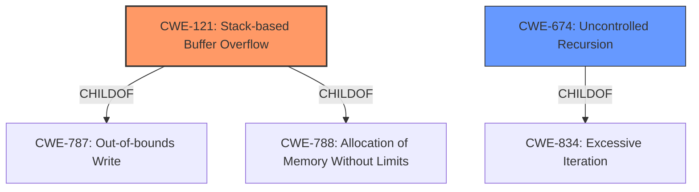

# Analysis Report for CVE-2022-38334

# Vulnerability Analysis Report: CVE-2022-38334

## Description


## Analysis (with Relationship Data)

# Summary
| CWE ID | CWE Name | Confidence | CWE Abstraction Level | CWE Vulnerability Mapping Label | CWE-Vulnerability Mapping Notes |
|---|---|---|---|---|---|
| CWE-121 | Stack-based Buffer Overflow | 1.0 | Variant | Allowed | Primary CWE |
| CWE-674 | Uncontrolled Recursion | 0.5 | Class | Allowed-with-Review | Secondary CWE |

## Evidence and Confidence

*   **Confidence Score:** 0.8
*   **Evidence Strength:** HIGH

## Relationship Analysis
The primary relationship is that CWE-121 is a variant of CWE-788 (Allocation of Memory Without Limits) and CWE-787 (Out-of-bounds Write). CWE-674 is related to CWE-834 (Excessive Iteration). The selection of CWE-121 is based on the explicit mention of a "**stack overflow**" in the vulnerability description, making it the most specific and relevant choice. While CWE-674 could be related, the stack overflow is more explicitly tied to a buffer overflow scenario, making CWE-121 more directly applicable.



## Vulnerability Chain
The vulnerability chain starts with the **stack overflow** in the `CatalogcountPageTree()` function. This suggests a direct **out-of-bounds write** on the stack, leading to potential control-flow hijacking or denial of service.
  - Root Cause: Stack overflow due to a flaw in the `CatalogcountPageTree()` function.
  - Weakness: **Improper** or missing bounds checking when writing to a stack-allocated buffer.
  - Impact: Potential for arbitrary code execution or denial of service.

## Summary of Analysis
The initial assessment focused on identifying the root cause of the vulnerability based on the provided description. The key phrase "**stack overflow**" strongly suggests CWE-121 (Stack-based Buffer Overflow) as the primary weakness. The retriever results also support this selection, with CWE-121 having the highest score.

The description explicitly mentions a stack overflow in the `CatalogcountPageTree()` function within XPDF v4.04 and earlier. This directly aligns with the characteristics of CWE-121, which involves overwriting a buffer allocated on the stack. The vulnerability could allow an attacker to overwrite the return address or other critical data on the stack, potentially leading to arbitrary code execution.

The selection of CWE-121 is at the optimal level of specificity because it is a Variant that accurately reflects the location (stack) of the buffer overflow. This is more specific than a more general CWE like CWE-119 (Improper Restriction of Operations within the Bounds of a Memory Buffer).

The confidence in this mapping is high (0.8) due to the explicit mention of a stack overflow in the vulnerability description.

CWEs considered but not used:

*   CWE-190 (Integer Overflow or Wraparound): While integer overflows can sometimes lead to buffer overflows, there is no direct evidence of an integer overflow in the provided description.
*   CWE-674 (Uncontrolled Recursion): Although stack overflows can sometimes be caused by uncontrolled recursion, the description does not explicitly mention recursion, making CWE-121 a more direct and appropriate mapping.
*   CWE-122 (Heap-based Buffer Overflow): The description specifies a **stack overflow**, making CWE-122 irrelevant.
*   CWE-125 (Out-of-bounds Read): The description specifies a **stack overflow**, which is a write, making CWE-125 less relevant.
*   CWE-1325 (Improperly Controlled Sequential Memory Allocation): While this could potentially contribute to a stack overflow if allocations happen recursively, it is not the primary issue described.
*   CWE-128 (Wrap-around Error): Not directly indicated in the description.
*   CWE-193 (Off-by-one Error): Not directly indicated in the description.
*   CWE-1284 (Improper Validation of Specified Quantity in Input): The root cause is the stack overflow and not necessarily input validation.
*   CWE-770 (Allocation of Resources Without Limits or Throttling): While a stack overflow can be related to resource exhaustion, the primary issue is the buffer overflow.


## CWE Relationship Analysis

Current CWEs represent these abstraction levels: .


### Vulnerability Chain Analysis

**Chain starting from CWE-190:**
- 190 (Integer Overflow or Wraparound) - ROOT


**Chain starting from CWE-1325:**
- 1325 (Improperly Controlled Sequential Memory Allocation) - ROOT


### CWE Relationship Diagram

```mermaid
graph TD
    classDef primary fill:#f96,stroke:#333,stroke-width:2px
    classDef secondary fill:#69f,stroke:#333
    classDef tertiary fill:#9e9,stroke:#333
```


*Report generated on 2025-03-31 08:03:57*
