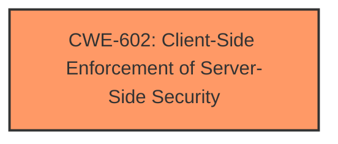

# Enhanced Analysis for CVE-2022-38341

# Summary
| CWE ID | CWE Name | Confidence | CWE Abstraction Level | CWE Vulnerability Mapping Label | CWE-Vulnerability Mapping Notes |
|---|---|---|---|---|---|
| CWE-602 | Client-Side Enforcement of Server-Side Security | 1.0 | Class | Allowed-with-Review | Primary CWE |

## Evidence and Confidence

*   **Confidence Score:** 1.0
*   **Evidence Strength:** HIGH

## Relationship Analysis
The primary relationship that influenced my decision was the parent-child relationship between CWE-602 (Client-Side Enforcement of Server-Side Security) and its potential Base-level children. However, based on the provided information, the vulnerability description directly aligns with the characteristics of CWE-602 itself. The absence of server-side validation, as stated in the vulnerability description, perfectly embodies the core concept of CWE-602.



## Vulnerability Chain
The vulnerability chain is straightforward: The **lack of server-side validation** (CWE-602) directly leads to potential security vulnerabilities, as client-side controls can be easily bypassed.

## Summary of Analysis
The initial analysis strongly pointed towards CWE-602 (Client-Side Enforcement of Server-Side Security) as the primary weakness. The vulnerability description explicitly states that the software "does not employ server-side validation," which perfectly matches the core concept of CWE-602.

The retriever results also highlighted CWE-602 as the top candidate. While the mapping guidance suggests reviewing potential Base-level children of CWE-602, the provided information does not indicate any specific client-side mechanism or protection being bypassed. Therefore, the Class-level CWE-602 is the most appropriate and specific choice in this case.

The evidence is explicit in the vulnerability description, stating the **weakness** as a **lack of server-side validation**: "Safe Software FME Server v2021.2.5 and below **does not employ server-side validation**."

I am confident in this assessment.

Relevant CWE Information:

# Enhanced Context (25 CWEs)

## CWE-602: Client-Side Enforcement of Server-Side Security
**Abstraction Level**: Class
**Similarity Score**: 0.78
**Source**: dense

**Description**:
The product is composed of a server that relies on the client to implement a mechanism that is intended to protect the server.

**Mapping Guidance**:
- Usage: Allowed-with-Review
- Rationale: This CWE entry is a Class and might have Base-level children that would be more appropriate
INSERT the assigned CWEs in a table format with the following columns: CWE ID, CWE Name, Confidence, CWE Abstraction Level, CWE Vulnerability Mapping Label, CWE-Vulnerability Mapping Notes
  - The Primary CWE should be first and noted as the Primary CWEs
  - The secondary candidate CWEs should be next and noted as secondary candidates.
  - The confidence is a confidence score 0 to 1 to rate your confidence in your assessment for that CWE.
  - The CWE Abstraction Level as one of these values: Base, Variant, Pillar, Class, Compound
  - The Mapping Notes Usage as one of these values: Allowed, Allowed-with-Review, Prohibited, Discouraged


## CWE Relationship Analysis

Current CWEs represent these abstraction levels: .


### Vulnerability Chain Analysis

**Chain starting from CWE-602:**
- 602 (Client-Side Enforcement of Server-Side Security) - ROOT


### CWE Relationship Diagram

```mermaid
graph TD
    classDef primary fill:#f96,stroke:#333,stroke-width:2px
    classDef secondary fill:#69f,stroke:#333
    classDef tertiary fill:#9e9,stroke:#333
```