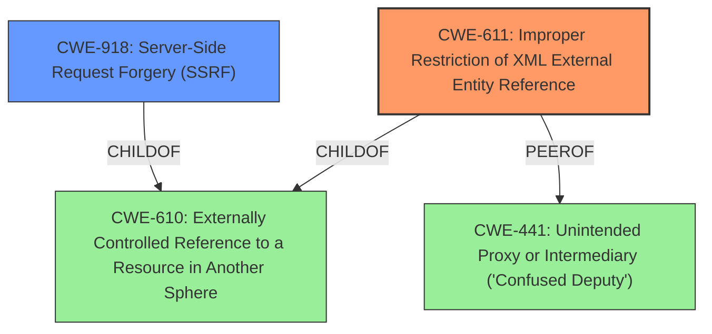

# Analysis for CVE-2022-38342

# Summary
| CWE ID | CWE Name | Confidence | CWE Abstraction Level | CWE Vulnerability Mapping Label | CWE-Vulnerability Mapping Notes |
|---|---|---|---|---|---|
| CWE-611 | Improper Restriction of XML External Entity Reference | 1.0 | Base | Allowed | Primary CWE |
| CWE-918 | Server-Side Request Forgery (SSRF) | 0.7 | Base | Allowed | Secondary Candidate |

## Evidence and Confidence

*   **Confidence Score:** 0.9
*   **Evidence Strength:** HIGH

## Relationship Analysis
The primary CWE, CWE-611, is a Base level weakness, providing a specific root cause for the vulnerability. CWE-918, SSRF, is a related weakness often caused by XXE. Both CWE-611 and CWE-918 are children of CWE-610 (Externally Controlled Reference to a Resource in Another Sphere). CWE-611 is also a peer of CWE-441 (Unintended Proxy or Intermediary ('Confused Deputy')). The choice of CWE-611 as primary and CWE-918 as secondary is based on the direct mention of XXE in the vulnerability description.

## Vulnerability Chain
The vulnerability chain starts with **improper XML parsing** leading to the **XXE** vulnerability. This **XXE** vulnerability enables data exfiltration and Server-Side Request Forgery (SSRF) attacks.

## Summary of Analysis
The initial analysis identified CWE-611 as the primary weakness due to the explicit mention of **XXE** in the vulnerability description, supported by the vulnerability key phrases identifying the root cause as **improper XML parsing**. The description states "Safe Software FME Server v2021.2.5, v2022.0.0.2 and below was discovered to contain a XML External Entity (**XXE**) vulnerability which allows authenticated attackers to perform data exfiltration or Server-Side Request Forgery (SSRF) attacks." This directly aligns with the CWE-611 description: "The product processes an XML document that can contain XML entities with URIs that resolve to documents outside of the intended sphere of control, causing the product to embed incorrect documents into its output." The Retriever Results also show CWE-611 as the top combined result with a score of 1.000.

CWE-918 is identified as a secondary weakness as a consequence of the **XXE** vulnerability, enabling Server-Side Request Forgery. The relationship analysis supports this, as CWE-918 and CWE-611 are related and can lead to outbound requests to unexpected destinations.

The selected CWEs are at the optimal level of specificity, with CWE-611 being a Base level weakness that directly addresses the root cause.