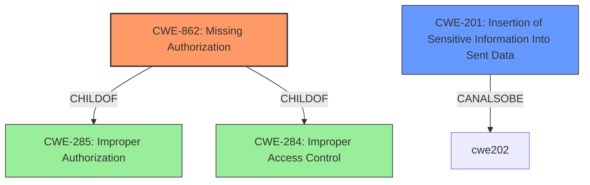

# Raw Analyzer Response for CVE-2022-38370

# Summary
| CWE ID | CWE Name | Confidence | CWE Abstraction Level | CWE Vulnerability Mapping Label | CWE-Vulnerability Mapping Notes |
|---|---|---|---|---|---|
| CWE-862 | Missing Authorization | 0.95 | Class | Allowed-with-Review | Primary CWE |
| CWE-201 | Insertion of Sensitive Information Into Sent Data | 0.60 | Base | Allowed | Secondary Candidate |

## Evidence and Confidence

*   **Confidence Score:** 0.90
*   **Evidence Strength:** HIGH

## Relationship Analysis
The primary relationship is that CWE-862 [CWE-862: Missing Authorization] is a child of CWE-285 [CWE-285: Improper Authorization] and CWE-284 [CWE-284: Improper Access Control]. Although CWE-284 is very high level, the vulnerability description and CVE summary clearly indicate a **missing authorization** check. The relationship to CWE-285 is less direct as it encompasses both missing and incorrect authorization. The retriever results suggested CWE-863 [CWE-863: Incorrect Authorization], however the vulnerability description clearly indicates the **rootcause** as a missing authorization check, which is more accurately represented by CWE-862 [CWE-862: Missing Authorization]. CWE-201 [CWE-201: Insertion of Sensitive Information Into Sent Data] is related because the impact of the missing authorization leads to sensitive data exposure.

## Vulnerability Chain
The vulnerability chain starts with the **missing authorization** check on the `DatabaseConnectController` interface (CWE-862 [CWE-862: Missing Authorization]). This allows unauthorized access to the interface, which results in the exposure of the internal database structure (CWE-201 [CWE-201: Insertion of Sensitive Information Into Sent Data]).

## Summary of Analysis
The initial analysis focused on identifying the **root cause** of the vulnerability, which is the **missing authorization** check. The vulnerability description and CVE summary explicitly state this. The retriever results suggested several CWEs related to access control and authorization, but CWE-862 [CWE-862: Missing Authorization] was the most accurate representation of the **root cause**.
The graph relationships helped to understand the context of the vulnerability within the broader scope of access control issues. The selection of CWE-862 [CWE-862: Missing Authorization] as the primary CWE is based on the explicit evidence of a **missing authorization** check and the mapping guidance suggesting more specific CWEs when available.
The supporting evidence includes the following:
- "Apache IoTDB grafana-connector version 0.13.0 contains an **interface without authorization**, which may expose the internal structure of database."
- "**Root cause of vulnerability:** **Missing authorization** check for the `DatabaseConnectController` interface in Apache IoTDB grafana-connector."
- "**Weaknesses/vulnerabilities present:** Lack of authorization on a specific interface."
- "**Impact of exploitation:** Exposure of internal database structure."

CWE-284 [CWE-284: Improper Access Control] was considered but not used as it is a very high-level "Pillar" CWE, and more specific options are available. CWE-863 [CWE-863: Incorrect Authorization] was considered but not used because the vulnerability description clearly indicated that authorization was missing, not incorrectly implemented. CWE-201 [CWE-201: Insertion of Sensitive Information Into Sent Data] was added as a secondary issue as the impact of the missing authorization leads to the exposure of sensitive data.

Relevant CWE Information:

*   **CWE-862 [CWE-862: Missing Authorization]:** The product does not perform an authorization check when an actor attempts to access a resource or perform an action. This perfectly matches the vulnerability description, which states that the interface lacks authorization.
*   **CWE-201 [CWE-201: Insertion of Sensitive Information Into Sent Data]:** The code transmits data to another actor, but a portion of the data includes sensitive information that should not be accessible to that actor.