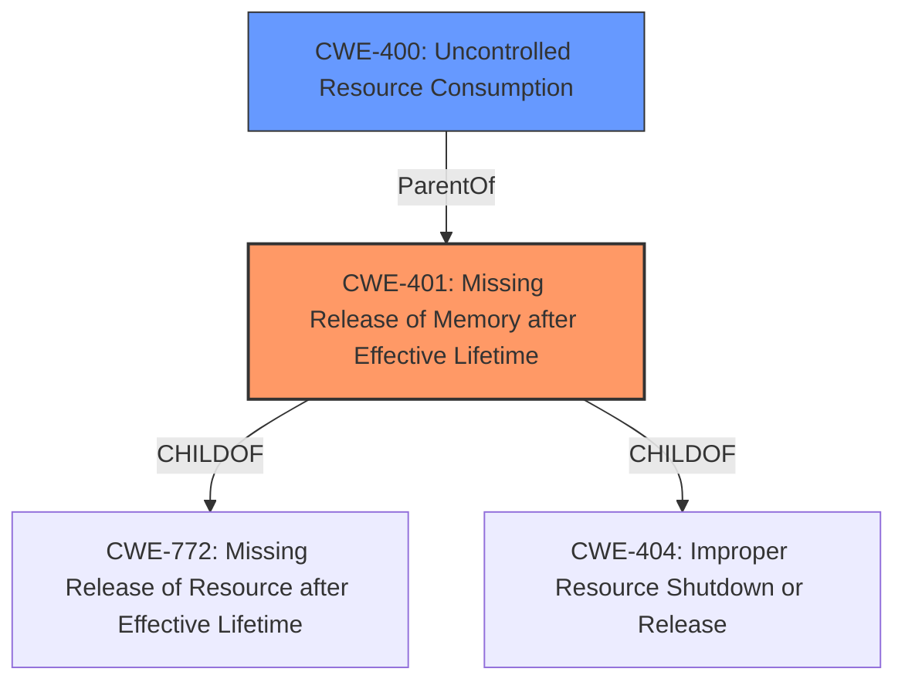

# Analysis for CVE-2022-38371

# Summary
| CWE ID | CWE Name | Confidence | CWE Abstraction Level | CWE Vulnerability Mapping Label | CWE-Vulnerability Mapping Notes |
|---|---|---|---|---|---|
| CWE-401 | Missing Release of Memory after Effective Lifetime | 1.0 | Variant | Allowed | Primary CWE |
| CWE-400 | Uncontrolled Resource Consumption | 0.8 | Class | Allowed | Secondary Candidate |

## Evidence and Confidence

*   **Confidence Score:** 0.9
*   **Evidence Strength:** HIGH

## Relationship Analysis
The primary CWE is CWE-401, a Variant of CWE-404 (Missing Release of Resource) and CWE-772 (Missing Release of Resource After Effective Lifetime). CWE-401 is more specific than its parents, as it focuses on memory resources. CWE-400 (Uncontrolled Resource Consumption) is a related Class-level CWE that describes the impact of resource exhaustion, which is the result of failing to release memory in this case.

## Vulnerability Chain
The vulnerability chain starts with the **improper memory resource release** (CWE-401), leading to **uncontrolled resource consumption** (CWE-400), and ultimately resulting in a denial-of-service (DoS) condition.

## Summary of Analysis
Based on the provided information, the FTP server **fails to properly release memory resources** allocated for incomplete connection attempts, leading to a resource exhaustion when incomplete connection attempts are made repeatedly.

The **Vulnerability Description Key Phrases** highlights the rootcause as an **improper memory resource release**.

The **CVE Reference Links Content Summary** provides additional information:
*   **Uncontrolled Resource Consumption (CWE-400):** The core issue is that memory resources are not properly released, leading to a resource exhaustion when incomplete connection attempts are made repeatedly.

Given this evidence, CWE-401 (Missing Release of Memory after Effective Lifetime) is the most appropriate primary CWE. CWE-400 describes the impact (DoS), which is the result of the memory leak.

CWE-170 (Improper Null Termination) was considered but deemed irrelevant because the vulnerability doesn't involve string termination issues. CWE-121 (Stack-based Buffer Overflow) was also considered but not selected, as the vulnerability is related to memory management and not buffer overflows. CWE-20 (Improper Input Validation) is too general and does not accurately reflect the specific weakness. CWE-916 (Use of Password Hash With Insufficient Computational Effort) is irrelevant because password hashing isn't involved. CWE-326 (Inadequate Encryption Strength) is also not applicable. CWE-120 (Buffer Copy without Checking Size of Input) is not relevant, as there's no buffer copy operation involved. CWE-200 (Exposure of Sensitive Information to an Unauthorized Actor) is not applicable since it is not an information exposure vulnerability. CWE-94 (Improper Control of Generation of Code ('Code Injection')) is not relevant because there's no code injection involved. CWE-84 (Improper Neutralization of Encoded URI Schemes in a Web Page) is also not applicable.

CWE-401 is the optimal level of specificity because it directly addresses the **root cause** of the vulnerability: the **failure to release memory resources**. This is a Variant-level CWE, which is preferred for root cause mapping.