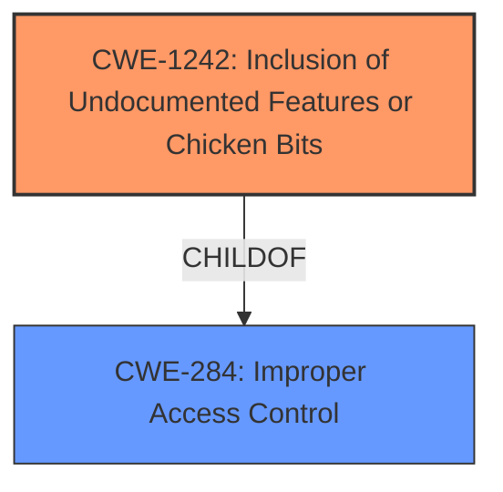

# Raw Analyzer Response for CVE-2022-38372

# Summary
| CWE ID    | CWE Name                                                                       | Confidence | CWE Abstraction Level | CWE Vulnerability Mapping Label | CWE-Vulnerability Mapping Notes |
| :-------- | :----------------------------------------------------------------------------- | :--------- | :---------------------- | :------------------------------ | :------------------------------ |
| CWE-1242 | Inclusion of Undocumented Features or Chicken Bits                                           | 1.0        | Base                    | Primary CWE                   | Allowed                       |

## Evidence and Confidence

*   **Confidence Score:** 1.0
*   **Evidence Strength:** HIGH

## Relationship Analysis
The primary relationship considered was the direct match of the vulnerability description to CWE-1242, making it the most suitable choice. The other CWEs considered were related to privilege management, command injection, or general authorization issues, but they did not directly address the presence of **hidden functionality [CWE-1242]**. CWE-1242 is a base level CWE.

## Vulnerability Chain
The vulnerability chain consists of:
  1. **Root Cause**: **Hidden functionality [CWE-1242]** (undocumented command) is present in the FortiTester CLI.
  2. **Exploitation**: A local privileged user exploits this **hidden functionality [CWE-1242]** by executing the undocumented command.
  3. **Impact**: The user obtains a root shell on the device.

## Summary of Analysis
The initial analysis focused on identifying the root cause of the vulnerability, which the description clearly states as a **hidden functionality [CWE-1242]** issue. The evidence is strong, with explicit mentions in both the vulnerability description and the CVE reference links content summary.

The vulnerability description states "A **hidden functionality vulnerability [CWE-1242]** in FortiTester CLI... may allow a local, privileged user to obtain a root shell on the device via an undocumented command."
The CVE Reference Links Content Summary states "Root cause of vulnerability: A hidden functionality vulnerability exists in FortiTester CLI. An undocumented shell command allows a local, privileged user to obtain a root shell."

The graph relationships confirm that CWE-1242 is related to access control issues (CWE-284), but the core problem is the existence of the **hidden functionality [CWE-1242]** itself.

The selected CWE-1242 is at the optimal level of specificity, directly addressing the presence of **hidden functionality [CWE-1242]** or "chicken bits" as the root cause, as specified in the CWE description. Other CWEs considered, such as those related to privilege management or command injection, are not as directly relevant as they describe potential consequences or related issues but not the root cause.

Relevant CWE Information:

# Enhanced Context (25 CWEs)
The following CWEs were identified as potentially relevant to this vulnerability:

## CWE-1242: Inclusion of Undocumented Features or Chicken Bits
**Abstraction:** Base
**Similarity Score**: 0.420
**Source**: sparse

**Description**:
The device includes chicken bits or undocumented features that can create entry points for unauthorized actors.

**Mapping Guidance**:
- Usage: Allowed
- Rationale: This CWE entry is at the Base level of abstraction, which is a preferred level of abstraction for mapping to the root causes of vulnerabilities.

## CWE-912: Hidden Functionality
**Abstraction:** Class
**Similarity Score**: 0.296
**Source**: sparse

**Description**:
The product contains functionality that is not documented, not part of the specification, and not accessible through an interface or command sequence that is obvious to the product's users or administrators.

**Mapping Guidance**:
- Usage: Allowed-with-Review
- Rationale: This CWE entry is a Class and might have Base-level children that would be more appropriate

## CWE-250: Execution with Unnecessary Privileges
**Abstraction:** Base
**Similarity Score**: 0.258
**Source**: sparse

**Description**:
The product performs an operation at a privilege level that is higher than the minimum level required, which creates new weaknesses or amplifies the consequences of other weaknesses.

**Mapping Guidance**:
- Usage: Allowed
- Rationale: This CWE entry is at the Base level of abstraction, which is a preferred level of abstraction for mapping to the root causes of vulnerabilities.

## CWE-269: Improper Privilege Management
**Abstraction:** Class
**Similarity Score**: 0.255
**Source**: sparse

**Description**:
The product does not properly assign, modify, track, or check privileges for an actor, creating an unintended sphere of control for that actor.

**Mapping Guidance**:
- Usage: Discouraged
- Rationale: CWE-269 is commonly misused. It can be conflated with "privilege escalation," which is a technical impact that is listed in many low-information vulnerability reports [REF-1287]. It is not useful for trend analysis.

## CWE-78: Improper Neutralization of Special Elements used in an OS Command ('OS Command Injection')
**Abstraction:** Base
**Similarity Score**: 0.250
**Source**: sparse

**Description**:
The product constructs all or part of an OS command using externally-influenced input from an upstream component, but it does not neutralize or incorrectly neutralizes special elements that could modify the intended OS command when it is sent to a downstream component.

**Mapping Guidance**:
- Usage: Allowed
- Rationale: This CWE entry is at the Base level of abstraction, which is a preferred level of abstraction for mapping to the root causes of vulnerabilities.

### Considered but not Used:

*   **CWE-912 Hidden Functionality:** Although related, CWE-1242 is more specific as it directly addresses the inclusion of undocumented features, making it a better fit than the more general CWE-912.
*   **CWE-250 Execution with Unnecessary Privileges & CWE-269 Improper Privilege Management:** These CWEs relate to how privileges are handled, but the root cause here is the existence of the hidden command, not necessarily a flaw in privilege management, thus less relevant.
*   **CWE-78 Improper Neutralization of Special Elements used in an OS Command ('OS Command Injection'):** This CWE is about command injection, which is not directly indicated in the description. The issue is the existence and accessibility of the **hidden functionality [CWE-1242]**, not the injection of commands.