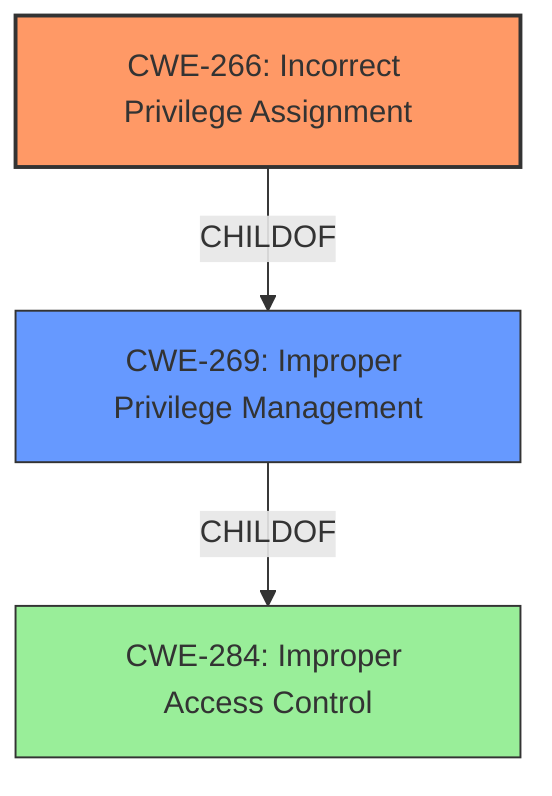

# Enhanced Analysis for CVE-2022-38378

# Summary
| CWE ID | CWE Name | Confidence | CWE Abstraction Level | CWE Vulnerability Mapping Label | CWE-Vulnerability Mapping Notes |
|---|---|---|---|---|---|
| CWE-266 | Incorrect Privilege Assignment | 0.9 | Base | Primary | Allowed |
| CWE-269 | Improper Privilege Management | 0.7 | Class | Secondary | Discouraged |

## Evidence and Confidence

*   **Confidence Score:** 0.9
*   **Evidence Strength:** HIGH

## Relationship Analysis
The primary CWE, CWE-266 (Incorrect Privilege Assignment), is a child of the more general CWE-269 (Improper Privilege Management). The vulnerability description indicates that an administrator is able to modify their own profile to escalate privileges. This suggests an incorrect assignment of privileges, which aligns with CWE-266. While CWE-269 broadly covers the issue of improper privilege management, CWE-266 offers a more specific classification. The choice of CWE-266 is further supported by the MITRE mapping guidance, which discourages the use of CWE-269 due to its common misuse and suggests examining its children for more specific mappings.



## Vulnerability Chain
The vulnerability chain starts with an **incorrect privilege assignment** [CWE-266], where a user with limited administrative privileges is granted the ability to modify their own profile. This leads to a **privilege escalation**, where the user can upgrade their permissions to read-write access.

## Summary of Analysis
The initial assessment, based on the vulnerability description key phrases and CVE reference links content summary, pointed to **improper privilege management**. The vulnerability description states: "An **improper privilege management** vulnerability [CWE-269]... allows an attacker that has access to the admin profile section... to modify their own profile and upgrade their privileges to Read Write..."

However, considering the MITRE mapping guidance for CWE-269 (Improper Privilege Management), which discourages its use due to frequent misuse and suggests examining its children for a more specific mapping, a more detailed analysis was performed. The vulnerability involves an administrator with access to the admin profile section being able to modify their own profile to escalate privileges. This scenario aligns more precisely with CWE-266 (Incorrect Privilege Assignment), a child of CWE-269. CWE-266 describes a situation where a product incorrectly assigns a privilege to a particular actor, creating an unintended sphere of control. In this case, the privilege to modify one's own profile is incorrectly assigned, leading to privilege escalation. The selection of CWE-266 provides a more specific and accurate representation of the vulnerability compared to the more general CWE-269.

The final decision is based on the evidence provided in the vulnerability description and the CVE reference links content summary, as well as the MITRE mapping guidance for CWE-269. By selecting CWE-266, the analysis achieves a higher level of specificity, aligning with the best practices for CWE classification.

Relevant CWE Information:

# Enhanced Context (25 CWEs)

## CWE-274: Improper Handling of Insufficient Privileges
**Abstraction Level**: Base
**Similarity Score**: 0.79
**Source**: dense

**Description**:
The product does not handle or incorrectly handles when it has insufficient privileges to perform an operation, leading to resultant weaknesses.

**Mapping Guidance**:
- Usage: Discouraged
- Rationale: This CWE entry could be deprecated in a future version of CWE.

*Not Selected:* This CWE is not selected because the vulnerability is due to assigning excessive privileges, not improperly handling insufficient ones.

## CWE-280: Improper Handling of Insufficient Permissions or Privileges 
**Abstraction Level**: Base
**Similarity Score**: 0.78
**Source**: dense

**Description**:
The product does not handle or incorrectly handles when it has insufficient privileges to access resources or functionality as specified by their permissions. This may cause it to follow unexpected code paths that may leave the product in an invalid state.

**Mapping Guidance**:
- Usage: Allowed
- Rationale: This CWE entry is at the Base level of abstraction, which is a preferred level of abstraction for mapping to the root causes of vulnerabilities.

*Not Selected:* This CWE is not selected because the vulnerability is due to assigning excessive privileges, not improperly handling insufficient ones.

## CWE-266: Incorrect Privilege Assignment
**Abstraction Level**: Base
**Similarity Score**: 0.77
**Source**: dense

**Description**:
A product incorrectly assigns a privilege to a particular actor, creating an unintended sphere of control for that actor.

**Mapping Guidance**:
- Usage: Allowed
- Rationale: This CWE entry is at the Base level of abstraction, which is a preferred level of abstraction for mapping to the root causes of vulnerabilities.

*Selected:* This CWE is selected as the Primary CWE because the vulnerability stems from an administrator being incorrectly granted the privilege to modify their own profile, leading to privilege escalation.

## CWE-267: Privilege Defined With Unsafe Actions
**Abstraction Level**: Base
**Similarity Score**: 0.76
**Source**: dense

**Description**:
A particular privilege, role, capability, or right can be used to perform unsafe actions that were not intended, even when it is assigned to the correct entity.

**Mapping Guidance**:
- Usage: Allowed
- Rationale: This CWE entry is at the Base level of abstraction, which is a preferred level of abstraction for mapping to the root causes of vulnerabilities.

*Not Selected:* This CWE is not selected because it describes a situation where a privilege, even when correctly assigned, can be used for unintended actions. In this case, the vulnerability is due to the incorrect assignment of the modify-profile privilege itself.

## CWE-653: Improper Isolation or Compartmentalization
**Abstraction Level**: Class
**Similarity Score**: 0.76
**Source**: dense

**Description**:
The product does not properly compartmentalize or isolate functionality, processes, or resources that require different privilege levels, rights, or permissions.

**Mapping Guidance**:
- Usage: Allowed
- Rationale: This CWE entry is at the Base level of abstraction, which is a preferred level of abstraction for mapping to the root causes of vulnerabilities.

*Not Selected:* This CWE is not selected because the vulnerability is not primarily related to a failure in isolating functionalities with different privilege levels.

## CWE-1220: Insufficient Granularity of Access Control
**Abstraction Level**: Base
**Similarity Score**: 0.75
**Source**: dense

**Description**:
The product implements access controls via a policy or other feature with the intention to disable or restrict accesses (reads and/or writes) to assets in a system from untrusted agents. However, implemented access controls lack required granularity, which renders the control policy too broad because it allows accesses from unauthorized agents to the security-sensitive assets.

**Mapping Guidance**:
- Usage: Allowed
- Rationale: This CWE entry is at the Base level of abstraction, which is a preferred level of abstraction for mapping to the root causes of vulnerabilities.

*Not Selected:* This CWE is not selected because the vulnerability is not primarily about the granularity of access control policies, but rather about the incorrect assignment of a specific privilege.

## CWE-639: Authorization Bypass Through User-Controlled Key
**Abstraction Level**: Base
**Similarity Score**: 0.75
**Source**: dense

**Description**:
The system's authorization functionality does not prevent one user from gaining access to another user's data or record by modifying the key value identifying the data.

**Mapping Guidance**:
- Usage: Allowed
- Rationale: This CWE entry is at the Base level of abstraction, which is a preferred level of abstraction for mapping to the root causes of vulnerabilities.

*Not Selected:* This CWE is not selected because the vulnerability is not related to bypassing authorization by manipulating user-controlled keys.

## CWE-668: Exposure of Resource to Wrong Sphere
**Abstraction Level**: Class
**Similarity Score**: 0.75
**Source**: dense

**Description**:
The product exposes a resource to the wrong control sphere, providing unintended actors with inappropriate access to the resource.

**Mapping Guidance**:
- Usage: Discouraged
- Rationale: CWE-668 is high-level and is often misused as a catch-all when lower-level CWE IDs might be applicable. It is sometimes used for low-information vulnerability reports [REF-1287]. It is a level-1 Class (i.e., a child of a Pillar). It is not useful for trend analysis.

*Not Selected:* This CWE is not selected because it is a high-level classification, and a more specific CWE (CWE


## CWE Relationship Analysis

Current CWEs represent these abstraction levels: .


### Vulnerability Chain Analysis

**Chain starting from CWE-266:**
- 266 (Incorrect Privilege Assignment) - ROOT


**Chain starting from CWE-280:**
- 280 (Improper Handling of Insufficient Permissions or Privileges ) - ROOT


### CWE Relationship Diagram

```mermaid
graph TD
    classDef primary fill:#f96,stroke:#333,stroke-width:2px
    classDef secondary fill:#69f,stroke:#333
    classDef tertiary fill:#9e9,stroke:#333
```