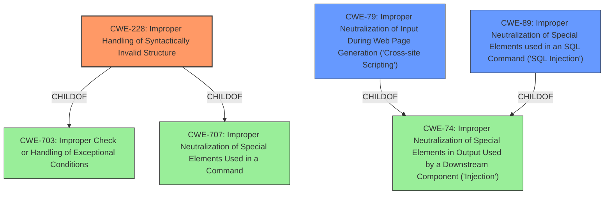

# Analysis for CVE-2022-38381

# Summary
| CWE ID  | CWE Name                                                                | Confidence | CWE Abstraction Level | CWE Vulnerability Mapping Label | CWE-Vulnerability Mapping Notes |
| :-------- | :---------------------------------------------------------------------- | :--------- | :---------------------- | :------------------------------ | :-------------------------------- |
| CWE-228 | Improper Handling of Syntactically Invalid Structure                    | 0.9        | Class                   | Primary CWE                     | Allowed-with-Review              |
| CWE-79  | Improper Neutralization of Input During Web Page Generation ('Cross-site Scripting') | 0.7        | Base                    | Secondary Candidate             | Allowed                         |
| CWE-89  | Improper Neutralization of Special Elements used in an SQL Command ('SQL Injection') | 0.7        | Base                    | Secondary Candidate             | Allowed                         |

## Evidence and Confidence

*   **Confidence Score:** 0.8
*   **Evidence Strength:** HIGH

## Relationship Analysis
The primary CWE is CWE-228, which is a Class-level CWE. This CWE is related to its parents CWE-703 and CWE-707. The vulnerability description indicates that the issue is related to how the application handles syntactically invalid structures.
CWE-79 and CWE-89 are Base-level CWEs that represent the specific types of attacks that can bypass the WAF due to the **improper handling of malformed requests** [CWE-228]. These are both children of CWE-74.

## Vulnerability Chain
The chain of events starts with a malformed HTTP request, which is not properly handled by the FortiADC [CWE-228]. This **improper handling** allows the attacker to bypass the WAF protections. The WAF protection bypass then leads to potential SQL Injection [CWE-89] and Cross-Site Scripting [CWE-79] vulnerabilities.

## Summary of Analysis
The vulnerability description explicitly states an **improper handling of malformed request**, making CWE-228 the most relevant primary weakness. The CVE Reference Links Content Summary reinforces this by stating: "The vulnerability lies in the FortiADC's failure to properly handle malformed HTTP requests, which allows for the bypass of Web Application Firewall (WAF) protections."

The retriever results list CWE-228 as the top combined result, reinforcing the selection of this CWE.
The selection of CWE-228 as the primary CWE is based on the evidence that the **improper handling of malformed requests** is the root cause that enables the bypass of WAF protections such as SQL Injection and XSS filters.
CWE-79 and CWE-89 are included as they are the two vulnerabilities that the WAF is supposed to protect against, and which are bypassed by the **improper handling of malformed requests** [CWE-228].

Relevant CWE Information:
# Enhanced Context (25 CWEs)
The following CWEs were identified as potentially relevant to this vulnerability:

## CWE-80: Improper Neutralization of Script-Related HTML Tags in a Web Page (Basic XSS)
**Abstraction Level**: Variant
**Similarity Score**: 0.79
**Source**: dense
**Description**:
The product receives input from an upstream component, but it does not neutralize or incorrectly neutralizes special characters such as "<", ">", and "&" that could be interpreted as web-scripting elements when they are sent to a downstream component that processes web pages.
**Mapping Guidance**:
- Usage: Allowed
- Rationale: This CWE entry is at the Variant level of abstraction, which is a preferred level of abstraction for mapping to the root causes of vulnerabilities.

*This was not selected because it is a more specific version of CWE-79*

## CWE-113: Improper Neutralization of CRLF Sequences in HTTP Headers ('HTTP Request/Response Splitting')
**Abstraction Level**: Variant
**Similarity Score**: 0.78
**Source**: dense
**Description**:
The product receives data from an HTTP agent/component (e.g., web server, proxy, browser, etc.), but it does not neutralize or incorrectly neutralizes CR and LF characters before the data is included in outgoing HTTP headers.
**Mapping Guidance**:
- Usage: Allowed
- Rationale: This CWE entry is at the Variant level of abstraction, which is a preferred level of abstraction for mapping to the root causes of vulnerabilities.

*This was not selected because it is not directly related to the stated vulnerability which is the **improper handling of malformed request**.*

## CWE-1289: Improper Validation of Unsafe Equivalence in Input
**Abstraction Level**: Base
**Similarity Score**: 0.77
**Source**: dense
**Description**:
The product receives an input value that is used as a resource identifier or other type of reference, but it does not validate or incorrectly validates that the input is equivalent to a potentially-unsafe value.
**Mapping Guidance**:
- Usage: Allowed
- Rationale: This CWE entry is at the Base level of abstraction, which is a preferred level of abstraction for mapping to the root causes of vulnerabilities.

*This was not selected because it is not directly related to the stated vulnerability which is the **improper handling of malformed request**.*

## CWE-184: Incomplete List of Disallowed Inputs
**Abstraction Level**: Base
**Similarity Score**: 0.76
**Source**: dense
**Description**:
The product implements a protection mechanism that relies on a list of inputs (or properties of inputs) that are not allowed by policy or otherwise require other action to neutralize before additional processing takes place, but the list is incomplete.
**Mapping Guidance**:
- Usage: Allowed
- Rationale: This CWE entry is at the Base level of abstraction, which is a preferred level of abstraction for mapping to the root causes of vulnerabilities.

*This was not selected because it is not directly related to the stated vulnerability which is the **improper handling of malformed request**.*

## CWE-74: Improper Neutralization of Special Elements in Output Used by a Downstream Component ('Injection')
**Abstraction Level**: Class
**Similarity Score**: 0.76
**Source**: dense
**Description**:
The product constructs all or part of a command, data structure, or record using externally-influenced input from an upstream component, but it does not neutralize or incorrectly neutralizes special elements that could modify how it is parsed or interpreted when it is sent to a downstream component.
**Mapping Guidance**:
- Usage: Discouraged
- Rationale: CWE-74 is high-level and often misused when lower-level weaknesses are more appropriate.

*This was not selected because it is a higher level than its children CWE-79 and CWE-89*

## CWE-444: Inconsistent Interpretation of HTTP Requests ('HTTP Request/Response Smuggling')
**Abstraction Level**: Base
**Similarity Score**: 0.75
**Source**: dense
**Description**:
The product acts as an intermediary HTTP agent
         (such as a proxy or firewall) in the data flow between two
         entities such as a client and server, but it does not
         interpret malformed HTTP requests or responses in ways that
         are consistent with how the messages will be processed by
         those entities that are at the ultimate destination.
**Mapping Guidance**:
- Usage: Allowed
- Rationale: This CWE entry is at the Base level of abstraction, which is a preferred level of abstraction for mapping to the root causes of vulnerabilities.

*This was not selected because it is not directly related to the stated vulnerability which is the **improper handling of malformed request**.*

## CWE-116: Improper Encoding or Escaping of Output
**Abstraction Level**: Class
**Similarity Score**: 0.75
**Source**: dense
**Description**:
The product prepares a structured message for communication with another component, but encoding or escaping of the data is either missing or done incorrectly