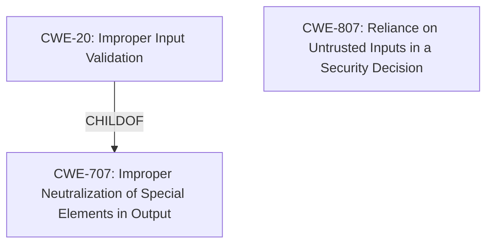

# Analysis for CVE-2022-38385

# Summary
| CWE ID  | CWE Name                                                                                       | Confidence | CWE Abstraction Level | CWE Vulnerability Mapping Label | CWE-Vulnerability Mapping Notes |
| :-------- | :--------------------------------------------------------------------------------------------- | :---------- | :---------------------- | :------------------------------ | :------------------------------ |
| CWE-20   | Improper Input Validation                                                                    | 0.8       | Class                   | Primary CWE                    | Discouraged                   |
| CWE-807 | Reliance on Untrusted Inputs in a Security Decision                                                                         | 0.6       | Base                    | Secondary CWE                    | Allowed                   |

## Evidence and Confidence

*   **Confidence Score:** 0.7
*   **Evidence Strength:** MEDIUM

## Relationship Analysis
The primary relationship that influenced the CWE selection was the parent-child relationship between CWE-707 (Improper Neutralization of Special Elements in Output) and CWE-20 (Improper Input Validation). The vulnerability description mentions **improper input validation** as the root cause, making CWE-20 a relevant choice. However, CWE-20 is a Class-level CWE and is discouraged. CWE-807 (Reliance on Untrusted Inputs in a Security Decision) was also considered and it's Abstraction Level is Base. 

## Vulnerability Chain
The vulnerability chain starts with **improper input validation** (CWE-20) which allows an authenticated user to obtain highly sensitive information or perform unauthorized actions.

## Summary of Analysis
The initial assessment identified **improper input validation** as the primary weakness based on the vulnerability description key phrases and the CVE Reference Links Content Summary. The Retriever Results also listed CWE-20 as a relevant CWE, although it's marked as "Discouraged."

The final decision to include CWE-20 is based on the explicit mention of **improper input validation** in the vulnerability description. However, due to its Class level and the discouraged usage, a secondary CWE, CWE-807, was considered. The graph relationships show that CWE-20 is a child of CWE-707, indicating a potential need for a more specific CWE if available.

The selected CWEs are at the optimal level of specificity given the available evidence. While a more specific CWE might exist, the current description does not provide enough detail to justify a lower-level mapping. The confidence level is moderate due to the limited information provided in the vulnerability description.

Relevant CWE Information:

# Enhanced Context (25 CWEs)
The following CWEs were identified as potentially relevant to this vulnerability:

## CWE-807: Reliance on Untrusted Inputs in a Security Decision
**Abstraction Level**: Base
**Similarity Score**: 0.78
**Source**: dense

**Description**:
The product uses a protection mechanism that relies on the existence or values of an input, but the input can be modified by an untrusted actor in a way that bypasses the protection mechanism.

**Mapping Guidance**:
- Usage: Allowed
- Rationale: This CWE entry is at the Base level of abstraction, which is a preferred level of abstraction for mapping to the root causes of vulnerabilities.

### Summary of other CWEs considered but not used:
*   **CWE-326: Inadequate Encryption Strength, CWE-327: Use of a Broken or Risky Cryptographic Algorithm**: These CWEs relate to cryptographic issues, but the vulnerability description does not mention any problems with encryption.
*   **CWE-90: Improper Neutralization of Special Elements used in an LDAP Query ('LDAP Injection')**: This CWE relates to LDAP injection, which is not mentioned in the vulnerability description.
*   **CWE-613: Insufficient Session Expiration**: This CWE relates to session management, which is not mentioned in the vulnerability description.
*   **CWE-522: Insufficiently Protected Credentials**: This CWE relates to credential protection, which is not explicitly mentioned in the vulnerability description.
*   **CWE-287: Improper Authentication**: This CWE relates to authentication issues, but the description focuses on input validation, not authentication.
*   **CWE-201: Insertion of Sensitive Information Into Sent Data**: This CWE relates to information leakage, which is a potential impact, but the root cause is **improper input validation**.
*   **CWE-208: Observable Timing Discrepancy**: This CWE relates to timing attacks, which are not relevant to the vulnerability description.
*   **CWE-73: External Control of File Name or Path and CWE-22: Improper Limitation of a Pathname to a Restricted Directory ('Path Traversal')**: These relate to path traversal vulnerabilities, and there isn't sufficient evidence to indicate that this is a file path issue.
*   **CWE-345: Insufficient Verification of Data Authenticity**: This could be a possibility, but the description does not have enough detail.

## CWE Details

*   **CWE-20: Improper Input Validation**
    *   **Technical Explanation:** The product does not validate or incorrectly validates input, allowing an attacker to craft unexpected input.
    *   **Security Implications:** Altered control flow, arbitrary control of a resource, or arbitrary code execution.
    *   **Relationship:** ChildOf CWE-707 (Improper Neutralization of Special Elements in Output).
    *   **Mapping Guidance Influence:** Discouraged due to its high-level nature; however, the explicit mention in the description justifies its use.
*   **CWE-807: Reliance on Untrusted Inputs in a Security Decision**
    *   **Technical Explanation:** The product uses a protection mechanism that relies on the existence or values of an input, but the input can be modified by an untrusted actor in a way that bypasses the protection mechanism.
    *   **Security Implications:** Security decisions such as authentication and authorization are made based on the values of these inputs, attackers can bypass the security of the software.
    *   **Relationship:** ChildOf CWE-693
    *   **Mapping Guidance Influence:** Allowed due to being at the Base level of abstraction.