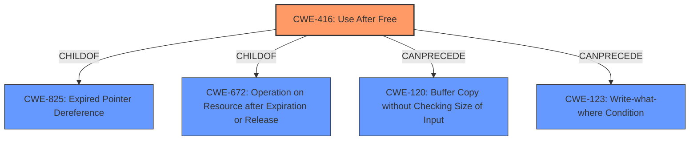

# Raw Analyzer Response for CVE-2022-3842

# Summary
| CWE ID | CWE Name | Confidence | CWE Abstraction Level | CWE Vulnerability Mapping Label | CWE-Vulnerability Mapping Notes |
|---|---|---|---|---|---|
| CWE-416 | Use After Free | 1.0 | Variant | Allowed | Primary CWE |

## Evidence and Confidence

*   **Confidence Score:** 1.0
*   **Evidence Strength:** HIGH

## Relationship Analysis
The primary identified CWE is CWE-416 (**Use After Free**), which is a Variant level CWE. CWE-416 is a child of CWE-825 (**Expired Pointer Dereference**) and CWE-672 (**Operation on Resource after Expiration or Release**). There is also a CANPRECEDE relationship between CWE-416 and CWE-120 (**Buffer Copy without Checking Size of Input**), and CWE-123 (**Write-what-where Condition**). The analysis focuses on CWE-416 because the vulnerability description clearly indicates a use-after-free condition.

## Vulnerability Chain
The vulnerability chain starts with a **Use After Free** (**CWE-416**) condition in the Passwords component of Google Chrome. This leads to potential heap corruption, as stated in the vulnerability description. The impact is heap corruption, which could further lead to arbitrary code execution or other impacts.

## Summary of Analysis
The analysis is based on the provided vulnerability description, which explicitly states a **Use After Free** condition. The primary CWE, CWE-416, is a Variant, which is the preferred abstraction level. The evidence is strong because the vulnerability description and the CVE Reference Links Content Summary both point to a **Use After Free** vulnerability.

The vulnerability description states: "**Use after free** in Passwords in Google Chrome prior to 105.0.5195.125 allowed a remote attacker who had compromised the renderer process to potentially exploit heap corruption via a crafted HTML page."

The CVE Reference Links Content Summary states: "**Root cause of vulnerability:** Use-after-free", and "**Weaknesses/vulnerabilities present:** Use-after-free in Passwords component".

The relationship analysis confirms that CWE-416 is the most specific and appropriate CWE for this vulnerability. The selection of CWE-416 is at the optimal level of specificity because it directly describes the weakness.

Relevant CWE Information:
*   CWE-416 (**Use After Free**) is chosen as the primary CWE because the vulnerability description explicitly mentions a **Use After Free** condition. This aligns with the CWE's description, which states that the product reuses or references memory after it has been freed. The security implication is that an attacker could potentially exploit heap corruption, leading to arbitrary code execution.

*   CWE-366 (**Race Condition within a Thread**) was considered because race conditions can sometimes lead to use-after-free vulnerabilities, but there is no direct evidence of a race condition in the provided description. Therefore, this CWE was not selected.

*   CWE-843 (**Access of Resource Using Incompatible Type ('Type Confusion')**) was considered but not selected because there is no information about type confusion in the description.

*   CWE-122 (**Heap-based Buffer Overflow**) was considered because use-after-free can sometimes lead to heap corruption, which can be exploited as a heap overflow. However, the primary weakness is the use-after-free, so CWE-416 is more appropriate.

*   CWE-911 (**Improper Update of Reference Count**) was considered because reference counting issues can lead to premature freeing of resources, resulting in use-after-free. However, the description doesn't provide any evidence of reference counting issues, so it was not selected.

*   CWE-451 (**User Interface (UI) Misrepresentation of Critical Information**) was considered but is not relevant to this vulnerability.

*   CWE-123 (**Write-what-where Condition**) was considered because it is a potential consequence of a use-after-free, but there is no direct evidence of the attacker's ability to write arbitrary values to arbitrary locations in memory. Therefore, this CWE was not selected.