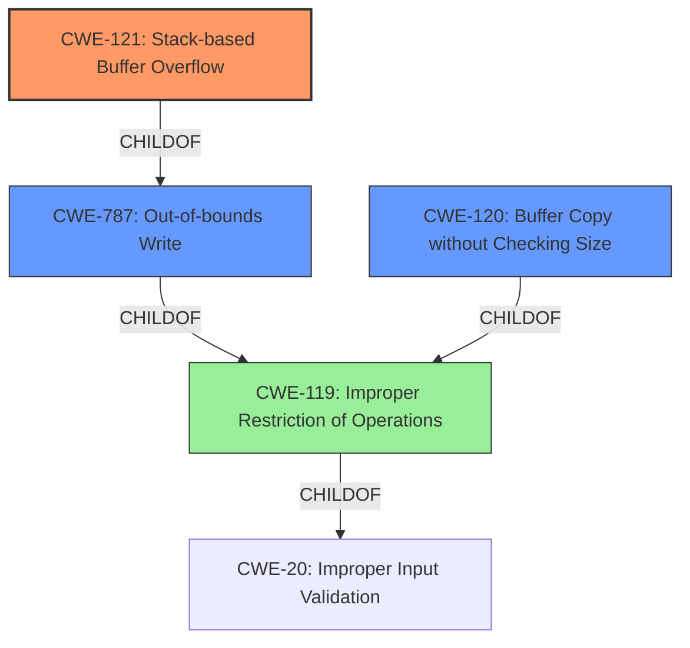

# Raw Analyzer Response for CVE-2022-38459

# Summary
| CWE ID | CWE Name | Confidence | CWE Abstraction Level | CWE Vulnerability Mapping Label | CWE-Vulnerability Mapping Notes |
|---|---|---|---|---|---|
| CWE-121 | Stack-based Buffer Overflow | 1.0 | Variant | Allowed | Primary CWE |
| CWE-120 | Buffer Copy without Checking Size of Input ('Classic Buffer Overflow') | 0.7 | Base | Allowed-with-Review | Secondary Candidate |
| CWE-787 | Out-of-bounds Write | 0.6 | Base | Allowed | Secondary Candidate |

## Evidence and Confidence

*   **Confidence Score:** 0.9
*   **Evidence Strength:** HIGH

## Relationship Analysis
The primary CWE is CWE-121, which is a variant of CWE-787, indicating a more specific type of buffer overflow. CWE-120 is also related as it describes the classic buffer overflow scenario, which often leads to out-of-bounds writes. The relationship between these CWEs highlights the progression from a general buffer overflow (CWE-120) to a specific type occurring on the stack (CWE-121), ultimately resulting in an out-of-bounds write (CWE-787). The abstraction levels influenced the selection, opting for the most specific variant (CWE-121) while acknowledging the broader context of buffer overflows.

## Vulnerability Chain
The vulnerability chain starts with the **improper input validation** (implicit, could be CWE-20), leading to **buffer copy without checking size** (CWE-120), resulting in a **stack-based buffer overflow** (CWE-121) and finally an **out-of-bounds write** (CWE-787), which allows for remote code execution.

## Summary of Analysis
The initial assessment strongly pointed to CWE-787 due to the **stack-based buffer overflow** being the root cause and the description matching "out-of-bounds write". However, given the explicit mention of "stack-based," and the availability of CWE-121 as a more specific variant, CWE-121 was chosen as the primary CWE. The CVE Reference Links Content Summary states, "The `downfile.cgi` script in Siretta QUARTZ-GOLD routers uses `sprintf` to construct a file path without checking the size of the input `_filename` parameter, leading to a stack-based buffer overflow." This clearly indicates a lack of input validation and subsequent buffer overflow on the stack. CWE-121 is the most specific and accurate representation of this vulnerability. CWE-120 is considered because it is the "classic" buffer overflow, but the stack allocation makes CWE-121 more precise.

Relevant CWE Information:

# Enhanced Context (25 CWEs)

## CWE-121: Stack-based Buffer Overflow
**CWE-121** is selected as the primary CWE because the vulnerability description explicitly mentions a **stack-based buffer overflow**. This aligns perfectly with the definition of CWE-121, which is a variant of buffer overflow occurring on the stack. The impact is remote code execution, a typical consequence of such overflows. This is the most specific CWE available.
*   **How the vulnerability's details match the CWE's characteristics:** The vulnerability involves writing beyond the allocated buffer on the stack, which is the core characteristic of CWE-121.
*   **The security implications and potential impact:** The overflow can overwrite critical data on the stack, such as return addresses, leading to control-flow hijacking and remote code execution.
*   **Any parent-child relationships or chain patterns that influenced your mapping:** CWE-121 is a child of CWE-787 (Out-of-bounds Write) and CWE-119 (Improper Restriction of Operations within the Bounds of a Memory Buffer).
*   **Whether the weakness is primary or secondary in the vulnerability:** This is the primary weakness.
*   **How the official MITRE mapping guidance influenced your decision:** The guidance suggests using the most specific variant when available, which supports the selection of CWE-121.

## CWE-120: Buffer Copy without Checking Size of Input ('Classic Buffer Overflow')
CWE-120 was considered due to the root cause being the use of `sprintf` without proper bounds checking. This fits the description of copying data to a buffer without ensuring sufficient space. However, the stack-specific nature of the overflow led to choosing CWE-121 as the primary.
*   **How the vulnerability's details match the CWE's characteristics:** The use of `sprintf` without size checks directly corresponds to CWE-120's description.
*   **The security implications and potential impact:** Without size checks, `sprintf` can write beyond the buffer's boundaries, leading to a buffer overflow.
*   **Any parent-child relationships or chain patterns that influenced your mapping:** CWE-120 is a child of CWE-119 (Improper Restriction of Operations within the Bounds of a Memory Buffer).
*   **Whether the weakness is primary or secondary in the vulnerability:** This is a secondary factor contributing to the vulnerability.
*   **How the official MITRE mapping guidance influenced your decision:** The guidance suggests that if there is input validation, consider children of CWE-20 such as CWE-1284. However, there is no explicit validation, so the usage of sprintf without size checking is the main weakness that contributes to this vulnerability.

## CWE-787: Out-of-bounds Write
CWE-787 was considered as a more general classification of the buffer overflow. The overflow ultimately results in writing outside the intended memory region. However, due to the availability of the more precise CWE-121, CWE-787 is a secondary consideration.

**CWEs Considered But Not Used:**

*   **CWE-119: Improper Restriction of Operations within the Bounds of a Memory Buffer:** This is a more general class that encompasses buffer overflows, but CWE-121 and CWE-120 provide more specific details about the nature and location of the overflow.
*   **CWE-1284: Improper Validation of Specified Quantity in Input:** While the `_filename` parameter is not validated for length, the core issue is the unchecked copy operation using `sprintf`, making CWE-120/121 more relevant.
*   **CWE-190: Integer Overflow or Wraparound:** There's no evidence of integer overflow being directly involved in this vulnerability.
*   **CWE-918: Server-Side Request Forgery (SSRF):** This is not relevant as the vulnerability is a buffer overflow, not a request forgery issue.
*   **CWE-128: Wrap-around Error:** Not relevant as there is no evidence of wrap-around errors.
*   **CWE-674: Uncontrolled Recursion:** This is not relevant as the vulnerability is a buffer overflow, not a recursion issue.
*   **CWE-1287: Improper Validation of Specified Type of Input:** While input validation is missing, the key issue is the lack of bounds checking during the copy operation, which is better captured by CWE-120 and CWE-121.
*   **CWE-122: Heap-based Buffer Overflow:** This is not the correct location since the overflow happens on the stack.