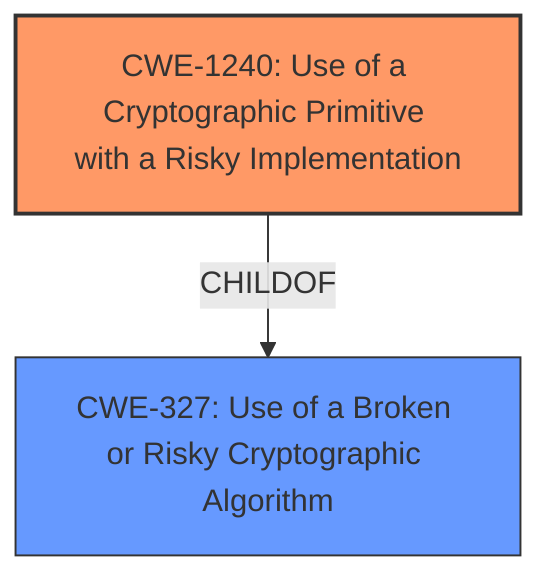

# Analysis Report for CVE-2022-38493

# Vulnerability Analysis Report: CVE-2022-38493

## Description


## Analysis (with Relationship Data)

# Summary
| CWE ID | CWE Name | Confidence | CWE Abstraction Level | CWE Vulnerability Mapping Label | CWE-Vulnerability Mapping Notes |
|---|---|---|---|---|---|
| CWE-1240 | Use of a Cryptographic Primitive with a Risky Implementation | 0.9 | Base | Allowed | Primary CWE |
| CWE-327 | Use of a Broken or Risky Cryptographic Algorithm | 0.7 | Class | Allowed-with-Review | Secondary Candidate |

## Evidence and Confidence

*   **Confidence Score:** 0.8
*   **Evidence Strength:** HIGH

## Relationship Analysis
The primary CWE selected is CWE-1240, which is a Base level CWE, and a child of CWE-327. CWE-327 is a Class level CWE. The decision to choose CWE-1240 is based on the fact that the vulnerability involves using an RSA-OAEP decryption without checking the RSA private key length which is considered a risky implementation of a cryptographic primitive. Choosing CWE-1240 over CWE-327 provides a more specific classification.



## Vulnerability Chain
The vulnerability chain begins with the **root cause** of **not checking the RSA private key length before RSA-OAEP decryption**. This can lead to a denial of service (**impact**) through a crafted JWE token (**vector**).

## Summary of Analysis
The initial analysis strongly points towards a cryptographic issue related to improper key handling in RSA-OAEP decryption. The evidence from the vulnerability description and CVE reference summary clearly indicates that the code **does not check the RSA private key length before RSA-OAEP decryption**. The commit message "Fix rsa oaep key length check before decryption" further supports this. The key was also missing a check that the size of the key should be large enough to hold the two hashes and padding needed in RSA OAEP.

The Retriever Results listed CWE-1240 "Use of a Cryptographic Primitive with a Risky Implementation" with high scores. CWE-1240 is at the Base level, which is preferred. The description of CWE-1240 mentions "the product implements a cryptographic algorithm using a non-standard, unproven, or disallowed/non-compliant cryptographic implementation," which aligns with the vulnerability.

CWE-327 "Use of a Broken or Risky Cryptographic Algorithm" was also considered, as it is a parent of CWE-1240. However, CWE-1240 provides a more specific description of the weakness, making it a better fit.

Therefore, the final decision is to classify this vulnerability as CWE-1240 "Use of a Cryptographic Primitive with a Risky Implementation" with high confidence. This decision is based on the evidence from the vulnerability description, CVE reference summary, and the CWE specifications.

Relevant CWE Information:

# Enhanced Context (25 CWEs)

## CWE-1240: Use of a Cryptographic Primitive with a Risky Implementation
**Abstraction Level**: Base
**Similarity Score**: 0.82
**Source**: dense

**Description**:
To fulfill the need for a cryptographic primitive, the product implements a cryptographic algorithm using a non-standard, unproven, or disallowed/non-compliant cryptographic implementation.

**Mapping Guidance**:
- Usage: Allowed
- Rationale: This CWE entry is at the Base level of abstraction, which is a preferred level of abstraction for mapping to the root causes of vulnerabilities.

Justification: The vulnerability description indicates a failure to properly validate the RSA private key length before RSA-OAEP decryption. This falls under the category of using a cryptographic primitive (RSA-OAEP) with a risky implementation (insufficient key length check). The **rootcause** is **doesnt check the RSA private key length before RSA-OAEP decryption**. This can lead to denial of service if exploited.

## CWE-327: Use of a Broken or Risky Cryptographic Algorithm
**Abstraction Level**: Class
**Similarity Score**: 7482.99
**Source**: sparse

**Description**:
The product uses a broken or risky cryptographic algorithm or protocol.

**Mapping Guidance**:
- Usage: Allowed-with-Review
- Rationale: This CWE entry is a Class and might have Base-level children that would be more appropriate

Justification: While the **rootcause** is **doesnt check the RSA private key length before RSA-OAEP decryption**, this could be seen as using a risky cryptographic algorithm because of the **lack of proper key length validation**. This is a broader classification than CWE-1240.


## CWE Relationship Analysis

Current CWEs represent these abstraction levels: .


### Vulnerability Chain Analysis

**Chain starting from CWE-327:**
- 327 (Use of a Broken or Risky Cryptographic Algorithm) - ROOT


**Chain starting from CWE-1240:**
- 1240 (Use of a Cryptographic Primitive with a Risky Implementation) - ROOT


### CWE Relationship Diagram

```mermaid
graph TD
    classDef primary fill:#f96,stroke:#333,stroke-width:2px
    classDef secondary fill:#69f,stroke:#333
    classDef tertiary fill:#9e9,stroke:#333
```


*Report generated on 2025-03-30 16:10:41*
