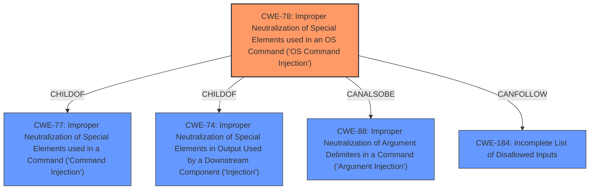

# Enhanced Analysis for CVE-2022-38511

# Summary
| CWE ID | CWE Name | Confidence | CWE Abstraction Level | CWE Vulnerability Mapping Label | CWE-Vulnerability Mapping Notes |
|---|---|---|---|---|---|
| CWE-78 | Improper Neutralization of Special Elements used in an OS Command ('OS Command Injection') | 1.0 | Base | Allowed | Primary CWE |

## Evidence and Confidence

*   **Confidence Score:** 1.0
*   **Evidence Strength:** HIGH

## Relationship Analysis
The primary CWE is CWE-78, which is a Base level CWE. It is a child of CWE-77 and CWE-74, but those are class level CWEs and less specific. CWE-78 can also be related to CWE-88 which deals with argument injection. There is also a CANFOLLOW relationship to CWE-184 and other CWEs. Because CWE-78 is the most specific and maps directly to the **command injection** vulnerability, and is at the base level of abstraction, it is the right choice here.



## Vulnerability Chain
The vulnerability chain starts with the `downloadFile.cgi` script.
1.  The script **fails to sanitize** user-supplied input from the `QUERY_STRING`.
2.  The unsanitized input is passed to the `system` function.
3.  This allows for **command injection**, where an attacker can execute arbitrary commands.

Thus, the root cause is the **improper neutralization** and the result is **OS Command Injection**.

## Summary of Analysis
The vulnerability description clearly states a **command injection** vulnerability in `downloadFile.cgi` due to **failure to sanitize** user input from `QUERY_STRING` before passing it to the `system` function.

The CVE Reference Links Content Summary confirms this: "The vulnerability stems from the `downloadFile.cgi` script **failing to sanitize** user-supplied input from the `QUERY_STRING` before passing it to the `system` function. This allows for command injection."

The Retriever Results list CWE-77 and CWE-78 as top candidates. CWE-78, "Improper Neutralization of Special Elements used in an OS Command ('OS Command Injection')" is a Base level CWE, while CWE-77 "Improper Neutralization of Special Elements used in a Command ('Command Injection')" is a Class level CWE. Since the vulnerability is specifically related to OS commands, CWE-78 is a more precise match. The Mapping Guidance for CWE-78 states "This CWE entry is at the Base level of abstraction, which is a preferred level of abstraction for mapping to the root causes of vulnerabilities."

The evidence supports selecting CWE-78 as the primary CWE. The other CWEs, such as CWE-77, are less specific.
CWE-74 is a class-level "Improper Neutralization" CWE. CWE-77 is a class-level "Command Injection" CWE.
CWE-184 (Incomplete List of Disallowed Inputs) could be a contributing factor if the sanitization was attempted but incomplete, but the description focuses on the lack of sanitization.
CWE-790 (Improper Filtering of Special Elements) is similar to CWE-138 (Improper Neutralization of Special Elements), and both are too general.
CWE-94 (Improper Control of Generation of Code ('Code Injection')) and CWE-96 (Improper Neutralization of Directives in Statically Saved Code ('Static Code Injection')) are for cases where the product constructs a code segment, which is not the case here.
CWE-121 (Stack-based Buffer Overflow) is a memory corruption issue and not relevant to this vulnerability.


## CWE Relationship Analysis

Current CWEs represent these abstraction levels: .


### Vulnerability Chain Analysis

**Chain starting from CWE-96:**
- 96 (Improper Neutralization of Directives in Statically Saved Code ('Static Code Injection')) - ROOT


**Chain starting from CWE-184:**
- 184 (Incomplete List of Disallowed Inputs) - ROOT


### CWE Relationship Diagram

```mermaid
graph TD
    classDef primary fill:#f96,stroke:#333,stroke-width:2px
    classDef secondary fill:#69f,stroke:#333
    classDef tertiary fill:#9e9,stroke:#333
```