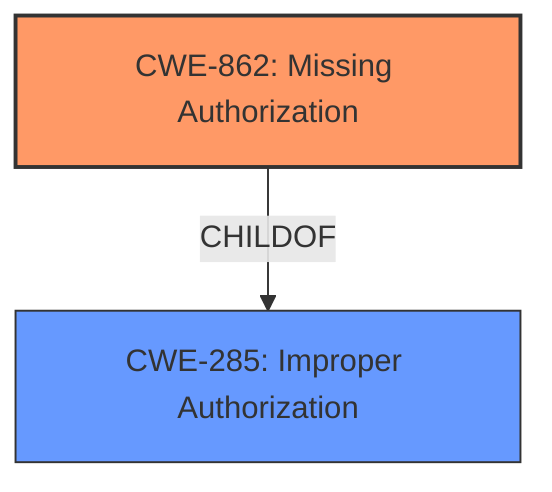

# Enhanced Analysis for CVE-2022-38512

# Summary
| CWE ID | CWE Name | Confidence | CWE Abstraction Level | CWE Vulnerability Mapping Label | CWE-Vulnerability Mapping Notes |
|---|---|---|---|---|---|
| CWE-862 | Missing Authorization | 1 | Class | Allowed-with-Review | Primary CWE |

## Evidence and Confidence

*   **Confidence Score:** 1
*   **Evidence Strength:** HIGH

## Relationship Analysis
The primary relationship impacting the decision is the ChildOf relationship between CWE-862 and CWE-285 (Improper Authorization). CWE-862 represents the specific case where authorization is entirely missing, making it a more precise classification than its parent. Other relationships, such as those in the retriever results, are less relevant as they focus on path traversal or CSRF, which are not directly indicated in the vulnerability description. The choice of the Class level for CWE-862 is due to the lack of a more specific Base or Variant CWE that directly addresses the root cause.



## Vulnerability Chain
The vulnerability chain consists of a single primary weakness:
1.  **Root Cause:** **Missing Authorization** in the Translation module. This allows unauthorized users to proceed with actions that should be restricted.
2.  **Impact:** Unauthorized download of web content pages XLIFF translation file, potentially exposing sensitive information.

## Summary of Analysis
The initial analysis focused on identifying the **root cause** of the vulnerability. The description clearly states that the Translation module **does not check permissions** before allowing a user to export web content for translation. This directly aligns with the definition of CWE-862 (Missing Authorization), which describes a situation where the product does not perform an authorization check when an actor attempts to access a resource or perform an action.

The evidence from the vulnerability description and CVE Reference Links Content Summary strongly supports this classification:

*   **Vulnerability Description Key Phrases:** "**does not check permissions**"
*   **CVE Reference Links Content Summary:** "The Translation module ... **does not properly check permissions** before allowing users to export web content for translation."
*   **CVE Reference Links Content Summary:** "**Missing authorization check:** The system fails to verify if a user has the necessary permissions to export web content for translation."

The retriever results also suggested CWE-862 as a candidate, further reinforcing its relevance. While CWE-285 (Improper Authorization) was also suggested, CWE-862 is more specific as it indicates a complete absence of authorization checks, rather than an incorrect implementation.

The selection of CWE-862 is at the optimal level of specificity because it directly addresses the **root cause** of the vulnerability: the **lack of permission checks**. While other CWEs, such as CWE-22 (Improper Limitation of a Pathname to a Restricted Directory) or CWE-352 (Cross-Site Request Forgery), might be indirectly related or represent potential attack vectors, they do not accurately capture the fundamental **weakness** in the Translation module's authorization mechanism.


## CWE Relationship Analysis

Current CWEs represent these abstraction levels: .


### Vulnerability Chain Analysis

**Chain starting from CWE-862:**
- 862 (Missing Authorization) - ROOT


**Chain starting from CWE-352:**
- 352 (Cross-Site Request Forgery (CSRF)) - ROOT


### CWE Relationship Diagram

```mermaid
graph TD
    classDef primary fill:#f96,stroke:#333,stroke-width:2px
    classDef secondary fill:#69f,stroke:#333
    classDef tertiary fill:#9e9,stroke:#333
```