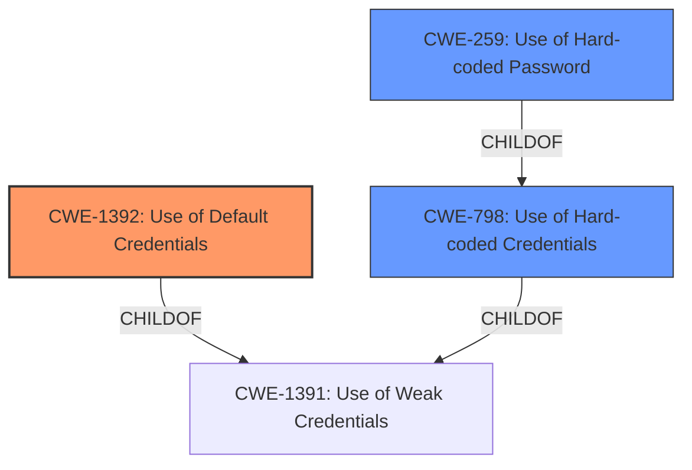

# Analysis Report for CVE-2022-38556

# Vulnerability Analysis Report: CVE-2022-38556

## Description


## Analysis (with Relationship Data)

# Summary
| CWE ID  | CWE Name                       | Confidence | CWE Abstraction Level | CWE Vulnerability Mapping Label | CWE-Vulnerability Mapping Notes |
|---------|--------------------------------|------------|-----------------------|---------------------------------|-------------------------------|
| CWE-1392 | Use of Default Credentials     | 1          | Base                  | Primary                         | Allowed                       |
| CWE-798  | Use of Hard-coded Credentials  | 0.7        | Base                  | Secondary                       | Allowed                       |
| CWE-259  | Use of Hard-coded Password     | 0.6        | Variant               | Secondary                       | Allowed                       |

## Evidence and Confidence

*   **Confidence Score:** 0.8
*   **Evidence Strength:** HIGH

## Relationship Analysis
The primary CWE is CWE-1392 **Use of Default Credentials**, which is a Base level CWE and a child of CWE-1391 **Use of Weak Credentials** (Class). CWE-798 **Use of Hard-coded Credentials** (Base) is also a child of CWE-1391. CWE-259 **Use of Hard-coded Password** (Variant) is a child of CWE-798. The relationship suggests that the **weakness** could be further specified.



## Vulnerability Chain
The vulnerability chain starts with the **static default credential** in the `/etc/init0.d/S80telnetd.sh` file, leading to unauthorized access via Telnet.

## Summary of Analysis
The vulnerability description explicitly mentions a "**static default credential**" in `/etc/init0.d/S80telnetd.sh`.

Based on the evidence, the primary CWE is CWE-1392 **Use of Default Credentials**, which accurately captures the **root cause** of the vulnerability.

CWE-798 **Use of Hard-coded Credentials** and CWE-259 **Use of Hard-coded Password** are considered as secondary because the description mentions "**default**" credentials, which implies that the credentials are the same across multiple installations, aligning more closely with the definition of CWE-1392. However, the credentials are also static, which aligns with CWE-798 and CWE-259.

The retriever results indicate that CWE-1392, CWE-798, and CWE-259 are all highly relevant. The final decision is based on the specific phrase "**static default credential**" in the description, which directly maps to the concept of default credentials that are not unique to each installation.

Relevant CWE Information:

# Enhanced Context (25 CWEs)
The following CWEs were identified as potentially relevant to this vulnerability:

## CWE-1392: Use of Default Credentials
**Abstraction:** Base

### Description
The product uses default credentials (such as passwords or cryptographic keys) for potentially critical functionality.

### Mapping Guidance
**Usage:** Allowed
**Rationale:** This CWE entry is at the Base level of abstraction, which is a preferred level of abstraction for mapping to the root causes of vulnerabilities.

### Observed Examples
- **CVE-2022-30270:** Remote Terminal Unit (RTU) uses default credentials for some SSH accounts
- **CVE-2021-41192:** data visualization/sharing package uses default secret keys or cookie values if they are not specified in environment variables
- **CVE-2021-38759:** microcontroller board has default password

## CWE-798: Use of Hard-coded Credentials
**Abstraction:** Base

### Description
The product contains hard-coded credentials, such as a password or cryptographic key.

### Mapping Guidance
**Usage:** Allowed
**Rationale:** This CWE entry is at the Base level of abstraction, which is a preferred level of abstraction for mapping to the root causes of vulnerabilities.

### Observed Examples
- **CVE-2022-29953:** Condition Monitor firmware has a maintenance interface with hard-coded credentials
- **CVE-2022-29960:** Engineering Workstation uses hard-coded cryptographic keys that could allow for unathorized filesystem access and privilege escalation
- **CVE-2022-29964:** Distributed Control System (DCS) has hard-coded passwords for local shell access

## CWE-259: Use of Hard-coded Password
**Abstraction:** Variant

### Description
The product contains a hard-coded password, which it uses for its own inbound authentication or for outbound communication to external components.

### Mapping Guidance
**Usage:** Allowed
**Rationale:** This CWE entry is at the Variant level of abstraction, which is a preferred level of abstraction for mapping to the root causes of vulnerabilities.

### Observed Examples
- **CVE-2022-29964:** Distributed Control System (DCS) has hard-coded passwords for local shell access
- **CVE-2021-37555:** Telnet service for IoT feeder for dogs and cats has hard-coded password [REF-1288]
- **CVE-2021-35033:** Firmware for a WiFi router uses a hard-coded password for a BusyBox shell, allowing bypass of authentication through the UART port

### Technical Explanation for CWE-1392:
The Trendnet TEW733GR v1.03B01 router uses **default credentials** in the `/etc/init0.d/S80telnetd.sh` file, which allows unauthorized access via Telnet. This matches the description of CWE-1392, which states that the product uses default credentials for potentially critical functionality.
- **Security Implications:** Unauthorized access to the router, potentially leading to configuration changes, data theft, or further exploitation.
- **Relationship:** CWE-1392 is a Base level CWE and a child of CWE-1391.
- **Mapping Guidance:** The Usage is ALLOWED.
- **Rationale:** The "**default credential**" aspect aligns perfectly with the CWE description.

### Technical Explanation for CWE-798:
The **static** nature of the **default credential** also implies that it is **hard-coded**, aligning with CWE-798. However, the "**default**" aspect is more prominent.
- **Security Implications:** Unauthorized access due to the predictability of the **hard-coded** credential.
- **Relationship:** CWE-798 is a Base level CWE and a child of CWE-1391.
- **Mapping Guidance:** The Usage is ALLOWED.

### Technical Explanation for CWE-259:
Since the vulnerability involves a password, CWE-259 is also considered. However, it is more specific to passwords, and the broader term of "**default credential**" in CWE-1392 is more encompassing.
- **Security Implications:** Unauthorized access due to the presence of a **hard-coded** password.
- **Relationship:** CWE-259 is a Variant level CWE and a child of CWE-798.
- **Mapping Guidance:** The Usage is ALLOWED.

### Other CWEs Considered but Not Used:
CWE-96 **Improper Neutralization of Directives in Statically Saved Code ('Static Code Injection')**: This CWE was not selected because the vulnerability is not related to code injection.
CWE-1391 **Use of Weak Credentials**: This CWE is a Class, and the more specific Base CWE-1392 is a better fit.
CWE-184 **Incomplete List of Disallowed Inputs**: This CWE was not selected because the vulnerability is not related to an incomplete list of disallowed inputs.
CWE-321 **Use of Hard-coded Cryptographic Key**: This CWE was not selected because the vulnerability involves a password, not a cryptographic key.
CWE-613 **Insufficient Session Expiration**: This CWE was not selected because the vulnerability is not related to session expiration.
CWE-912 **Hidden Functionality**: This CWE was not selected because the vulnerability is not related to hidden functionality.


## CWE Relationship Analysis

Current CWEs represent these abstraction levels: .


### Vulnerability Chain Analysis

**Chain starting from CWE-1392:**
- 1392 (Use of Default Credentials) - ROOT


**Chain starting from CWE-184:**
- 184 (Incomplete List of Disallowed Inputs) - ROOT


### CWE Relationship Diagram

```mermaid
graph TD
    classDef primary fill:#f96,stroke:#333,stroke-width:2px
    classDef secondary fill:#69f,stroke:#333
    classDef tertiary fill:#9e9,stroke:#333
```


*Report generated on 2025-03-31 01:53:42*
