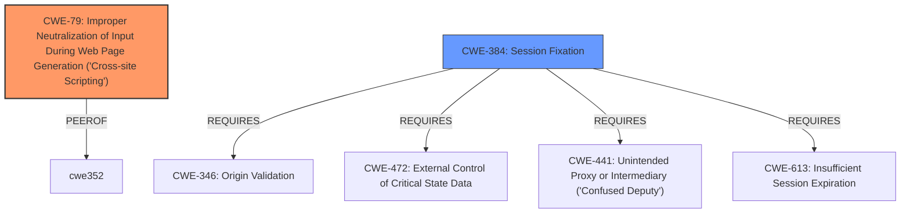

# Analysis for CVE-2022-38628

# Summary

| CWE ID | CWE Name | Confidence | CWE Abstraction Level | CWE Vulnerability Mapping Label | CWE-Vulnerability Mapping Notes |
|---|---|---|---|---|---|
| CWE-79 | Improper Neutralization of Input During Web Page Generation ('Cross-site Scripting') | 1.0 | Base | Allowed | Primary CWE: The vulnerability is due to **improper neutralization of input** leading to XSS. |
| CWE-384 | Session Fixation | 0.8 | Compound | Allowed | Secondary CWE: The vulnerability is chained with session fixation, allowing for privilege escalation. |

## Evidence and Confidence

*   **Confidence Score:** 0.9
*   **Evidence Strength:** HIGH

## Relationship Analysis

The primary weakness is **CWE-79 (Improper Neutralization of Input During Web Page Generation ('Cross-site Scripting'))**. This CWE is at the Base level of abstraction and directly addresses the root cause of the XSS vulnerability. The vulnerability is chained with **CWE-384 (Session Fixation)**, a Compound CWE. **CWE-79** is a PeerOf **CWE-352**, Cross-Site Request Forgery, but CSRF is not mentioned in the description. **CWE-384** Requires **CWE-346 (Origin Validation)**, **CWE-472 (External Control of Critical State Data)** and **CWE-441 (Unintended Proxy or Intermediary ('Confused Deputy'))** and **CWE-613 (Insufficient Session Expiration)**.

## Vulnerability Chain

The vulnerability chain starts with **improper sanitization** of the "no" parameter (`ack_log.php`), leading to **CWE-79 (Cross-Site Scripting)**, which, when combined with **CWE-384 (Session Fixation)**, allows for **privilege escalation**.

## Summary of Analysis

Initially, the description indicated a **cross-site scripting** (XSS) vulnerability chained with a local session fixation allowing attackers to escalate privileges. The CVE Reference Links Content Summary revealed that the **root cause** is the lack of proper sanitization of the "no" parameter in the `ack_log.php` script, confirming **CWE-79 (Improper Neutralization of Input During Web Page Generation ('Cross-site Scripting'))**. The vulnerability is chained with session fixation, leading to privilege escalation. The retriever results listed **CWE-79** and **CWE-384 (Session Fixation)**, supporting the initial assessment. **CWE-79** is the primary weakness as it is the **root cause** of the XSS vulnerability. **CWE-384** is a secondary weakness because it is chained with the XSS to enable privilege escalation. Both **CWE-79** and **CWE-384** are at appropriate levels of abstraction. The choice of **CWE-79** is based on the evidence: "The application does not sufficiently sanitize the input provided via the "no" parameter, allowing an attacker to inject malicious JavaScript code." The choice of **CWE-384** is based on the evidence that this XSS vulnerability is chainable with session fixation.

Relevant CWE Information:

# Enhanced Context (25 CWEs)

## CWE-130: Improper Handling of Length Parameter Inconsistency
**Abstraction Level**: Base
**Similarity Score**: 0.80
**Source**: dense

**Description**:
The product parses a formatted message or structure, but it does not handle or incorrectly handles a length field that is inconsistent with the actual length of the associated data.

**Mapping Guidance**:
- Usage: Allowed
- Rationale: This CWE entry is at the Base level of abstraction, which is a preferred level of abstraction for mapping to the root causes of vulnerabilities.

This CWE was not selected because there is no evidence of length parameter inconsistency in the vulnerability description.

## CWE-113: Improper Neutralization of CRLF Sequences in HTTP Headers ('HTTP Request/Response Splitting')
**Abstraction Level**: Variant
**Similarity Score**: 0.79
**Source**: dense

**Description**:
The product receives data from an HTTP agent/component (e.g., web server, proxy, browser, etc.), but it does not neutralize or incorrectly neutralizes CR and LF characters before the data is included in outgoing HTTP headers.

**Mapping Guidance**:
- Usage: Allowed
- Rationale: This CWE entry is at the Variant level of abstraction, which is a preferred level of abstraction for mapping to the root causes of vulnerabilities.

This CWE was not selected because there is no evidence of CRLF sequence issues in the vulnerability description.

## CWE-74: Improper Neutralization of Special Elements in Output Used by a Downstream Component ('Injection')
**Abstraction Level**: Class
**Similarity Score**: 0.77
**Source**: dense

**Description**:
The product constructs all or part of a command, data structure, or record using externally-influenced input from an upstream component, but it does not neutralize or incorrectly neutralizes special elements that could modify how it is parsed or interpreted when it is sent to a downstream component.

**Mapping Guidance**:
- Usage: Discouraged
- Rationale: CWE-74 is high-level and often misused when lower-level weaknesses are more appropriate.

This CWE was not selected because it is a high-level class, and CWE-79 provides a more specific base-level classification for the XSS vulnerability.

## CWE-41: Improper Resolution of Path Equivalence
**Abstraction Level**: Base
**Similarity Score**: 0.76
**Source**: dense

**Description**:
The product is vulnerable to file system contents disclosure through path equivalence. Path equivalence involves the use of special characters in file and directory names. The associated manipulations are intended to generate multiple names for the same object.

**Mapping Guidance**:
- Usage: Allowed
- Rationale: This CWE entry is at the Base level of abstraction, which is a preferred level of abstraction for mapping to the root causes of vulnerabilities.

This CWE was not selected because there is no evidence of path equivalence issues in the vulnerability description.

## CWE-125: Out-of-bounds Read
**Abstraction Level**: Base
**Similarity Score**: 0.76
**Source**: dense

**Description**:
The product reads data past the end, or before the beginning, of the intended buffer.

**Mapping Guidance**:
- Usage: Allowed
- Rationale: This CWE entry is at the Base level of abstraction, which is a preferred level of abstraction for mapping to the root causes of vulnerabilities.

This CWE was not selected because there is no evidence of out-of-bounds read issues in the vulnerability description.

## CWE-131: Incorrect Calculation of Buffer Size
**Abstraction Level**: Base
**Similarity Score**: 0.75
**Source**: dense

**Description**:
The product does not correctly calculate the size to be used when allocating a buffer, which could lead to a buffer overflow.

**Mapping Guidance**:
- Usage: Allowed
- Rationale: This CWE entry is at the Base level of abstraction, which is a preferred level of abstraction for mapping to the root causes of vulnerabilities.

This CWE was not selected because there is no evidence of incorrect buffer size calculation in the vulnerability description.

## CWE-212: Improper Removal of Sensitive Information Before Storage or Transfer
**Abstraction Level**: Base
**Similarity Score**: 0.75
**Source**: dense

**Description**:
The product stores, transfers, or shares a resource that contains sensitive information, but it does not properly remove that information before the product makes the resource available to unauthorized actors.

**Mapping Guidance**:
- Usage: Allowed
- Rationale: This CWE entry is at the Base level of abstraction, which is a preferred level of abstraction for mapping to the root causes of vulnerabilities.

This CWE was not selected because there is no evidence of sensitive information exposure in the vulnerability description.

## CWE-191: Integer Underflow (Wrap or Wraparound)
**Abstraction Level**: Base
**Similarity Score**: 0.75
**Source**: dense

**Description**:
The product subtracts one