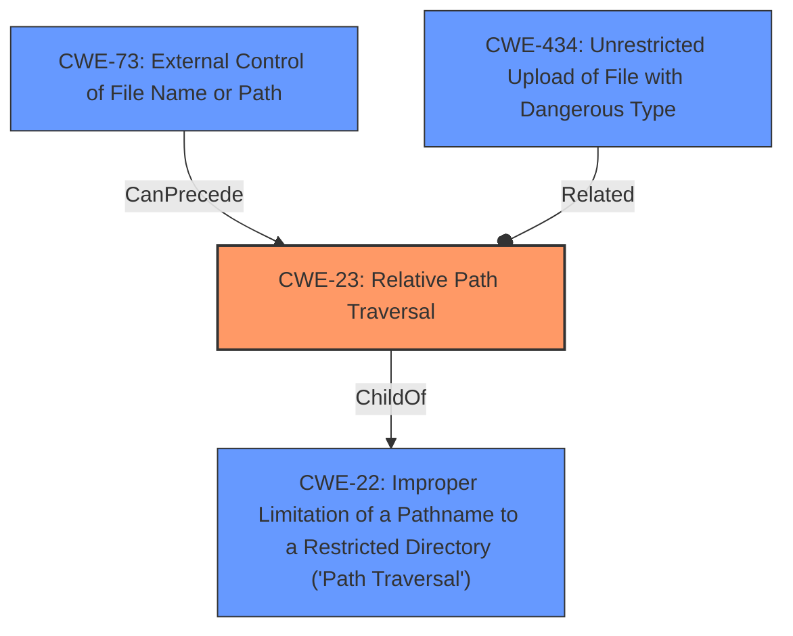

# Analysis Report for CVE-2022-38638

# Vulnerability Analysis Report: CVE-2022-38638

## Description


## Analysis (with Relationship Data)

# Summary
| CWE ID | CWE Name | Confidence | CWE Abstraction Level | CWE Vulnerability Mapping Label | CWE-Vulnerability Mapping Notes |
|---|---|---|---|---|---|
| CWE-23 | Relative Path Traversal | 1.0 | Base | Allowed | Primary CWE |
| CWE-73 | External Control of File Name or Path | 0.8 | Base | Allowed | Secondary Candidate |
| CWE-434 | Unrestricted Upload of File with Dangerous Type | 0.6 | Base | Allowed | Secondary Candidate |

## Evidence and Confidence

*   **Confidence Score:** 0.9
*   **Evidence Strength:** HIGH

## Relationship Analysis
The primary weakness, **CWE-23 (Relative Path Traversal)**, is a specific type of **CWE-22 (Improper Limitation of a Pathname to a Restricted Directory ('Path Traversal'))**. **CWE-73 (External Control of File Name or Path)** can precede **CWE-23**, as external control of the filename or path is often a prerequisite for path traversal vulnerabilities. **CWE-434 (Unrestricted Upload of File with Dangerous Type)** is related because the file upload mechanism provides the vector for the path traversal to be exploited, but is not the root cause.



## Vulnerability Chain
The vulnerability chain starts with the application allowing external control of the file path (**CWE-73**). This then leads to the **Improper Limitation of a Pathname to a Restricted Directory ('Path Traversal')** (**CWE-22**), specifically a **Relative Path Traversal** vulnerability (**CWE-23**), where an attacker can use "../" sequences to write files to arbitrary locations. The file upload mechanism (**CWE-434**) provides the means to exploit the path traversal, resulting in arbitrary file write.

## Summary of Analysis
Based on the provided vulnerability description and the supporting evidence, the primary weakness is **CWE-23 (Relative Path Traversal)**. The vulnerability involves the **improper neutralization** of ".." sequences in the `fullFilePath` parameter, allowing attackers to write files outside the intended directory.

The following evidence supports this classification:

*   "**Root cause of vulnerability**: The `fullFilePath` parameter of the `/api/upload-resource` endpoint, when the upload provider is set to "Storage Local File System," allows for directory traversal."
*   "**Weaknesses/vulnerabilities present**: The vulnerability is an arbitrary file write/overwrite vulnerability. Specifically, the **lack of proper sanitization** of the `fullFilePath` parameter allows an attacker to use relative paths like `../` to navigate outside the intended directory."
*   "**Attack vectors**: The vulnerability is exploited via the `/api/upload-resource` endpoint with a crafted POST request that includes the `fullFilePath` parameter with directory traversal sequences (e.g., `resource%2F%2e%2e%2F%2e%2e%2Fweb%2Fbuild%2Fflag.html`)."

**CWE-23 (Relative Path Traversal)** accurately captures this weakness. It is a Base level CWE, which is the preferred level of abstraction. The description of **CWE-23** explicitly mentions the "**improper neutralization** of sequences such as ".." that can resolve to a location that is outside of that directory."

**CWE-73 (External Control of File Name or Path)** was considered because the vulnerability involves the `fullFilePath` parameter being controllable by the user. However, the core issue is not just external control, but the **improper handling** of the path, leading to traversal. Therefore, **CWE-23** is more specific.

**CWE-434 (Unrestricted Upload of File with Dangerous Type)** was considered because the vulnerability is triggered through a file upload mechanism. However, the root cause is the **path traversal** vulnerability and not the unrestricted upload of files in general. The arbitrary file write is a consequence of the path traversal, not the primary weakness.

**CWE-78 (Improper Neutralization of Special Elements used in an OS Command ('OS Command Injection'))** was considered because the impact is arbitrary file write which could lead to code execution. However, this isn't OS command injection. The **root cause** is the **lack of sanitization** that lead to **relative path traversal**.

Therefore, **CWE-23 (Relative Path Traversal)** is the most accurate and specific CWE for this vulnerability.

Relevant CWE Information:
INSERT


## CWE Relationship Analysis

Current CWEs represent these abstraction levels: .


### Vulnerability Chain Analysis

**Chain starting from CWE-434:**
- 434 (Unrestricted Upload of File with Dangerous Type) - ROOT


**Chain starting from CWE-78:**
- 78 (Improper Neutralization of Special Elements used in an OS Command ('OS Command Injection')) - ROOT


### CWE Relationship Diagram

```mermaid
graph TD
    classDef primary fill:#f96,stroke:#333,stroke-width:2px
    classDef secondary fill:#69f,stroke:#333
    classDef tertiary fill:#9e9,stroke:#333
```


*Report generated on 2025-03-31 00:36:33*
