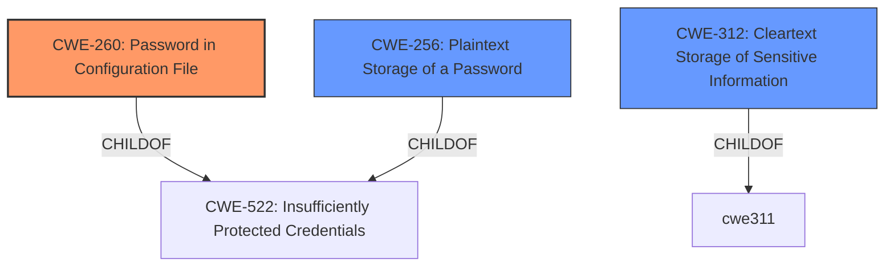

# Enhanced Analysis for CVE-2022-38665

# Summary
| CWE ID | CWE Name | Confidence | CWE Abstraction Level | CWE Vulnerability Mapping Label | CWE-Vulnerability Mapping Notes |
|---|---|---|---|---|---|
| CWE-260 | Password in Configuration File | 1.00 | Base | Allowed | Primary CWE |
| CWE-312 | Cleartext Storage of Sensitive Information | 0.75 | Base | Allowed | Secondary Candidate |
| CWE-256 | Plaintext Storage of a Password | 0.75 | Base | Allowed | Secondary Candidate |

## Evidence and Confidence

*   **Confidence Score:** 0.90
*   **Evidence Strength:** HIGH

## Relationship Analysis
The primary CWE, CWE-260, is a child of CWE-522 (Insufficiently Protected Credentials), which is a class-level CWE. This indicates that CWE-260 is a more specific type of credential protection issue. While CWE-522 is a parent, it is too general of a classification. The vulnerability specifically involves a password stored in a configuration file, justifying the choice of CWE-260.



## Vulnerability Chain
The vulnerability chain involves the following sequence:
1.  **Root Cause:** **Insecure storage of the RabbitMQ password in plaintext** within the configuration file. This corresponds to CWE-260 (Password in Configuration File).
2.  **Weakness:** The **unencrypted storage of sensitive information** allows unauthorized access to the password. This could also be viewed as CWE-312 (Cleartext Storage of Sensitive Information) or CWE-256 (Plaintext Storage of a Password).
3.  **Impact:** Users with access to the Jenkins controller's file system can view the RabbitMQ password, potentially leading to unauthorized access to the RabbitMQ server and connected systems.

## Summary of Analysis
The initial analysis identified that the **weakness** is the **unencrypted storage of the RabbitMQ password** in a configuration file. The evidence from the vulnerability description states, "Jenkins CollabNet Plugins Plugin 2.0.8 and earlier stores a RabbitMQ password unencrypted in its global configuration file on the Jenkins controller where it can be viewed by users with access to the Jenkins controller file system." The CVE Reference Links Content Summary reinforces this by stating, "The CollabNet Plugins Plugin stores a RabbitMQ password unencrypted in its global configuration file."

The Retriever Results show CWE-260 (Password in Configuration File) as the top candidate. CWE-260's description states, "The product stores a password in a configuration file that might be accessible to actors who do not know the password." This aligns perfectly with the vulnerability description.

While CWE-312 (Cleartext Storage of Sensitive Information) and CWE-256 (Plaintext Storage of a Password) are also relevant, CWE-260 is more specific as it pinpoints the configuration file as the location of the insecure storage. The relationship analysis confirms that CWE-260 is a child of CWE-522 (Insufficiently Protected Credentials), making it a more specific and appropriate choice.

The final decision to select CWE-260 is based on the evidence, the retriever results, and the hierarchical relationships between CWEs. The abstraction level of CWE-260 is Base, which is the preferred level of abstraction for mapping to the root causes of vulnerabilities according to MITRE's mapping guidance.

**CWEs Considered But Not Used:**

*   **CWE-522 Insufficiently Protected Credentials:** This is a Class-level CWE and is too general. The vulnerability is more specifically about a password stored in a configuration file.
*   **CWE-312 Cleartext Storage of Sensitive Information:** While applicable, CWE-260 is more specific to the context of a password within a configuration file. It is still listed as a secondary candidate.
*   **CWE-256 Plaintext Storage of a Password:** Similar to CWE-312, this is applicable, but CWE-260 is a better fit due to the configuration file aspect. It is still listed as a secondary candidate.
*   **CWE-538 Insertion of Sensitive Information into Externally-Accessible File or Directory:** This CWE is not the most appropriate because the primary issue isn't the placement of sensitive information into a file but rather the lack of encryption for a password specifically.
*   **CWE-862 Missing Authorization, CWE-863 Incorrect Authorization:** These CWEs are about authorization issues, which are not directly relevant to the **weakness** of storing a password in plaintext.
*   **CWE-555 J2EE Misconfiguration: Plaintext Password in Configuration File:** This is too specific to J2EE applications, and the vulnerability description does not indicate that this is a J2EE application.
*   **CWE-549 Missing Password Field Masking:** This relates to masking during entry, which is not relevant to this vulnerability.
*    CWE-178, CWE-1289, CWE-289, CWE-499, CWE-498, CWE-942, CWE-433, CWE-613: These were considered but deemed irrelevant as they didn't directly address the root cause of the vulnerability related to the password storage.


## CWE Relationship Analysis

Current CWEs represent these abstraction levels: .


### Vulnerability Chain Analysis

**Chain starting from CWE-862:**
- 862 (Missing Authorization) - ROOT


**Chain starting from CWE-942:**
- 942 (Permissive Cross-domain Policy with Untrusted Domains) - ROOT


### CWE Relationship Diagram

```mermaid
graph TD
    classDef primary fill:#f96,stroke:#333,stroke-width:2px
    classDef secondary fill:#69f,stroke:#333
    classDef tertiary fill:#9e9,stroke:#333
```