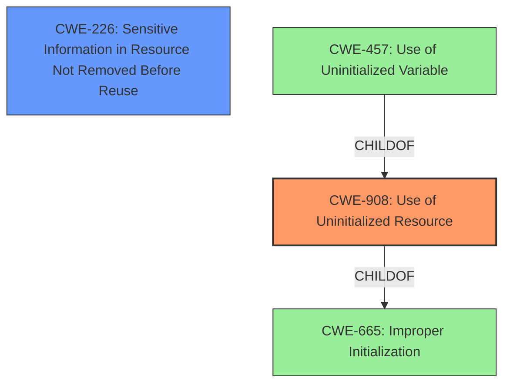

# Enhanced Analysis for CVE-2022-38668

# Summary
| CWE ID | CWE Name | Confidence | CWE Abstraction Level | CWE Vulnerability Mapping Label | CWE-Vulnerability Mapping Notes |
|---|---|---|---|---|---|
| CWE-908 | Use of Uninitialized Resource | 0.9 | Base | Primary | Allowed |
| CWE-226 | Sensitive Information in Resource Not Removed Before Reuse | 0.6 | Base | Secondary | Allowed |

## Evidence and Confidence

*   **Confidence Score:** 0.9
*   **Evidence Strength:** HIGH

## Relationship Analysis
The primary CWE is CWE-908, which is a Base-level CWE. The vulnerability involves the use of **uninitialized data** from stack memory. While other CWEs like CWE-457 (Use of Uninitialized Variable) are more specific, CWE-908 is more fitting because it deals with a resource, not just a variable. CWE-226 is included as a secondary CWE because the **uninitialized data** contained potentially sensitive information which was revealed.



## Vulnerability Chain
The chain starts with the **missing or improper initialization** of the stack memory used for serving static files. This leads to the **use of uninitialized data** when the file size is smaller than the buffer size. Finally, this results in **information disclosure**, as sensitive data from the stack memory is exposed.

## Summary of Analysis
The vulnerability is caused by the **use of uninitialized data** when serving static files, which leads to the disclosure of sensitive information. The primary CWE, CWE-908 (Use of Uninitialized Resource), accurately describes the root cause. The vulnerability description states: "HTTP applications (servers) based on Crow through 1.0+4 may reveal potentially sensitive **uninitialized data** from stack memory when fulfilling a request for a static file smaller than 16 KB." This directly supports the mapping to CWE-908.

CWE-457 (Use of Uninitialized Variable) was considered but deemed less appropriate because the issue is with a resource (the memory buffer), not just a variable. CWE-226 (Sensitive Information in Resource Not Removed Before Reuse) was considered as a potential secondary CWE because of the nature of the information being leaked. However, the primary issue is the use of **uninitialized data** itself, making CWE-908 the more accurate primary mapping.

The final decision is based on the evidence and the CWE descriptions, selecting the most specific and relevant CWE to represent the vulnerability's root cause.


## CWE Relationship Analysis

Current CWEs represent these abstraction levels: .


### Vulnerability Chain Analysis

**Chain starting from CWE-665:**
- 665 (Improper Initialization) - ROOT


**Chain starting from CWE-908:**
- 908 (Use of Uninitialized Resource) - ROOT


### CWE Relationship Diagram

```mermaid
graph TD
    classDef primary fill:#f96,stroke:#333,stroke-width:2px
    classDef secondary fill:#69f,stroke:#333
    classDef tertiary fill:#9e9,stroke:#333
```