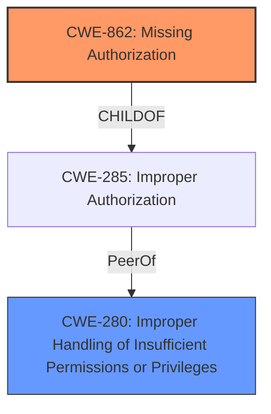

# Raw Analyzer Response for CVE-2022-38677

# Summary
| CWE ID | CWE Name | Confidence | CWE Abstraction Level | CWE Vulnerability Mapping Label | CWE-Vulnerability Mapping Notes |
|---|---|---|---|---|---|
| CWE-862 | Missing Authorization | 1.0 | Class | Allowed-with-Review | Primary CWE |
| CWE-280 | Improper Handling of Insufficient Permissions or Privileges | 0.7 | Base | Allowed | Secondary Candidate |

## Evidence and Confidence

*   **Confidence Score:** 1.0
*   **Evidence Strength:** HIGH

## Relationship Analysis
The primary relationship influencing the decision is that **CWE-862 (Missing Authorization)** is a Class-level CWE, and it can have more specific Base-level children. However, in this case, the provided information is precise enough to directly map to **CWE-862** as the **missing permission check** is a direct instance of missing authorization. **CWE-280** is a base level that defines "Improper Handling of Insufficient Permissions or Privileges," where **CWE-862** is a child class and defines the **missing authorization**.

## Vulnerability Chain
The vulnerability chain starts with the **missing permission check** (CWE-862), which leads to a local denial of service. There aren't any weaknesses that followed for the Vulnerability Description.

## Summary of Analysis
The initial assessment and resulting conclusion are heavily based on the provided evidence, specifically the phrase "**missing permission check**". This directly aligns with the definition of **CWE-862 (Missing Authorization)**, which states: "The product does not perform an authorization check when an actor attempts to access a resource or perform an action."

The graph relationships influenced the final selection by confirming that **CWE-862** is a valid and appropriate choice, given the available information. While it's a Class-level CWE, no more specific Base-level CWEs are applicable based on the description.

The selected CWE is at the optimal level of specificity because it precisely captures the root cause of the vulnerability: the **lack of an authorization check**.

Relevant CWE Information:

# Enhanced Context (25 CWEs)

## Vulnerability Description
In cell service, there is a **missing permission check**. This could lead to local denial of service in cell service with no additional execution privileges needed.

### Vulnerability Description Key Phrases
- **rootcause:** **missing permission check**
- **impact:** local denial of service
- **product:** cell service

## CVE Reference Links Content Summary
This content is **UNRELATED** to CVE-2022-38677. The provided text is a webpage from Unisoc, a semiconductor company, and it does not contain any information about a specific vulnerability. It primarily focuses on the company's products, solutions, and support services.

## Retriever Results

### Top Combined Results

| Rank | CWE ID | Name | Abstraction | Usage  | Retrievers | Individual Scores |
|------|--------|------|-------------|-------|------------|-------------------|
| 1 | 862 | Missing Authorization | Class | Allowed-with-Review | sparse | 0.254 |
| 2 | 927 | Use of Implicit Intent for Sensitive Communication | Variant | Allowed | sparse | 0.199 |
| 3 | 1021 | Improper Restriction of Rendered UI Layers or Frames | Base | Allowed | sparse | 0.189 |
| 4 | 1284 | Improper Validation of Specified Quantity in Input | Base | Allowed | sparse | 0.187 |
| 5 | 941 | Incorrectly Specified Destination in a Communication Channel | Base | Allowed | sparse | 0.184 |
| 6 | 638 | Not Using Complete Mediation | Class | Allowed-with-Review | dense | 0.486 |
| 7 | 252 | Unchecked Return Value | Base | Allowed | graph | 0.002 |
| 8 | 770 | Allocation of Resources Without Limits or Throttling | Base | Allowed | sparse | 0.182 |
| 9 | 20 | Improper Input Validation | Class | Discouraged | sparse | 0.182 |
| 10 | 732 | Incorrect Permission Assignment for Critical Resource | Class | Allowed-with-Review | sparse | 0.179 |

### CWE Considerations:

*   **CWE-862 (Missing Authorization):** The vulnerability description explicitly states "**missing permission check**," which directly maps to the definition of **CWE-862**. This CWE is a Class, and the Mapping Guidance suggests examining children for a better fit. However, in this case, the description is precise enough that no child CWE is more appropriate.
*   **CWE-927 (Use of Implicit Intent for Sensitive Communication):** This CWE is specific to Android applications and the use of implicit intents, which is not indicated in the vulnerability description. Therefore, it's not applicable.
*   **CWE-1021 (Improper Restriction of Rendered UI Layers or Frames):** This CWE relates to clickjacking and UI redress attacks, which are not relevant to the **missing permission check** in cell service.
*   **CWE-1284 (Improper Validation of Specified Quantity in Input):** This CWE is about validating quantities in input, which is not related to the **missing permission check** described.
*   **CWE-941 (Incorrectly Specified Destination in a Communication Channel):** This CWE is related to communication channels and specifying the correct destination, which doesn't align with the **missing permission check** in cell service.
*   **CWE-638 (Not Using Complete Mediation):** While this CWE relates to access checks, it's about not performing them every time a resource is accessed. The description only mentions a **missing** check, not an incomplete one.
*   **CWE-252 (Unchecked Return Value):** This CWE relates to not checking return values from functions, which is not relevant to the **missing permission check**.
*   **CWE-770 (Allocation of Resources Without Limits or Throttling):** This CWE concerns resource allocation without limits, which is not related to the **missing permission check**.
*   **CWE-20 (Improper Input Validation):** This is a very broad CWE and is discouraged when more specific CWEs are available. Since the vulnerability is specifically a **missing permission check**, **CWE-862** is a more appropriate choice.
*   **CWE-732 (Incorrect Permission Assignment for Critical Resource):** This CWE is about assigning incorrect permissions, but the vulnerability is about a **missing** check. It can be misused when "permissions" are not checked. **CWE-862** is more appropriate.
*   **CWE-280 (Improper Handling of Insufficient Permissions or Privileges):** The product does not handle or incorrectly handles when it has insufficient privileges to access resources or functionality as specified by their permissions. This may cause it to follow unexpected code paths that may leave the product in an invalid state.