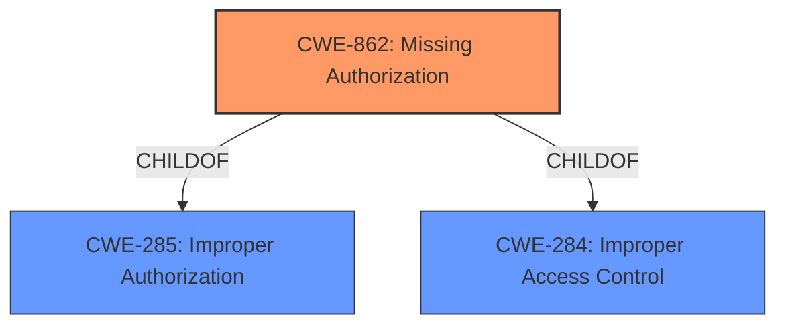

# Raw Analyzer Response for CVE-2022-38679

# Summary
| CWE ID | CWE Name | Confidence | CWE Abstraction Level | CWE Vulnerability Mapping Label | CWE-Vulnerability Mapping Notes |
|---|---|---|---|---|---|
| CWE-862 | Missing Authorization | 1.0 | Class | Allowed-with-Review | Primary CWE |

## Evidence and Confidence

*   **Confidence Score:** 1.0
*   **Evidence Strength:** HIGH

## Relationship Analysis
The primary CWE, CWE-862, is a Class-level CWE. Its parents are CWE-285 (Improper Authorization) and CWE-284 (Improper Access Control). There are no child CWEs listed, meaning we cannot select a more specific variant.

## Vulnerability Chain
The vulnerability chain consists of a **missing permission check** (CWE-862) leading to a local denial of service.

## Summary of Analysis
The vulnerability description states that there is a "**missing permission check**" in a music service, which could lead to a local denial of service.

The primary CWE match from similar CVE descriptions is CWE-862 (Missing Authorization). The retriever also identifies CWE-862 as the top combined result.

CWE-862 (Missing Authorization): This CWE describes a situation where the product does not perform an authorization check when an actor attempts to access a resource or perform an action. This aligns directly with the "**missing permission check**" described in the vulnerability.

The mapping guidance for CWE-862 is "Allowed-with-Review" since it is a Class-level CWE. The guidance suggests examining children for a better fit, but no children are provided.

The description explicitly states the **rootcause** as a **missing permission check**, making CWE-862 the most appropriate choice.

The other CWEs from the Retriever Results were considered but ultimately rejected because they did not accurately reflect the **rootcause** of the vulnerability:

*   CWE-927 (Use of Implicit Intent for Sensitive Communication): This CWE is specific to Android applications and implicit intents, which is not mentioned in the vulnerability description.
*   CWE-1284 (Improper Validation of Specified Quantity in Input): This CWE relates to the validation of quantities, which is not relevant to the **missing permission check**.
*   CWE-20 (Improper Input Validation): This CWE is too broad and general and does not accurately describe the specific issue of a **missing permission check**. The guidance specifically discourages use of CWE-20 when more specific CWEs are available.
*   CWE-367 (Time-of-check Time-of-use (TOCTOU) Race Condition): This CWE describes a race condition vulnerability, which is not mentioned or implied in the vulnerability description.
*   CWE-650 (Trusting HTTP Permission Methods on the Server Side): This CWE is specific to HTTP permission methods and is not relevant to the general **missing permission check** in the music service.
*   CWE-386 (Symbolic Name not Mapping to Correct Object): This CWE describes issues with symbolic names and object mapping, which is not mentioned in the vulnerability description.
*   CWE-1021 (Improper Restriction of Rendered UI Layers or Frames): This CWE is specific to UI rendering and clickjacking attacks, which is not relevant to the **missing permission check**.
*   CWE-252 (Unchecked Return Value): This CWE is about not checking the return value of a function, which is not the same as a **missing permission check**.
*   CWE-941 (Incorrectly Specified Destination in a Communication Channel): This CWE describes issues with communication channels and destinations, which is not relevant to the **missing permission check**.