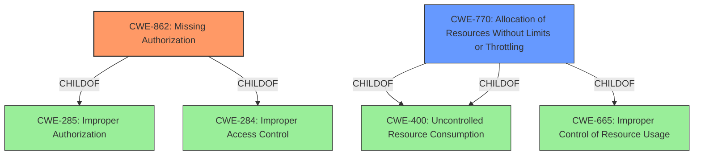

# Raw Analyzer Response for CVE-2022-38683

# Summary

| CWE ID | CWE Name | Confidence | CWE Abstraction Level | CWE Vulnerability Mapping Label | CWE-Vulnerability Mapping Notes |
|---|---|---|---|---|---|
| CWE-862 | Missing Authorization | 1.0 | Class | Allowed-with-Review | Primary CWE |
| CWE-770 | Allocation of Resources Without Limits or Throttling | 0.5 | Base | Allowed | Secondary Candidate |

## Evidence and Confidence

*   **Confidence Score:** 0.8
*   **Evidence Strength:** HIGH

## Relationship Analysis

The primary relationship influencing my decision is the ChildOf relationship. CWE-862 (Missing Authorization) is a Class-level CWE, and while it is encouraged to find more specific Base or Variant-level CWEs, in this case, the provided information is limited, and CWE-862 accurately captures the **missing permission check**. CWE-770 (Allocation of Resources Without Limits or Throttling) is a Base level CWE and is related to the impact of the vulnerability.

## Vulnerability Chain

The vulnerability chain starts with a **missing permission check** (CWE-862) which leads to a local denial of service. While the exact mechanism of the denial of service isn't detailed, a plausible scenario could involve uncontrolled resource allocation. Thus:

CWE-862 (Missing Authorization) -> Potential Uncontrolled Resource Consumption (CWE-770) -> Local Denial of Service

## Summary of Analysis

The primary weakness is the **missing permission check**, which directly aligns with CWE-862 (Missing Authorization). The description clearly states this **missing permission check** leads to a local denial of service, making CWE-862 the most appropriate primary CWE.

The evidence is strong, as the "Vulnerability Description Key Phrases" section explicitly identifies "**missing permission check**" as the root cause.

While the denial of service aspect could potentially involve other CWEs, such as CWE-400 (Uncontrolled Resource Consumption), the description doesn't provide enough detail to confirm the exact mechanism. It is possible that the lack of authorization allows an attacker to consume resources without limit, leading to the denial of service. Therefore, I am including CWE-770 (Allocation of Resources Without Limits or Throttling) as a secondary candidate, though with lower confidence.

CWE-862 is the optimal level of specificity given the provided information. Although it's a Class-level CWE, there's no further detail available to pinpoint a more specific Base or Variant.

Relevant CWE Information:

# Enhanced Context (25 CWEs)

## CWE-404: Improper Resource Shutdown or Release
**Abstraction Level**: Class
**Similarity Score**: 0.77
**Source**: dense

**Description**:
The product does not release or incorrectly releases a resource before it is made available for re-use.

**Mapping Guidance**:
- Usage: Allowed-with-Review
- Rationale: This CWE entry is a Class and might have Base-level children that would be more appropriate

*Reason for not selecting:* While a resource leak could contribute to a denial of service, the primary issue here is the **missing permission check**, not necessarily a failure to release resources.

## CWE-405: Asymmetric Resource Consumption (Amplification)
**Abstraction Level**: Class
**Similarity Score**: 0.77
**Source**: dense

**Description**:
The product does not properly control situations in which an adversary can cause the product to consume or produce excessive resources without requiring the adversary to invest equivalent work or otherwise prove authorization, i.e., the adversary's influence is "asymmetric."

**Mapping Guidance**:
- Usage: Allowed-with-Review
- Rationale: This CWE entry is a Class and might have Base-level children that would be more appropriate

*Reason for not selecting:* Although asymmetric resource consumption could be a factor in the denial of service, the root cause is the **missing permission check**.

## CWE-789: Memory Allocation with Excessive Size Value
**Abstraction Level**: Variant
**Similarity Score**: 0.76
**Source**: dense

**Description**:
The product allocates memory based on an untrusted, large size value, but it does not ensure that the size is within expected limits, allowing arbitrary amounts of memory to be allocated.

**Mapping Guidance**:
- Usage: Allowed
- Rationale: This CWE entry is at the Variant level of abstraction, which is a preferred level of abstraction for mapping to the root causes of vulnerabilities.

*Reason for not selecting:* This is a possible consequence of missing authorization, but the vulnerability description doesn't provide explicit details about excessive memory allocation.

## CWE-226: Sensitive Information in Resource Not Removed Before Reuse
**Abstraction Level**: Base
**Similarity Score**: 0.76
**Source**: dense

**Description**:
The product releases a resource such as memory or a file so that it can be made available for reuse, but it does not clear or "zeroize" the information contained in the resource before the product performs a critical state transition or makes the resource available for reuse by other entities.

**Mapping Guidance**:
- Usage: Allowed
- Rationale: This CWE entry is at the Base level of abstraction, which is a preferred level of abstraction for mapping to the root causes of vulnerabilities.

*Reason for not selecting:* This is not relevant to the **missing permission check**.

## CWE-1289: Improper Validation of Unsafe Equivalence in Input
**Abstraction Level**: Base
**Similarity Score**: 0.76
**Source**: dense

**Description**:
The product receives an input value that is used as a resource identifier or other type of reference, but it does not validate or incorrectly validates that the input is equivalent to a potentially-unsafe value.

**Mapping Guidance**:
- Usage: Allowed
- Rationale: This CWE entry is at the Base level of abstraction, which is a preferred level of abstraction for mapping to the root causes of vulnerabilities.

*Reason for not selecting:* This is not directly related to the **missing permission check**.

## CWE-799: Improper Control of Interaction Frequency
**Abstraction Level**: Class
**Similarity Score**: 0.75
**Source**: dense

**Description**:
The product does not properly limit the number or frequency of interactions that it has with an actor, such as the number of incoming requests.

**Mapping Guidance**:
- Usage: Allowed-with-Review
- Rationale: This CWE entry is a Class and might have Base-level children that would be more appropriate

*Reason for not selecting:* This is a possible consequence of missing authorization, but the vulnerability description doesn't explicitly mention interaction frequency.

## CWE-664: Improper Control of a Resource Through its Lifetime
**Abstraction Level**: Pillar
**Similarity Score**: 0.75
**Source**: dense

**Description**:
The product does not maintain or incorrectly maintains control over a resource throughout its lifetime of creation, use, and release.

**Mapping Guidance**:
- Usage: Discouraged
- Rationale: This CWE entry is high-level when lower-level children are available.

*Reason for not selecting:* Too high-level; CWE-862 is more specific.

## CWE-1325: Improperly Controlled Sequential Memory Allocation
**Abstraction Level**: Base
**Similarity Score**: 0.75
**Source**: dense

**Description**:
The product manages a group of objects or resources and performs a separate memory allocation for each object, but it does not properly limit the total amount of memory that is consumed by all of the combined objects.

**Mapping Guidance**:
- Usage: Allowed
- Rationale: This CWE entry is at the Base level of abstraction, which is a preferred level of abstraction for mapping to the root causes of vulnerabilities.

*Reason for not selecting:* A possible consequence of missing authorization, but the vulnerability description doesn't provide explicit details about sequential memory allocation.

## CWE-668: Exposure of Resource to Wrong Sphere
**Abstraction Level**: Class
**Similarity Score**: