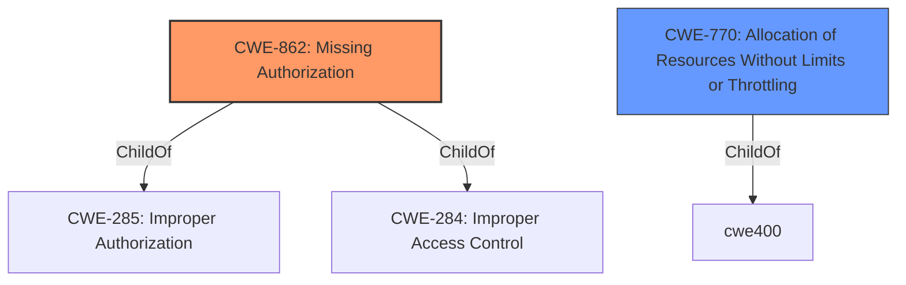

# Analysis Report for CVE-2022-38687

# Vulnerability Analysis Report: CVE-2022-38687

## Description


## Analysis (with Relationship Data)

# Summary
| CWE ID | CWE Name | Confidence | CWE Abstraction Level | CWE Vulnerability Mapping Label | CWE-Vulnerability Mapping Notes |
|---|---|---|---|---|---|
| CWE-862 | Missing Authorization | 1.0 | Class | Allowed-with-Review | Primary CWE |
| CWE-770 | Allocation of Resources Without Limits or Throttling | 0.5 | Base | Allowed | Secondary Candidate |

## Evidence and Confidence

*   **Confidence Score:** 0.75
*   **Evidence Strength:** HIGH

## Relationship Analysis
The primary relationship considered was the child-parent relationship. CWE-862 is a class-level CWE, and while there might be more specific base-level CWEs, the provided information focuses on the **missing permission check** which directly aligns with the definition of CWE-862. CWE-770 was considered since missing permission checks could potentially lead to resource exhaustion, but the description directly states "local denial of service" which isn't necessarily tied to resource allocation.



## Vulnerability Chain
The vulnerability chain starts with the **missing permission check**, leading to a local denial of service.

## Summary of Analysis
The initial analysis identified CWE-862 as the primary candidate due to the explicit mention of a **missing permission check**. This aligns with the CWE's description of a product not performing an authorization check when an actor attempts to access a resource or perform an action.

The retriever results also listed CWE-862 as the top candidate.

The decision is based on the provided evidence, specifically the phrase "**missing permission check**" in the "Vulnerability Description Key Phrases" section.

The selected CWE is at the optimal level of specificity because while more specific CWEs might exist, the provided information does not offer enough detail to warrant a more granular classification. CWE-862 directly addresses the **root cause** of the vulnerability.

Relevant CWE Information:

# Enhanced Context (25 CWEs)

## CWE-862: Missing Authorization
**Abstraction:** Class
**Status:** Incomplete

### Description
The product does not perform an authorization check when an actor attempts to access a resource or perform an action.

### Extended Description
Not provided

### Alternative Terms
AuthZ: "AuthZ" is typically used as an abbreviation of "authorization" within the web application security community. It is distinct from "AuthN" (or, sometimes, "AuthC") which is an abbreviation of "authentication." The use of "Auth" as an abbreviation is discouraged, since it could be used for either authentication or authorization.

### Relationships
ChildOf -> CWE-285
ChildOf -> CWE-284

### Mapping Guidance
**Usage:** Allowed-with-Review
**Rationale:** This CWE entry is a Class and might have Base-level children that would be more appropriate
**Comments:** Examine children of this entry to see if there is a better fit
**Reasons:**
- Abstraction

### Additional Notes
**[Terminology]** Assuming a user with a given identity, authorization is the process of determining whether that user can access a given resource, based on the user's privileges and any permissions or other access-control specifications that apply to the resource.

### Observed Examples
- **CVE-2022-24730:** Go-based continuous deployment product does not check that a user has certain privileges to update or create an app, allowing adversaries to read sensitive repository information
- **CVE-2009-3168:** Web application does not restrict access to admin scripts, allowing authenticated users to reset administrative passwords.
- **CVE-2009-3597:** Web application stores database file under the web root with insufficient access control (CWE-219), allowing direct request.

## CWE-770: Allocation of Resources Without Limits or Throttling
**Abstraction:** Base
**Status:** Incomplete

### Description
The product allocates a reusable resource or group of resources on behalf of an actor without imposing any restrictions on the size or number of resources that can be allocated, in violation of the intended security policy for that actor.

### Extended Description
Code frequently has to work with limited resources, so programmers must be careful to ensure that resources are not consumed too quickly, or too easily. Without use of quotas, resource limits, or other protection mechanisms, it can be easy for an attacker to consume many resources by rapidly making many requests, or causing larger resources to be used than is needed. When too many resources are allocated, or if a single resource is too large, then it can prevent the code from working correctly, possibly leading to a denial of service.

### Alternative Terms
None

### Relationships
ChildOf -> CWE-400
ChildOf -> CWE-665
ChildOf -> CWE-400

### Mapping Guidance
**Usage:** Allowed
**Rationale:** This CWE entry is at the Base level of abstraction, which is a preferred level of abstraction for mapping to the root causes of vulnerabilities.
**Comments:** Carefully read both the name and description to ensure that this mapping is an appropriate fit. Do not try to 'force' a mapping to a lower-level Base/Variant simply to comply with this preferred level of abstraction.
**Reasons:**
- Acceptable-Use

### Additional Notes
**[Relationship]** This entry is different from uncontrolled resource consumption (CWE-400) in that there are other weaknesses that are related to inability to control resource consumption, such as holding on to a resource too long after use, or not correctly keeping track of active resources so that they can be managed and released when they are finished (CWE-771).

**[Theoretical]** Vulnerability theory is largely about how behaviors and resources interact. "Resource exhaustion" can be regarded as either a consequence or an attack, depending on the perspective. This entry is an attempt to reflect one of the underlying weaknesses that enable these attacks (or consequences) to take place.

### Observed Examples
- **CVE-2022-21668:** Chain: Python library does not limit the resources used to process images that specify a very large number of bands (CWE-1284), leading to excessive memory consumption (CWE-789) or an integer overflow (CWE-190).
- **CVE-2009-4017:** Language interpreter does not restrict the number of temporary files being created when handling a MIME request with a large number of parts..
- **CVE-2009-2726:** Driver does not use a maximum width when invoking sscanf style functions, causing stack consumption.

CWEs considered but not used:

*   CWE-732: Incorrect Permission Assignment for Critical Resource - While related to permissions, this CWE focuses on *incorrect* assignment, whereas the description specifies a **missing** check.
*   CWE-927: Use of Implicit Intent for Sensitive Communication - This CWE is specific to Android applications and implicit intents, which is not mentioned in the description.
*   CWE-1021: Improper Restriction of Rendered UI Layers or Frames - This CWE is related to UI redress attacks, which is not relevant to the given description.
*   CWE-638: Not Using Complete Mediation - While related to access checks, the provided description is more directly a **missing** check rather than incomplete mediation.
*   CWE-22: Improper Limitation of a Pathname to a Restricted Directory ('Path Traversal') - This CWE is related to path traversal vulnerabilities, which is not relevant to the given description.
*   CWE-1284: Improper Validation of Specified Quantity in Input - This CWE is related to validating quantities in input, which is not relevant to the given description.
*   CWE-20: Improper Input Validation - This is a broad CWE and the description specifies a **missing permission check**, making CWE-862 a more specific and appropriate choice.
*   CWE-941: Incorrectly Specified Destination in a Communication Channel - This CWE is related to communication channels, which is not relevant to the given description.


## CWE Relationship Analysis

Current CWEs represent these abstraction levels: .


### Vulnerability Chain Analysis

**Chain starting from CWE-862:**
- 862 (Missing Authorization) - ROOT


**Chain starting from CWE-190:**
- 190 (Integer Overflow or Wraparound) - ROOT


### CWE Relationship Diagram

```mermaid
graph TD
    classDef primary fill:#f96,stroke:#333,stroke-width:2px
    classDef secondary fill:#69f,stroke:#333
    classDef tertiary fill:#9e9,stroke:#333
```


*Report generated on 2025-03-31 11:54:10*
