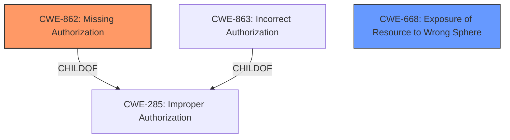

# Raw Analyzer Response for CVE-2022-38689

# Summary

| CWE ID  | CWE Name                      | Confidence | CWE Abstraction Level | CWE Vulnerability Mapping Label | CWE-Vulnerability Mapping Notes |
|---------|-------------------------------|------------|-----------------------|---------------------------------|---------------------------------|
| CWE-862 | Missing Authorization         | 0.9        | Class                 | Allowed-with-Review             | Primary CWE                    |
| CWE-668 | Exposure of Resource to Wrong Sphere | 0.6 | Class | Allowed-with-Review | Secondary CWE Candidate |

## Evidence and Confidence

*   **Confidence Score:** 0.9
*   **Evidence Strength:** HIGH

## Relationship Analysis

The primary relationship influencing my decision is the parent-child relationship between CWE-285 (Improper Authorization) and CWE-862 (Missing Authorization) and CWE-863 (Incorrect Authorization). Since the vulnerability description explicitly states "**missing permission check**", CWE-862 is a more precise fit than its parent. CWE-668 (Exposure of Resource to Wrong Sphere) is a peer that could also apply given the information disclosure impact, but it's a less direct match for the root cause.

## Vulnerability Chain

The vulnerability chain consists of a **missing permission check**, leading directly to local information disclosure. The root cause is the **missing permission check** (CWE-862). The impact is local information disclosure.

## Summary of Analysis

The analysis is based on the provided vulnerability description, which clearly indicates a **missing permission check**. The primary evidence is the "Vulnerability Description Key Phrases" section, specifically:

*   **rootcause:** **missing permission check**
*   **impact:** local information disclosure

The retriever results also list CWE-862 as the top candidate.

CWE-862 (Missing Authorization) is selected because it directly reflects the **missing permission check** root cause. Other CWEs like CWE-863 (Incorrect Authorization) were considered but deemed less accurate as they imply an authorization check exists but is flawed, while the description indicates a complete absence of such a check. CWE-668 (Exposure of Resource to Wrong Sphere) was considered because of the information disclosure, but this is the impact of the missing authorization, not the root cause. CWE-862 is at the appropriate level of specificity (Class), as there isn't enough information to map to a more specific Base or Variant.

**CWE Considerations:**

*   **CWE-862 (Missing Authorization):** This is the primary CWE because the vulnerability description explicitly states a **missing permission check**. This aligns with the definition of CWE-862.
*   **CWE-668 (Exposure of Resource to Wrong Sphere):** This is a secondary candidate because the vulnerability leads to local information disclosure, which aligns with the impact of CWE-668.

**CWEs Not Used and Why:**

*   CWE-863 (Incorrect Authorization): Not used because the description states **missing permission check**, not an incorrect one.
*   CWE-20 (Improper Input Validation): Not used as the root cause is not related to input validation but to a **missing permission check**.
*   CWE-789 (Memory Allocation with Excessive Size Value): Not relevant as the vulnerability is not related to memory allocation.
*   CWE-941 (Incorrectly Specified Destination in a Communication Channel): Not relevant as the vulnerability is not related to communication channels.
*   CWE-1284 (Improper Validation of Specified Quantity in Input): Not relevant as the vulnerability is not related to quantity validation.
*   CWE-223 (Omission of Security-relevant Information): Not relevant as the vulnerability is not related to missing security-relevant information.