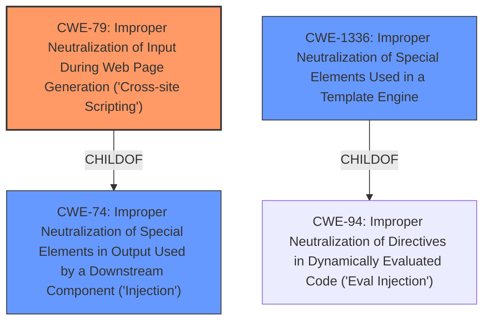

# Raw Analyzer Response for CVE-2022-3869

# Summary
| CWE ID | CWE Name | Confidence | CWE Abstraction Level | CWE Vulnerability Mapping Label | CWE-Vulnerability Mapping Notes |
|---|---|---|---|---|---|
| CWE-79 | Improper Neutralization of Input During Web Page Generation ('Cross-site Scripting') | 1 | Base | Allowed | Primary CWE |
| CWE-1336 | Improper Neutralization of Special Elements Used in a Template Engine | 0.6 | Base | Allowed | Secondary Candidate |

## Evidence and Confidence

*   **Confidence Score:** 1
*   **Evidence Strength:** HIGH

## Relationship Analysis
The primary relationship influencing the CWE selection is the parent-child relationship between CWE-74 (Improper Neutralization of Special Elements in Output Used by a Downstream Component ('Injection')) and CWE-79 (Improper Neutralization of Input During Web Page Generation ('Cross-site Scripting')). CWE-79 is a specific type of injection that occurs during web page generation. CWE-1336 (Improper Neutralization of Special Elements Used in a Template Engine) is another child of CWE-94 (Improper Neutralization of Directives in Dynamically Evaluated Code ('Eval Injection')).

## Vulnerability Chain
The vulnerability chain starts with the **lack of proper input sanitization** of user-supplied email addresses. This leads to **improper neutralization** when the email is inserted into an error message using `str_replace`. The final impact is the **potential injection of malicious HTML code**, which can result in XSS attacks.

## Summary of Analysis
The analysis is based on the provided evidence, which indicates a **code injection** vulnerability in froxlor/froxlor. The root cause is the **failure to properly sanitize** user-provided email addresses before including them in error messages. The `CVE Reference Links Content Summary` section states: "The core weakness is the **lack of proper input sanitization** before including user-provided data within output displayed to the user. Specifically the code was using `str_replace` to include an email in a string without escaping it first. This allows for a malicious email address to inject HTML."

The primary CWE selected is CWE-79 (Improper Neutralization of Input During Web Page Generation ('Cross-site Scripting')). This is because the vulnerability involves injecting malicious HTML into a web page served to users. This aligns with the description of CWE-79, which states: "The product does not neutralize or incorrectly neutralizes user-controllable input before it is placed in output that is used as a web page that is served to other users." The CWE for similar CVE Descriptions also lists CWE-79 as the Primary CWE Match.

CWE-1336 (Improper Neutralization of Special Elements Used in a Template Engine) was considered, because the vulnerability is fixed by removing user input from the error message, this could involve a template of some kind. But the evidence suggests the error was in the `str_replace` without template escaping, so CWE-79 is more accurate.

The final selection is at the optimal level of specificity because CWE-79 is a Base-level CWE that directly addresses the vulnerability.

Relevant CWE Information:

# Enhanced Context (25 CWEs)
The following CWEs were identified as potentially relevant to this vulnerability:

## CWE-79: Improper Neutralization of Input During Web Page Generation ('Cross-site Scripting')
**Technical Explanation:** The application fails to properly sanitize user-provided input (email addresses) before including it in the HTML output (error messages). This allows an attacker to inject malicious HTML code, leading to XSS.

**Security Implications:** An attacker could inject malicious scripts that can steal user cookies, redirect users to phishing sites, or perform other malicious actions in the context of the user's session.

**Parent-Child Relationships:** CWE-79 is a child of CWE-74, which is a more general class of injection vulnerabilities.

**Mapping Guidance Influence:** The MITRE mapping guidance recommends using Base-level CWEs, and CWE-79 is a Base-level CWE that accurately describes the vulnerability.

**Confidence:** 1

## CWE-1336: Improper Neutralization of Special Elements Used in a Template Engine
**Technical Explanation:** If a template engine were used, the application would fail to neutralize special elements in user input before processing it with the template engine, leading to code injection.

**Security Implications:** This could allow attackers to inject template expressions that execute arbitrary code or modify the generated output.

**Parent-Child Relationships:** CWE-1336 is a child of CWE-94, which is a class of weaknesses related to code injection.

**Mapping Guidance Influence:** The MITRE mapping guidance recommends using Base-level CWEs, and CWE-1336 is a Base-level CWE, but it is not the primary cause.

**Confidence:** 0.6