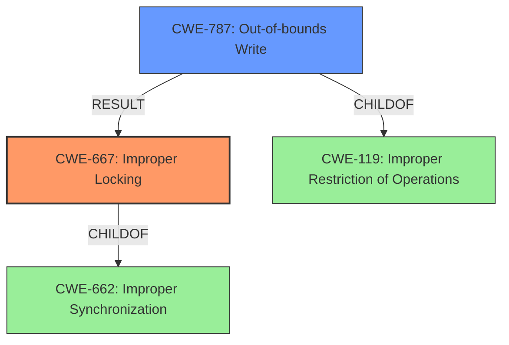

# Raw Analyzer Response for CVE-2022-38690

# Summary
| CWE ID | CWE Name | Confidence | CWE Abstraction Level | CWE Vulnerability Mapping Label | CWE-Vulnerability Mapping Notes |
|---|---|---|---|---|---|
| CWE-667 | Improper Locking | 0.9 | Class | Primary | Allowed-with-Review |
| CWE-787 | Out-of-bounds Write | 0.6 | Base | Secondary | Allowed |

## Evidence and Confidence

*   **Confidence Score:** 0.75
*   **Evidence Strength:** MEDIUM

## Relationship Analysis
The primary relationship is that **improper locking** (CWE-667) can lead to **memory corruption**, which can be manifested as an out-of-bounds write (CWE-787). CWE-667 is a Class, while CWE-787 is a Base. Both are children of higher-level categories related to concurrency and resource management.

## Vulnerability Chain
The vulnerability chain starts with **improper locking** (CWE-667), which leads to a race condition and ultimately results in **memory corruption**, specifically an out-of-bounds write (CWE-787).
  - Root Cause: **Improper Locking** (CWE-667)
  - Weakness: **Memory Corruption** (CWE-787)
  - Impact: Local Denial of Service

## Summary of Analysis
The initial assessment based on the description indicates **improper locking** (CWE-667) as the primary cause of the vulnerability, which results in **memory corruption**. The vulnerability description explicitly states "In camera driver, there is a possible **memory corruption** due to **improper locking**".

The retriever results also support this, with CWE-667 being one of the top matches. However, the retriever also lists CWE-787 (Out-of-bounds Write) as a strong candidate due to the memory corruption aspect.

The relationship analysis shows that CWE-667 can lead to memory corruption, which can be an out-of-bounds write (CWE-787). Therefore, it's reasonable to include CWE-787 as a secondary CWE, representing the specific type of memory corruption.

The final decision is to assign CWE-667 as the primary CWE because the vulnerability description explicitly identifies **improper locking** as the root cause. CWE-787 is assigned as a secondary CWE to describe the specific type of memory corruption.

CWE-362, CWE-413, CWE-662, CWE-367, CWE-123, CWE-833, CWE-415, CWE-1264 were considered but not used.
- CWE-362 (Concurrent Execution using Shared Resource with Improper Synchronization ('Race Condition')): While a race condition is possible, the description focuses on **improper locking** as the direct cause.
- CWE-413 (Improper Resource Locking): Similar to CWE-667, but CWE-667 is broader and more applicable to the given description.
- CWE-662 (Improper Synchronization): CWE-667 is a more specific child of CWE-662.
- CWE-367 (Time-of-check Time-of-use (TOCTOU) Race Condition): Not specific to the vulnerability description.
- CWE-123 (Write-what-where Condition): Less specific than CWE-787.
- CWE-833 (Deadlock): No indication of a deadlock in the description.
- CWE-415 (Double Free): Not applicable to the vulnerability description.
- CWE-1264 (Hardware Logic with Insecure De-Synchronization between Control and Data Channels): Not applicable, as the vulnerability is in the camera driver and not related to hardware logic.

Relevant CWE Information:

# Enhanced Context (25 CWEs)
The following CWEs were identified as potentially relevant to this vulnerability:

## CWE-667: Improper Locking
**Abstraction Level**: Class
**Similarity Score**: 0.81
**Source**: dense

**Description**:
The product does not properly acquire or release a lock on a resource, leading to unexpected resource state changes and behaviors.

**Mapping Guidance**:
- Usage: Allowed-with-Review
- Rationale: This CWE entry is a Class and might have Base-level children that would be more appropriate

## CWE-367: Time-of-check Time-of-use (TOCTOU) Race Condition
**Abstraction Level**: Base
**Similarity Score**: 0.81
**Source**: dense

**Description**:
The product checks the state of a resource before using that resource, but the resource's state can change between the check and the use in a way that invalidates the results of the check. This can cause the product to perform invalid actions when the resource is in an unexpected state.

**Mapping Guidance**:
- Usage: Allowed
- Rationale: This CWE entry is at the Base level of abstraction, which is a preferred level of abstraction for mapping to the root causes of vulnerabilities.

## CWE-366: Race Condition within a Thread
**Abstraction Level**: Base
**Similarity Score**: 0.79
**Source**: dense

**Description**:
If two threads of execution use a resource simultaneously, there exists the possibility that resources may be used while invalid, in turn making the state of execution undefined.

**Mapping Guidance**:
- Usage: Allowed
- Rationale: This CWE entry is at the Base level of abstraction, which is a preferred level of abstraction for mapping to the root causes of vulnerabilities.

## CWE-362: Concurrent Execution using Shared Resource with Improper Synchronization ('Race Condition')
**Abstraction Level**: Class
**Similarity Score**: 0.78
**Source**: dense

**Description**:
The product contains a concurrent code sequence that requires temporary, exclusive access to a shared resource, but a timing window exists in which the shared resource can be modified by another code sequence operating concurrently.

**Mapping Guidance**:
- Usage: Allowed-with-Review
- Rationale: This CWE entry is a Class and might have Base-level children that would be more appropriate

## CWE-404: Improper Resource Shutdown or Release
**Abstraction Level**: Class
**Similarity Score**: 0.78
**Source**: dense

**Description**:
The product does not release or incorrectly releases a resource before it is made available for re-use.

**Mapping Guidance**:
- Usage: Allowed-with-Review
- Rationale: This CWE entry is a Class and might have Base-level children that would be more appropriate

## CWE-662: Improper Synchronization
**Abstraction Level**: Class
**Similarity Score**: 0.77
**Source**: dense

**Description**:
The product utilizes multiple threads or processes to allow temporary access to a shared resource that can only be exclusive to one process at a time, but it does not properly synchronize these actions, which might cause simultaneous accesses of this resource by multiple threads or processes.

**Mapping Guidance**:
- Usage: Discouraged
- Rationale: This CWE entry is a level-1 Class (i.e., a child of a Pillar). It might have lower-level children that would be more appropriate

## CWE-226: Sensitive Information in Resource Not Removed Before Reuse
**Abstraction Level**: Base
**Similarity Score**: 0.76
**Source**: dense

**Description**:
The product releases a resource such as memory or a file so that it can be made available for reuse, but it does not clear or "zeroize" the information contained in the resource before the product performs a critical state transition or makes the resource available for reuse by other entities.

**Mapping Guidance**:
- Usage: Allowed
- Rationale: This CWE entry is at the Base level of abstraction, which is a preferred level of abstraction for mapping to the root causes of vulnerabilities.

## CWE-754: Improper Check for Unusual or Exceptional Conditions
**Abstraction Level**: Class
**Similarity Score**: 0.75
**Source**: dense

**Description**:
The product does not check or incorrectly checks for unusual or exceptional conditions that are not expected to occur frequently during day to day operation of the product.

**Mapping Guidance**:
- Usage: Allowed-with-Review
- Rationale: This CWE entry is a Class and might have Base-level children that would be more appropriate

## CWE-