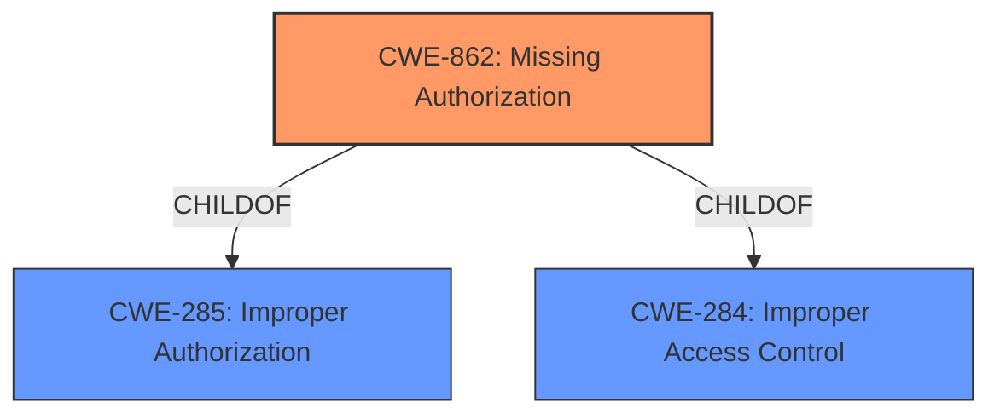

# Analysis Report for CVE-2022-38698

# Vulnerability Analysis Report: CVE-2022-38698

## Description


## Analysis (with Relationship Data)

# Summary

| CWE ID | CWE Name | Confidence | CWE Abstraction Level | CWE Vulnerability Mapping Label | CWE-Vulnerability Mapping Notes |
|---|---|---|---|---|---|
| CWE-862 | **CWE-862: Missing Authorization** | 1.0 | Class | Allowed-with-Review | Primary CWE |

## Evidence and Confidence

*   **Confidence Score:** 1.0
*   **Evidence Strength:** HIGH

## Relationship Analysis

The primary relationship impacting the decision is the ChildOf relationship between **CWE-862: Missing Authorization** and its parents, **CWE-285: Improper Authorization** and **CWE-284: Improper Access Control**. While a more specific Base or Variant CWE would be ideal, the available information does not provide enough detail to make a more precise classification.



## Vulnerability Chain

The vulnerability chain is straightforward: a **missing permission check** (CWE-862) leads directly to elevation of privilege.

## Summary of Analysis

The analysis is based on the provided vulnerability description, which clearly states a **missing permission check** as the root cause, leading to an elevation of privilege.

The vulnerability description key phrases includes:
- **rootcause:** **missing permission check**
- **impact:** elevation of privilege
- **product:** messaging service

The primary CWE match from similar CVE descriptions is **CWE-862: Missing Authorization**, which aligns perfectly with the **missing permission check** described in the vulnerability.

The retriever results also list **CWE-862: Missing Authorization** as the top candidate.

**CWE-862: Missing Authorization** is chosen because the vulnerability description explicitly mentions a **missing permission check**. The security implication is that an attacker can elevate their privileges without proper authorization. The CWE definition matches the vulnerability description.

Relevant CWE Information:

# Enhanced Context (25 CWEs)

## CWE-862: Missing Authorization
**Abstraction:** Class
**Status:** Incomplete

### Description
The product does not perform an authorization check when an actor attempts to access a resource or perform an action.

### Extended Description
Not provided

### Alternative Terms
AuthZ: "AuthZ" is typically used as an abbreviation of "authorization" within the web application security community. It is distinct from "AuthN" (or, sometimes, "AuthC") which is an abbreviation of "authentication." The use of "Auth" as an abbreviation is discouraged, since it could be used for either authentication or authorization.

### Relationships
ChildOf -> CWE-285
ChildOf -> CWE-284

### Mapping Guidance
**Usage:** Allowed-with-Review
**Rationale:** This CWE entry is a Class and might have Base-level children that would be more appropriate
**Comments:** Examine children of this entry to see if there is a better fit
**Reasons:**
- Abstraction

### Additional Notes
**[Terminology]** Assuming a user with a given identity, authorization is the process of determining whether that user can access a given resource, based on the user's privileges and any permissions or other access-control specifications that apply to the resource.

### Observed Examples
- **CVE-2022-24730:** Go-based continuous deployment product does not check that a user has certain privileges to update or create an app, allowing adversaries to read sensitive repository information
- **CVE-2009-3168:** Web application does not restrict access to admin scripts, allowing authenticated users to reset administrative passwords.
- **CVE-2009-3597:** Web application stores database file under the web root with insufficient access control (CWE-219), allowing direct request.

Other CWEs Considered:

*   **CWE-927: Use of Implicit Intent for Sensitive Communication:** While this CWE was suggested by the retriever, it is specific to Android applications and the use of implicit intents. The vulnerability description does not provide enough information to determine if this CWE is applicable.
*   **CWE-732: Incorrect Permission Assignment for Critical Resource:** This CWE relates to incorrectly assigning permissions to resources, but the description focuses on a **missing permission check**, which is more accurately captured by **CWE-862: Missing Authorization**.
*   **CWE-367: Time-of-check Time-of-use (TOCTOU) Race Condition:** This CWE describes a race condition where the state of a resource changes between the check and use. The vulnerability description does not indicate a race condition.
*   **CWE-863: Incorrect Authorization:** While closely related, **CWE-862: Missing Authorization** is preferred because the description explicitly states that the authorization check is missing, rather than incorrectly performed.


## CWE Relationship Analysis

Current CWEs represent these abstraction levels: .


### Vulnerability Chain Analysis

**Chain starting from CWE-862:**
- 862 (Missing Authorization) - ROOT


**Chain starting from CWE-732:**
- 732 (Incorrect Permission Assignment for Critical Resource) - ROOT


### CWE Relationship Diagram

```mermaid
graph TD
    classDef primary fill:#f96,stroke:#333,stroke-width:2px
    classDef secondary fill:#69f,stroke:#333
    classDef tertiary fill:#9e9,stroke:#333
```


*Report generated on 2025-03-30 16:15:38*
