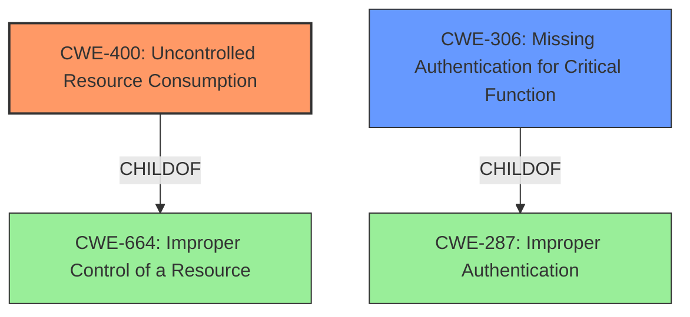

# Raw Analyzer Response for CVE-2022-38744

# Summary
| CWE ID | CWE Name | Confidence | CWE Abstraction Level | CWE Vulnerability Mapping Label | CWE-Vulnerability Mapping Notes |
|---|---|---|---|---|---|
| CWE-400 | Uncontrolled Resource Consumption | 0.8 | Class | Primary | Discouraged Usage: Conflated with the "technical impact" of vulnerabilities. It is sometimes used for low-information vulnerability reports. |
| CWE-306 | Missing Authentication for Critical Function | 0.7 | Base | Secondary | Allowed Usage: The product does not perform any authentication for functionality that requires a provable user identity or consumes a significant amount of resources. |

## Evidence and Confidence

*   **Confidence Score:** 0.75
*   **Evidence Strength:** MEDIUM

## Relationship Analysis
The primary CWE, CWE-400, is a Class-level weakness related to resource management. It's a child of CWE-664 (Improper Control of a Resource). The secondary CWE, CWE-306, is a Base-level weakness describing the absence of authentication for critical functions, a child of CWE-287 (Improper Authentication). The choice of CWE-400 reflects the DoS impact, while CWE-306 accounts for the lack of authentication that enables the attack.

## Vulnerability Chain
The vulnerability chain starts with a **missing authentication** (CWE-306) which leads to **uncontrolled resource consumption** (CWE-400), eventually resulting in a denial-of-service.

## Summary of Analysis
Initial analysis focused on the denial-of-service impact and the unauthenticated attack vector. The Retriever results suggested CWE-400 (Uncontrolled Resource Consumption) and CWE-306 (Missing Authentication for Critical Function) as relevant.

The vulnerability description states: "An **unauthenticated attacker** with network access to a victims Rockwell Automation FactoryTalk Alarm and Events service could open a connection, causing the service to fault and **become unavailable**."

The **lack of authentication** allows an attacker to open a connection, which then causes the service to fault and become unavailable. This aligns with CWE-306, Missing Authentication for Critical Function, since the service lacks proper authentication for accepting connections.

The "service to fault and become unavailable" points towards a **denial-of-service** condition. This is due to the service's resources being exhausted or otherwise rendered unusable by the attacker's connection. This aligns with CWE-400, Uncontrolled Resource Consumption, as the service does not properly control the resources used when establishing connections.

CWE-400 is chosen as the primary weakness because the vulnerability's impact is a denial-of-service condition resulting from uncontrolled resource consumption. CWE-306 is a secondary weakness because the **lack of authentication** is the enabler of the resource consumption.

Both CWEs are chosen because they provide the best level of specificity based on the available information.

Relevant CWE Information:

# Enhanced Context (25 CWEs)

## CWE-668: Exposure of Resource to Wrong Sphere
**Abstraction Level**: Class
**Similarity Score**: 0.77
**Source**: dense

**Description**:
The product exposes a resource to the wrong control sphere, providing unintended actors with inappropriate access to the resource.

**Mapping Guidance**:
- Usage: Discouraged
- Rationale: CWE-668 is high-level and is often misused as a catch-all when lower-level CWE IDs might be applicable. It is sometimes used for low-information vulnerability reports [REF-1287]. It is a level-1 Class (i.e., a child of a Pillar). It is not useful for trend analysis.

*Was considered but not selected because this CWE is too generic and doesn't specifically address the **missing authentication** or **resource consumption** aspects of the vulnerability.*

## CWE-807: Reliance on Untrusted Inputs in a Security Decision
**Abstraction Level**: Base
**Similarity Score**: 0.76
**Source**: dense

**Description**:
The product uses a protection mechanism that relies on the existence or values of an input, but the input can be modified by an untrusted actor in a way that bypasses the protection mechanism.

**Mapping Guidance**:
- Usage: Allowed
- Rationale: This CWE entry is at the Base level of abstraction, which is a preferred level of abstraction for mapping to the root causes of vulnerabilities.

*Was considered but not selected because the vulnerability doesn't seem to rely on untrusted inputs for a security decision, but rather **lacks authentication** altogether.*

## CWE-497: Exposure of Sensitive System Information to an Unauthorized Control Sphere
**Abstraction Level**: Base
**Similarity Score**: 0.75
**Source**: dense

**Description**:
The product does not properly prevent sensitive system-level information from being accessed by unauthorized actors who do not have the same level of access to the underlying system as the product does.

**Mapping Guidance**:
- Usage: Allowed
- Rationale: This CWE entry is at the Base level of abstraction, which is a preferred level of abstraction for mapping to the root causes of vulnerabilities.

*Was considered but not selected because the vulnerability is not about the exposure of sensitive information, but rather about the **lack of authentication** leading to a **denial-of-service**.*

## CWE-303: Incorrect Implementation of Authentication Algorithm
**Abstraction Level**: Base
**Similarity Score**: 0.75
**Source**: dense

**Description**:
The requirements for the product dictate the use of an established authentication algorithm, but the implementation of the algorithm is incorrect.

**Mapping Guidance**:
- Usage: Allowed
- Rationale: This CWE entry is at the Base level of abstraction, which is a preferred level of abstraction for mapping to the root causes of vulnerabilities.

*Was considered but not selected because the vulnerability does not seem to have an incorrect implementation, but rather a **missing implementation of authentication**.*

## CWE-345: Insufficient Verification of Data Authenticity
**Abstraction Level**: Class
**Similarity Score**: 0.75
**Source**: dense

**Description**:
The product does not sufficiently verify the origin or authenticity of data, in a way that causes it to accept invalid data.

**Mapping Guidance**:
- Usage: Discouraged
- Rationale: This CWE entry is a level-1 Class (i.e., a child of a Pillar). It might have lower-level children that would be more appropriate

*Was considered but not selected because the vulnerability is not about verifying data authenticity, but rather the **lack of authentication** for connections.*

## CWE-798: Use of Hard-coded Credentials
**Abstraction Level**: Base
**Similarity Score**: 0.75
**Source**: dense

**Description**:
The product contains hard-coded credentials, such as a password or cryptographic key.

**Mapping Guidance**:
- Usage: Allowed
- Rationale: This CWE entry is at the Base level of abstraction, which is a preferred level of abstraction for mapping to the root causes of vulnerabilities.

*Was considered but not selected because the vulnerability is not about hard-coded credentials, but rather the **lack of authentication**.*

## CWE-693: Protection Mechanism Failure
**Abstraction Level**: Pillar
**Similarity Score**: 0.75
**Source**: dense

**Description**:
The product does not use or incorrectly uses a protection mechanism that provides sufficient defense against directed attacks against the product.

**Mapping Guidance**:
- Usage: Discouraged
- Rationale: This CWE entry is extremely high-level, a Pillar.

*Was considered but not selected because this is a very high-level CWE, and more specific CWEs like CWE-306 and CWE-400 better describe the vulnerability.*

## CWE-41: Improper Resolution of Path Equivalence
**Abstraction Level**: Base
**Similarity Score**: 0.74
**Source**: dense

**Description**:
The product is vulnerable to file system contents disclosure through path equivalence. Path equivalence involves the use of special characters in file and directory names. The associated manipulations are intended to generate multiple names for the same object.

**Mapping Guidance**:
- Usage: Allowed
- Rationale: This CWE entry is at the Base level of abstraction, which is a preferred level of abstraction for mapping to the root causes of vulnerabilities.

*Was considered but not selected because the vulnerability is not related to path equivalence.*

## CWE-1391: Use of Weak Credentials
**Abstraction Level**: Class
**Similarity Score