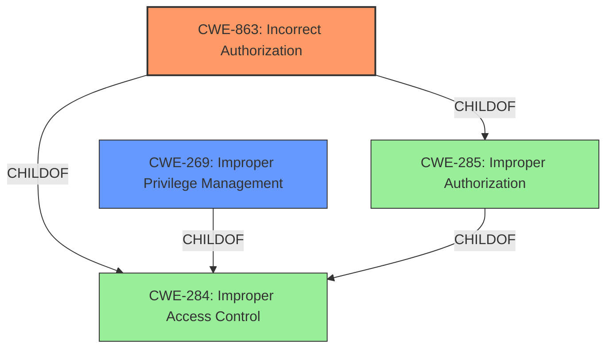

# Analysis Report for CVE-2022-38757

# Vulnerability Analysis Report: CVE-2022-38757

## Description


## Analysis (with Relationship Data)

# Summary
| CWE ID | CWE Name | Confidence | CWE Abstraction Level | CWE Vulnerability Mapping Label | CWE-Vulnerability Mapping Notes |
|---|---|---|---|---|---|
| CWE-863 | Incorrect Authorization | 0.8 | Class | Primary | Allowed-with-Review |
| CWE-269 | Improper Privilege Management | 0.6 | Class | Secondary | Discouraged |

## Evidence and Confidence

*   **Confidence Score:** 0.8
*   **Evidence Strength:** MEDIUM

## Relationship Analysis
The primary CWE is CWE-863, which is a child of CWE-285 (Improper Authorization) and CWE-284 (Improper Access Control). CWE-269 (Improper Privilege Management) is a possible secondary CWE, and it is also a child of CWE-284. The relationships suggest a hierarchical structure where a general access control issue leads to more specific authorization or privilege management problems. The Class level of CWE-863 is appropriate because the **incorrect authorization** logic is the **root cause**, although a more specific Base CWE may be available.



## Vulnerability Chain
The vulnerability chain starts with an **incorrect authorization** check that allows administrators to exercise rights on managed devices outside their intended scope. The lack of proper scoping leads to the impact of unauthorized actions on devices within the ZENworks zone.
  - **Root Cause:** Incorrect authorization check/logic (CWE-863)
  - **Weakness:** **Ability to exercise rights outside scope**
  - **Impact:** Unauthorized actions on managed devices

## Summary of Analysis
The primary focus is on the **incorrect authorization** that allows administrators to act outside their intended scope.

The selection of CWE-863 is based on the vulnerability description stating that administrators can "exercise these rights on managed devices in the ZENworks zone but which are outside the scope of the administrator." This directly points to an authorization issue where the scope of the administrator's rights is not correctly enforced.

CWE-269 is considered as a secondary CWE due to its relation to privilege management. However, the description clarifies that the vulnerability "does not result in the administrators gaining additional rights on the managed devices," which suggests that the core issue is not about escalating or gaining new privileges, but rather about **improperly applying existing privileges to the wrong devices**.

The retriever results also support the selection of CWE-863, as it is among the top-ranked CWEs for the provided vulnerability description.

The relationship analysis shows that CWE-863 is a child of CWE-285 and CWE-284, indicating that it is a more specific type of access control issue. While CWE-285 and CWE-284 are broader categories, CWE-863 provides a more precise classification of the vulnerability.

The evidence supports the selection of CWE-863 as the primary CWE because it directly addresses the **incorrect authorization** logic that allows administrators to act outside their intended scope. The evidence is the statement "administrators with rights to perform actions (e.g., install a bundle) on a set of managed devices, to be able to exercise these rights on managed devices in the ZENworks zone but which are outside the scope of the administrator." This statement provides a clear indication of an **authorization flaw** where the intended restrictions are not properly enforced.

CWE-285 (Improper Authorization) and CWE-284 (Improper Access Control) were considered but not selected as the primary CWE because they are higher-level classifications. While they are related to the vulnerability, they do not provide the same level of specificity as CWE-863.

CWE-269 (Improper Privilege Management) was considered as a secondary CWE due to its relation to privilege management. However, the vulnerability description clarifies that the vulnerability "does not result in the administrators gaining additional rights on the managed devices," which suggests that the core issue is not about escalating or gaining new privileges, but rather about **improperly applying existing privileges to the wrong devices**.

CWE-732 (Incorrect Permission Assignment for Critical Resource) was also considered, but it focuses on incorrect assignment of permissions to resources. The vulnerability in question is more about the incorrect application of existing rights to the wrong devices, rather than incorrect permissions assigned to a specific resource.

The selected CWE is at the optimal level of specificity because it directly addresses the **root cause** of the vulnerability, which is the **incorrect authorization** logic. It provides a more precise classification than the higher-level CWEs, and it is more relevant to the specific details of the vulnerability than the other considered CWEs.

Relevant CWE Information:

# Enhanced Context (25 CWEs)

## CWE-23: Relative Path Traversal
**Abstraction Level**: Base
**Similarity Score**: 0.80
**Source**: dense

**Description**:
The product uses external input to construct a pathname that should be within a restricted directory, but it does not properly neutralize sequences such as ".." that can resolve to a location that is outside of that directory.

**Mapping Guidance**:
- Usage: Allowed
- Rationale: This CWE entry is at the Base level of abstraction, which is a preferred level of abstraction for mapping to the root causes of vulnerabilities.

## CWE-59: Improper Link Resolution Before File Access ('Link Following')
**Abstraction Level**: Base
**Similarity Score**: 0.78
**Source**: dense

**Description**:
The product attempts to access a file based on the filename, but it does not properly prevent that filename from identifying a link or shortcut that resolves to an unintended resource.

**Mapping Guidance**:
- Usage: Allowed
- Rationale: This CWE entry is at the Base level of abstraction, which is a preferred level of abstraction for mapping to the root causes of vulnerabilities.

## CWE-73: External Control of File Name or Path
**Abstraction Level**: Base
**Similarity Score**: 0.78
**Source**: dense

**Description**:
The product allows user input to control or influence paths or file names that are used in filesystem operations.

**Mapping Guidance**:
- Usage: Allowed
- Rationale: This CWE entry is at the Base level of abstraction, which is a preferred level of abstraction for mapping to the root causes of vulnerabilities.

## CWE-41: Improper Resolution of Path Equivalence
**Abstraction Level**: Base
**Similarity Score**: 0.78
**Source**: dense

**Description**:
The product is vulnerable to file system contents disclosure through path equivalence. Path equivalence involves the use of special characters in file and directory names. The associated manipulations are intended to generate multiple names for the same object.

**Mapping Guidance**:
- Usage: Allowed
- Rationale: This CWE entry is at the Base level of abstraction, which is a preferred level of abstraction for mapping to the root causes of vulnerabilities.

## CWE-36: Absolute Path Traversal
**Abstraction Level**: Base
**Similarity Score**: 0.78
**Source**: dense

**Description**:
The product uses external input to construct a pathname that should be within a restricted directory, but it does not properly neutralize absolute path sequences such as "/abs/path" that can resolve to a location that is outside of that directory.

**Mapping Guidance**:
- Usage: Allowed
- Rationale: This CWE entry is at the Base level of abstraction, which is a preferred level of abstraction for mapping to the root causes of vulnerabilities.

## CWE-552: Files or Directories Accessible to External Parties
**Abstraction Level**: Base
**Similarity Score**: 0.76
**Source**: dense

**Description**:
The product makes files or directories accessible to unauthorized actors, even though they should not be.

**Mapping Guidance**:
- Usage: Allowed
- Rationale: This CWE entry is at the Base level of abstraction, which is a preferred level of abstraction for mapping to the root causes of vulnerabilities.

## CWE-668: Exposure of Resource to Wrong Sphere
**Abstraction Level**: Class
**Similarity Score**: 0.76
**Source**: dense

**Description**:
The product exposes a resource to the wrong control sphere, providing unintended actors with inappropriate access to the resource.

**Mapping Guidance**:
- Usage: Discouraged
- Rationale: CWE-668 is high-level and is often misused as a catch-all when lower-level CWE IDs might be applicable. It is sometimes used for low-information vulnerability reports [REF-


## CWE Relationship Analysis

Current CWEs represent these abstraction levels: .


### Vulnerability Chain Analysis

**Chain starting from CWE-552:**
- 552 (Files or Directories Accessible to External Parties) - ROOT


**Chain starting from CWE-41:**
- 41 (Improper Resolution of Path Equivalence) - ROOT


### CWE Relationship Diagram

```mermaid
graph TD
    classDef primary fill:#f96,stroke:#333,stroke-width:2px
    classDef secondary fill:#69f,stroke:#333
    classDef tertiary fill:#9e9,stroke:#333
```


*Report generated on 2025-03-31 11:01:34*
