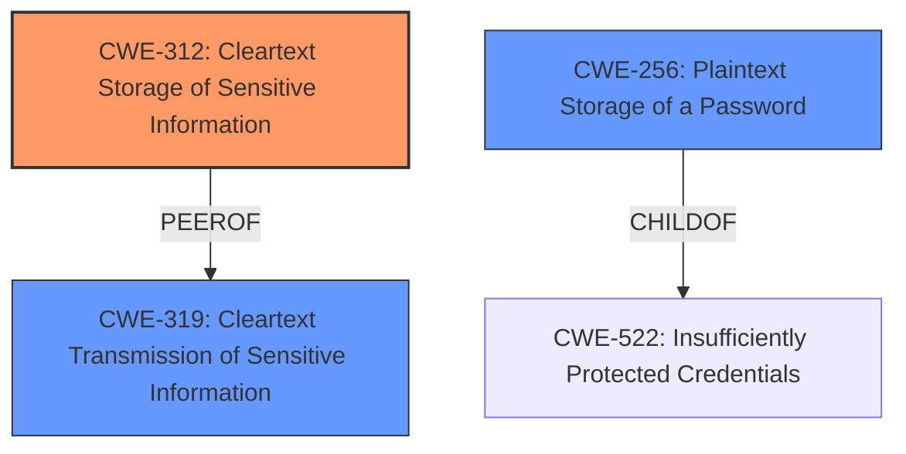

# Raw Analyzer Response for CVE-2022-38769

# Summary
| CWE ID | CWE Name | Confidence | CWE Abstraction Level | CWE Vulnerability Mapping Label | CWE-Vulnerability Mapping Notes |
|---|---|---|---|---|---|
| CWE-312 | Cleartext Storage of Sensitive Information | 1.0 | Base | Allowed | Primary CWE |
| CWE-319 | Cleartext Transmission of Sensitive Information | 0.7 | Base | Allowed | Secondary Candidate |
| CWE-256 | Plaintext Storage of a Password | 0.6 | Base | Allowed | Secondary Candidate |

## Evidence and Confidence

*   **Confidence Score:** 0.9
*   **Evidence Strength:** HIGH

## Relationship Analysis
The primary CWE is CWE-312, which deals with the storage of sensitive information in cleartext. This is a **root cause** in the vulnerability. CWE-319, Cleartext Transmission of Sensitive Information, is a potential secondary weakness because fetching the password implies transmission, though the primary issue is the **storage** itself. CWE-256 is a child of CWE-522, and is related to the storage of passwords, but CWE-312 is more specific to general sensitive information, not only passwords.

## Vulnerability Chain
The vulnerability chain starts with the **root cause**, which is the **cleartext storage of the password (CWE-312)**. This allows an attacker, upon successful login, to **fetch the cleartext password**. The fetching of the password can be considered a form of transmission, potentially leading to CWE-319.

## Summary of Analysis
The analysis is based on the evidence provided, especially the "CVE Reference Links Content Summary" and "Vulnerability Description Key Phrases". The primary weakness is CWE-312, because the core issue is that the passwords are being stored in cleartext.

The evidence from the vulnerability description:
*   "The mobile application in Transtek Mojodat FAM (Fixed Asset Management) 2.4.6 allows remote attackers to **fetch cleartext passwords** upon a successful login request."
*   "**Weaknesses/vulnerabilities present**: The mobile application **returns cleartext passwords** upon successful login."

The retriever results also support this with CWE-312 scoring well.

CWE-312 is at the Base level of abstraction, which is preferred, and accurately represents the weakness.

CWE-259 (Use of Hard-coded Password) was considered but rejected because the vulnerability description doesn't mention anything about hard-coded credentials. The issue is the **storage** of passwords in **cleartext**.

CWE-284 (Improper Access Control) was considered but rejected because it is too high-level (Pillar) and the problem isn't a general access control issue, it's specifically the **storage of the password in cleartext** once access is granted.

CWE-319 (Cleartext Transmission of Sensitive Information) was considered as a secondary candidate because the vulnerability allows remote attackers to **fetch cleartext passwords**. This action could involve the transmission of the cleartext password, making CWE-319 a relevant, but secondary, consideration.

Relevant CWE Information:

# Enhanced Context (25 CWEs)

## CWE-312: Cleartext Storage of Sensitive Information
**Abstraction Level**: Base
**Similarity Score**: 0.78
**Source**: dense

**Description**:
The product stores sensitive information in cleartext within a resource that might be accessible to another control sphere.

**Mapping Guidance**:
- Usage: Allowed
- Rationale: This CWE entry is at the Base level of abstraction, which is a preferred level of abstraction for mapping to the root causes of vulnerabilities.

## CWE-319: Cleartext Transmission of Sensitive Information
**Abstraction Level**: Base
**Similarity Score**: 0.74
**Source**: dense

**Description**:
The product transmits sensitive or security-critical data in cleartext in a communication channel that can be sniffed by unauthorized actors.

**Mapping Guidance**:
- Usage: Allowed
- Rationale: This CWE entry is at the Base level of abstraction, which is a preferred level of abstraction for mapping to the root causes of vulnerabilities.

## CWE-256: Plaintext Storage of a Password
**Abstraction Level**: Base
**Similarity Score**: 0.042
**Source**: sparse

**Description**:
Storing a password in plaintext may result in a system compromise.

**Mapping Guidance**:
**Usage:** Allowed
**Rationale:** This CWE entry is at the Base level of abstraction, which is a preferred level of abstraction for mapping to the root causes of vulnerabilities.