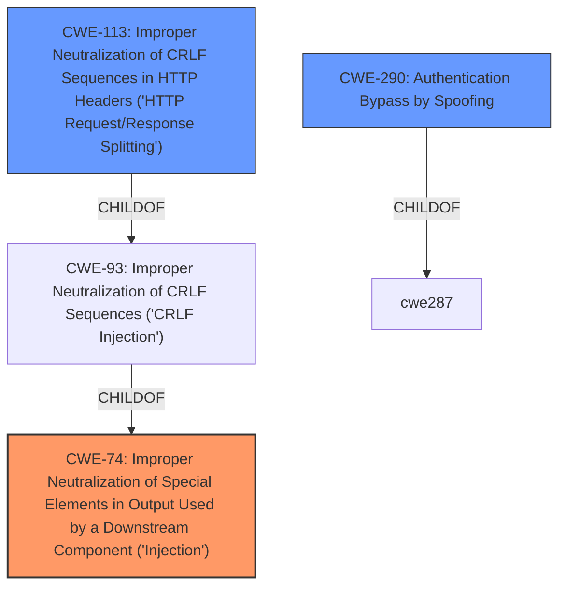

# Raw Analyzer Response for CVE-2022-38796

# Summary
| CWE ID | CWE Name | Confidence | CWE Abstraction Level | CWE Vulnerability Mapping Label | CWE-Vulnerability Mapping Notes |
|---|---|---|---|---|---|
| CWE-74 | Improper Neutralization of Special Elements in Output Used by a Downstream Component ('Injection') | 0.75 | Class | Primary | Allowed with Review |
| CWE-113 | Improper Neutralization of CRLF Sequences in HTTP Headers ('HTTP Request/Response Splitting') | 0.65 | Variant | Secondary | Allowed |
| CWE-290 | Authentication Bypass by Spoofing | 0.5 | Base | Secondary | Allowed |

## Evidence and Confidence

*   **Confidence Score:** 0.7
*   **Evidence Strength:** MEDIUM

## Relationship Analysis
The primary CWE identified is CWE-74, a Class-level weakness describing improper neutralization in output used by a downstream component. CWE-113 (Variant) is a child of CWE-93 (Base), which itself is a child of CWE-74. This indicates a potential path for the vulnerability. CWE-290 is presented as a base level weakness that can cause authentication bypass.

## Vulnerability Chain
The vulnerability chain starts with the **Host Header Injection** (**WEAKNESS**). This leads to the attacker being able to **spoof a particular header** (**IMPACT**), which in turn can be exploited for password reset emails.

## Summary of Analysis
Initially, the description mentions a **Host Header Injection** vulnerability, which allows an attacker to **spoof a particular header** by abusing password reset emails. This immediately suggests CWE-74, "Improper Neutralization of Special Elements in Output Used by a Downstream Component ('Injection')", since the **injection** of a **host header** allows the **spoofing** of downstream components.

CWE-113, "Improper Neutralization of CRLF Sequences in HTTP Headers ('HTTP Request/Response Splitting')", is a plausible secondary candidate, as host header injection could involve CRLF sequences and lead to HTTP request/response splitting. However, the description does not explicitly mention CRLF sequences.

CWE-290, "Authentication Bypass by Spoofing", is considered because the attacker can abuse password reset emails.

The final assessment is primarily based on the **Vulnerability Description** and its key phrases, which highlight the root cause as **Host Header Injection** and the immediate impact as **spoofing a particular header**.

The selection of CWE-74 is at the Class level. However, it aligns well with the provided vulnerability description which suggests a general injection issue.

Relevant CWE Information:

# Enhanced Context (25 CWEs)
The following CWEs were identified as potentially relevant to this vulnerability:

## CWE-74: Improper Neutralization of Special Elements in Output Used by a Downstream Component ('Injection')
**Abstraction Level**: Class
**Similarity Score**: 0.77
**Source**: dense

**Description**:
The product constructs all or part of a command, data structure, or record using externally-influenced input from an upstream component, but it does not neutralize or incorrectly neutralizes special elements that could modify how it is parsed or interpreted when it is sent to a downstream component.

**Mapping Guidance**:
- Usage: Discouraged
- Rationale: CWE-74 is high-level and often misused when lower-level weaknesses are more appropriate.

## CWE-113: Improper Neutralization of CRLF Sequences in HTTP Headers ('HTTP Request/Response Splitting')
**Abstraction Level**: Variant
**Similarity Score**: 0.76
**Source**: dense

**Description**:
The product receives data from an HTTP agent/component (e.g., web server, proxy, browser, etc.), but it does not neutralize or incorrectly neutralizes CR and LF characters before the data is included in outgoing HTTP headers.

**Mapping Guidance**:
- Usage: Allowed
- Rationale: This CWE entry is at the Variant level of abstraction, which is a preferred level of abstraction for mapping to the root causes of vulnerabilities.

## CWE-290: Authentication Bypass by Spoofing
**Abstraction Level**: Base
**Similarity Score**: 0.75
**Source**: dense

**Description**:
This attack-focused weakness is caused by incorrectly implemented authentication schemes that are subject to spoofing attacks.

**Mapping Guidance**:
- Usage: Allowed
- Rationale: This CWE entry is at the Base level of abstraction, which is a preferred level of abstraction for mapping to the root causes of vulnerabilities.