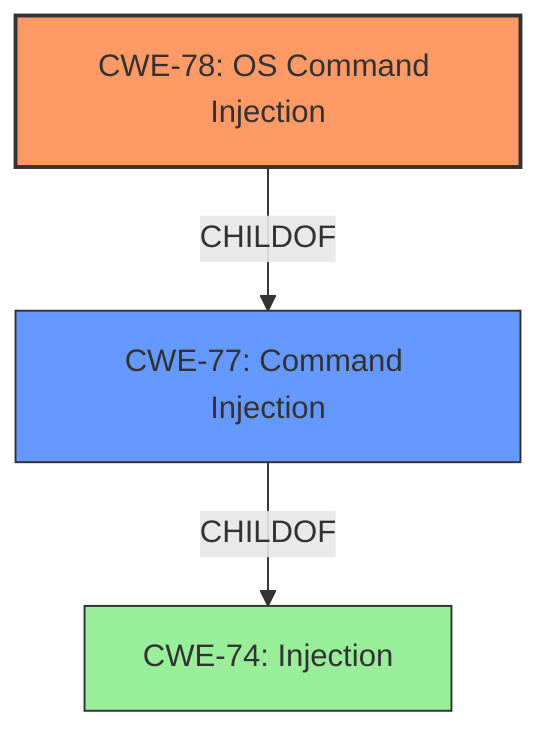

# Raw Analyzer Response for CVE-2022-38826

# Summary
| CWE ID | CWE Name | Confidence | CWE Abstraction Level | CWE Vulnerability Mapping Label | CWE-Vulnerability Mapping Notes |
|---|---|---|---|---|---|
| CWE-78 | Improper Neutralization of Special Elements used in an OS Command ('OS Command Injection') | 1 | Base | Allowed | Primary CWE |
| CWE-77 | Improper Neutralization of Special Elements used in a Command ('Command Injection') | 0.6 | Class | Allowed-with-Review | Secondary Candidate |

## Evidence and Confidence

*   **Confidence Score:** 1
*   **Evidence Strength:** HIGH

## Relationship Analysis
The primary relationship impacting the decision is that CWE-78 [Base] is a child of CWE-77 [Class]. Since the vulnerability clearly involves OS commands, CWE-78 is more specific and appropriate. The Retriever results also support this with a higher score for CWE-78.

## Vulnerability Chain
The vulnerability chain starts with **improper input validation** leading to **OS command injection**, resulting in the **execution of arbitrary commands**.

## Summary of Analysis
The initial assessment identified a command injection vulnerability. The analysis focused on identifying the root cause, which is the lack of proper sanitization of user-supplied input within the `cstecgi.cgi` script. The `mac` parameter is directly incorporated into a command executed by the system. This aligns with the description of CWE-78, "Improper Neutralization of Special Elements used in an OS Command ('OS Command Injection')."

The evidence from the "CVE Reference Links Content Summary" section clearly states: "The vulnerability stems from a lack of proper sanitization of user-supplied input, specifically the 'mac' parameter... The provided MAC address is directly incorporated into a command that is then executed by the system."

The retriever results also strongly suggest CWE-78 as the primary candidate.

The selected CWEs are at the optimal level of specificity because CWE-78 is a Base level CWE and the evidence clearly points to an OS Command injection.

Relevant CWE Information:

# Enhanced Context (25 CWEs)

## CWE-78: Improper Neutralization of Special Elements used in an OS Command ('OS Command Injection')
**Abstraction:** Base
**Similarity Score**: 5.03
**Source**: graph

**Description**:
The product constructs all or part of an OS command using externally-influenced input from an upstream component, but it does not neutralize or incorrectly neutralizes special elements that could modify the intended OS command when it is sent to a downstream component.

**Mapping Guidance**:
- Usage: Allowed
- Rationale: This CWE entry is at the Base level of abstraction, which is a preferred level of abstraction for mapping to the root causes of vulnerabilities.

**Relationships**:
- CANFOLLOW -> CWE-184
- CANALSOBE -> CWE-88
- CHILDOF -> CWE-77
- CHILDOF -> CWE-77
- CHILDOF -> CWE-74

## CWE-77: Improper Neutralization of Special Elements used in a Command ('Command Injection')
**Abstraction:** Class
**Similarity Score**: 0.043
**Source**: sparse

**Description**:
The product constructs all or part of a command using externally-influenced input from an upstream component, but it does not neutralize or incorrectly neutralizes special elements that could modify the intended command when it is sent to a downstream component.

**Mapping Guidance**:
- Usage: Allowed-with-Review
- Rationale: CWE-77 is often misused when OS command injection (CWE-78) was intended instead [REF-1287].
**Comments:** Ensure that the analysis focuses on the root-cause error that allows the execution of commands, as there are many weaknesses that can lead to this consequence. See Terminology Notes. If the weakness involves a command language besides OS shell invocation, then CWE-77 could be used.
**Reasons:**
- Frequent Misuse
**Suggested Alternatives:**
- CWE-78: OS Command Injection